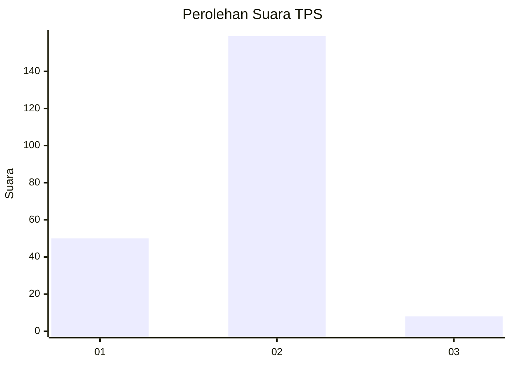

# Hasil

## Grafik

## Tabel

| No. | Nama Paslon    | Suara | Suara (raw) | Persentase |
|:--- |:-------------- | -----:| -----------:| ----------:|
| 1   | ANIES MUHAIMIN | 50    | [50][p-1]   | 23,04      |
| 2   | PRABOWO GIBRAN | 159   | [159][p-2]  | 73,27      |
| 3   | GANJAR MAHFUD  | 8     | [8][p-3]    | 3,69       |

[p-1]: https://github.com/gigit-pemilu/pemilu-2024-19-kepulauan-bangka-belitung/blob/main/pilpres/hitung-suara/sub/19-kepulauan-bangka-belitung/sub/01-bangka/sub/01-sungailiat/sub/1001-sungailiat/sub/001-tps/sub/paslon-1.txt
[p-2]: https://github.com/gigit-pemilu/pemilu-2024-19-kepulauan-bangka-belitung/blob/main/pilpres/hitung-suara/sub/19-kepulauan-bangka-belitung/sub/01-bangka/sub/01-sungailiat/sub/1001-sungailiat/sub/001-tps/sub/paslon-2.txt
[p-3]: https://github.com/gigit-pemilu/pemilu-2024-19-kepulauan-bangka-belitung/blob/main/pilpres/hitung-suara/sub/19-kepulauan-bangka-belitung/sub/01-bangka/sub/01-sungailiat/sub/1001-sungailiat/sub/001-tps/sub/paslon-3.txt

## Foto C Plano

https://sirekap-obj-formc.kpu.go.id/2b62/pemilu/ppwp/19/01/01/10/01/1901011001001-20240215-022555--540554a6-7692-423b-b113-24093f9e7ed8.jpg

https://sirekap-obj-formc.kpu.go.id/2b62/pemilu/ppwp/19/01/01/10/01/1901011001001-20240215-022703--349db49f-efc9-412e-94b5-f5ab7b640fc0.jpg

https://sirekap-obj-formc.kpu.go.id/2b62/pemilu/ppwp/19/01/01/10/01/1901011001001-20240215-022812--7c90889f-87d7-4336-b057-86b85ee6e990.jpg

## Metadata

| Key        | Value               |
| ---------- | ------------------- |
| Time Stamp | 2024-02-15 15:00:29 |

## DATA PEMILIH TETAP

Jumlah pemilih dalam DPT: **272**.
 * L: **138**.
 * P: **134**.

## DATA PENGGUNA HAK PILIH

Jumlah pengguna hak pilih dalam DPT: **216**.
 * L: **105**.
 * P: **111**.

Jumlah pengguna hak pilih dalam DPTb: **0**.
 * L: **0**.
 * P: **0**.

Jumlah pengguna hak pilih dalam DPK: **7**.
 * L: **3**.
 * P: **4**.

Jumlah pengguna hak pilih: **223**.
 * L: **108**.
 * P: **115**.

## JUMLAH SUARA SAH DAN TIDAK SAH

JUMLAH SELURUH SUARA SAH: **217**.

JUMLAH SUARA TIDAK SAH: **6**.

JUMLAH SELURUH SUARA SAH DAN SUARA TIDAK SAH: **223**.

