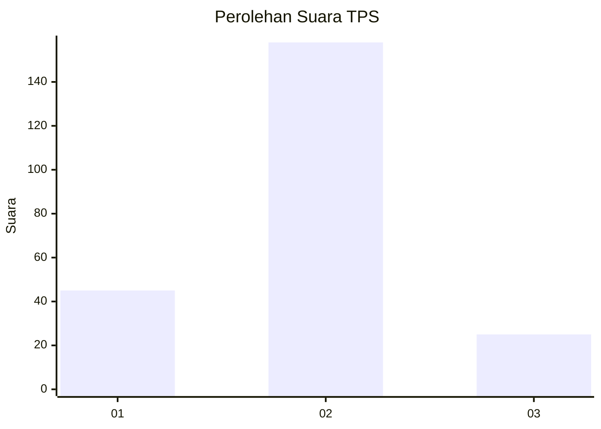
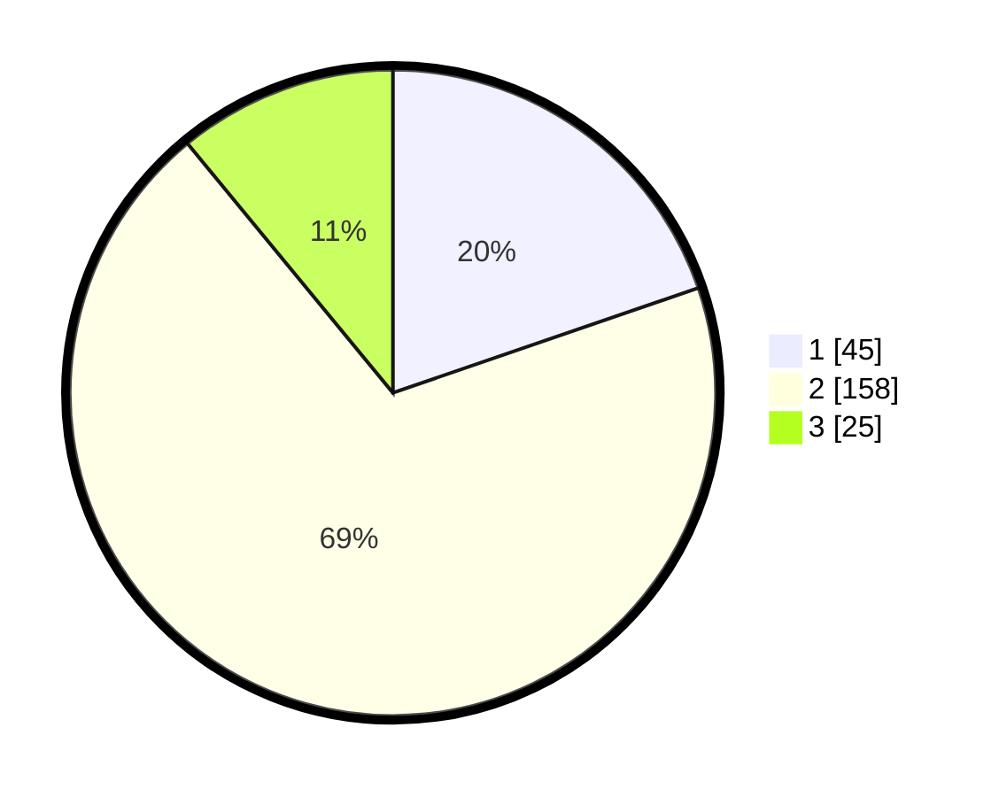

# Hasil

## Grafik

## Tabel

| No. | Nama Paslon    | Suara | Suara (raw) | Persentase |
|:--- |:-------------- | -----:| -----------:| ----------:|
| 1   | ANIES MUHAIMIN | 45    | [45][p-1]   | 19,74      |
| 2   | PRABOWO GIBRAN | 158   | [158][p-2]  | 69,30      |
| 3   | GANJAR MAHFUD  | 25    | [25][p-3]   | 10,96      |

[p-1]: https://github.com/gigit-pemilu/pemilu-2024-19-kepulauan-bangka-belitung/blob/main/pilpres/hitung-suara/sub/19-kepulauan-bangka-belitung/sub/01-bangka/sub/01-sungailiat/sub/1001-sungailiat/sub/002-tps/sub/paslon-1.txt
[p-2]: https://github.com/gigit-pemilu/pemilu-2024-19-kepulauan-bangka-belitung/blob/main/pilpres/hitung-suara/sub/19-kepulauan-bangka-belitung/sub/01-bangka/sub/01-sungailiat/sub/1001-sungailiat/sub/002-tps/sub/paslon-2.txt
[p-3]: https://github.com/gigit-pemilu/pemilu-2024-19-kepulauan-bangka-belitung/blob/main/pilpres/hitung-suara/sub/19-kepulauan-bangka-belitung/sub/01-bangka/sub/01-sungailiat/sub/1001-sungailiat/sub/002-tps/sub/paslon-3.txt

## Foto C Plano

https://sirekap-obj-formc.kpu.go.id/d5cd/pemilu/ppwp/19/01/01/10/01/1901011001002-20240215-003307--7f022fee-c5b4-4766-abf9-d9811b9222e7.jpg

https://sirekap-obj-formc.kpu.go.id/d5cd/pemilu/ppwp/19/01/01/10/01/1901011001002-20240215-003426--3de5dfb7-5a49-4c01-b465-63d21588b6b0.jpg

## Metadata

| Key        | Value               |
| ---------- | ------------------- |
| Time Stamp | 2024-02-16 14:30:33 |

