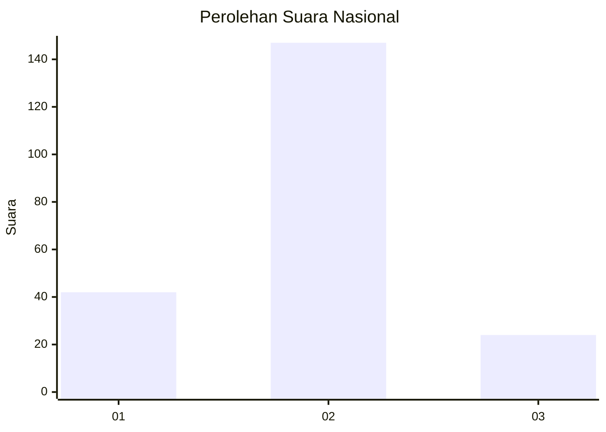
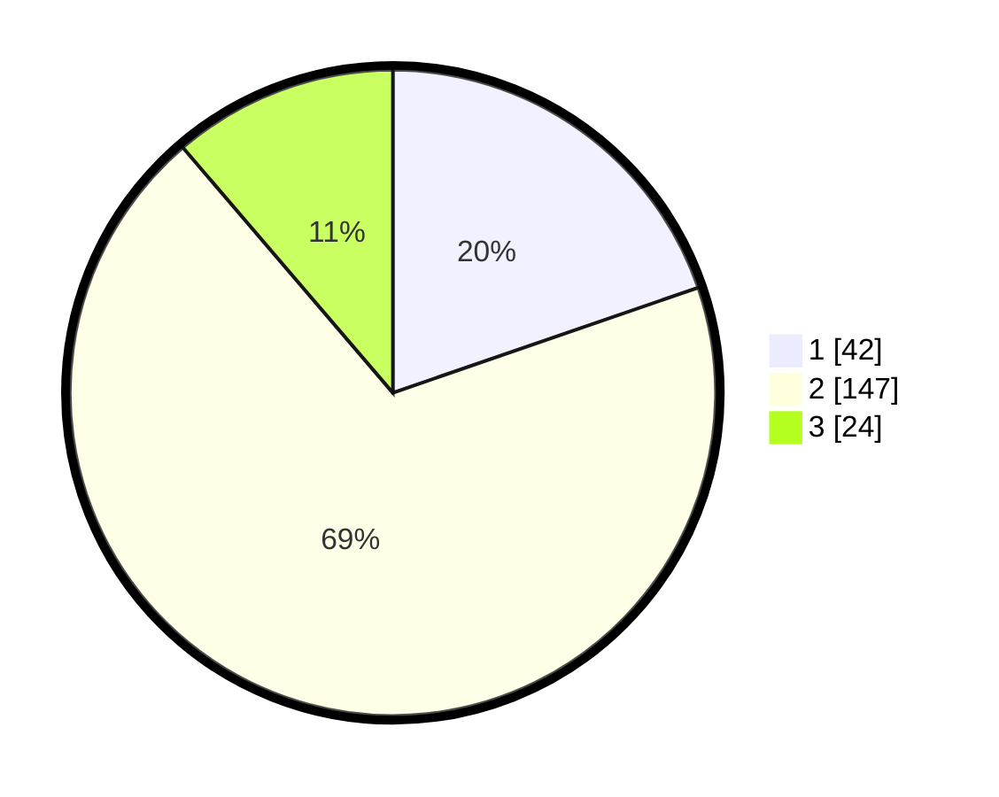

# Hasil

## Grafik

## Tabel

| No. | Nama Paslon    | Suara | Suara (raw) | Persentase |
|:--- |:-------------- | -----:| -----------:| ----------:|
| 1   | ANIES MUHAIMIN | 42    | [42][p-1]   | 19,72      |
| 2   | PRABOWO GIBRAN | 147   | [147][p-2]  | 69,01      |
| 3   | GANJAR MAHFUD  | 24    | [24][p-3]   | 11,27      |

[p-1]: https://github.com/gigit-pemilu/pemilu-2024/blob/main/pilpres/hitung-suara/sub/19-kepulauan-bangka-belitung/sub/01-bangka/sub/01-sungailiat/sub/1001-sungailiat/sub/003-tps/sub/paslon-1.txt
[p-2]: https://github.com/gigit-pemilu/pemilu-2024/blob/main/pilpres/hitung-suara/sub/19-kepulauan-bangka-belitung/sub/01-bangka/sub/01-sungailiat/sub/1001-sungailiat/sub/003-tps/sub/paslon-2.txt
[p-3]: https://github.com/gigit-pemilu/pemilu-2024/blob/main/pilpres/hitung-suara/sub/19-kepulauan-bangka-belitung/sub/01-bangka/sub/01-sungailiat/sub/1001-sungailiat/sub/003-tps/sub/paslon-3.txt

## Foto C Plano

https://sirekap-obj-formc.kpu.go.id/58ca/pemilu/ppwp/19/01/01/10/01/1901011001003-20240214-190901--b257e223-f937-40a1-aa97-6bcd83eee69f.jpg

https://sirekap-obj-formc.kpu.go.id/58ca/pemilu/ppwp/19/01/01/10/01/1901011001003-20240214-191229--df7d0b98-6731-48a5-8ff1-e9f3ad86016d.jpg

https://sirekap-obj-formc.kpu.go.id/58ca/pemilu/ppwp/19/01/01/10/01/1901011001003-20240214-190937--17863876-9ae2-40dc-9f05-d00402d3982e.jpg

## Metadata

| Key        | Value               |
| ---------- | ------------------- |
| Time Stamp | 2024-02-14 21:46:01 |

## DATA PEMILIH TETAP

Jumlah pemilih dalam DPT: **263**.
 * L: **124**.
 * P: **139**.

## DATA PENGGUNA HAK PILIH

Jumlah pengguna hak pilih dalam DPT: **210**.
 * L: **116**.
 * P: **94**.

Jumlah pengguna hak pilih dalam DPTb: **1**.
 * L: **0**.
 * P: **1**.

Jumlah pengguna hak pilih dalam DPK: **8**.
 * L: **5**.
 * P: **3**.

Jumlah pengguna hak pilih: **219**.
 * L: **121**.
 * P: **98**.

## JUMLAH SUARA SAH DAN TIDAK SAH

JUMLAH SELURUH SUARA SAH: **213**.

JUMLAH SUARA TIDAK SAH: **6**.

JUMLAH SELURUH SUARA SAH DAN SUARA TIDAK SAH: **219**.

