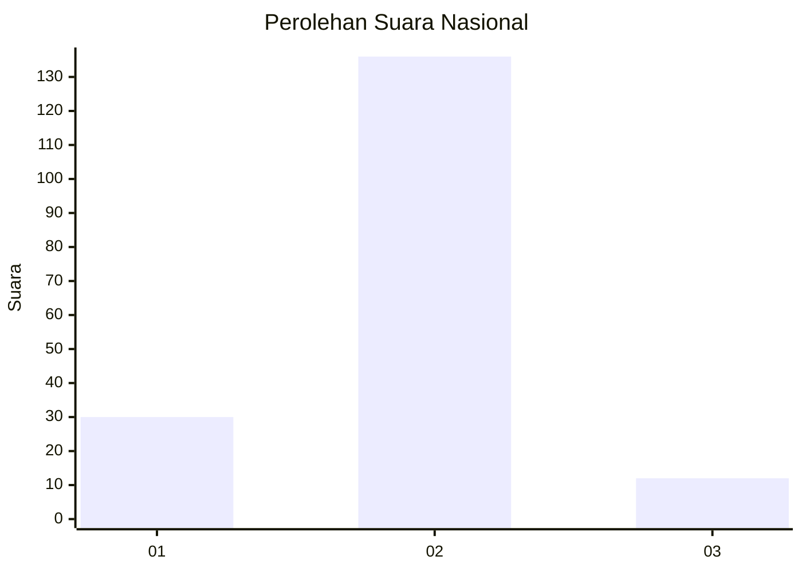
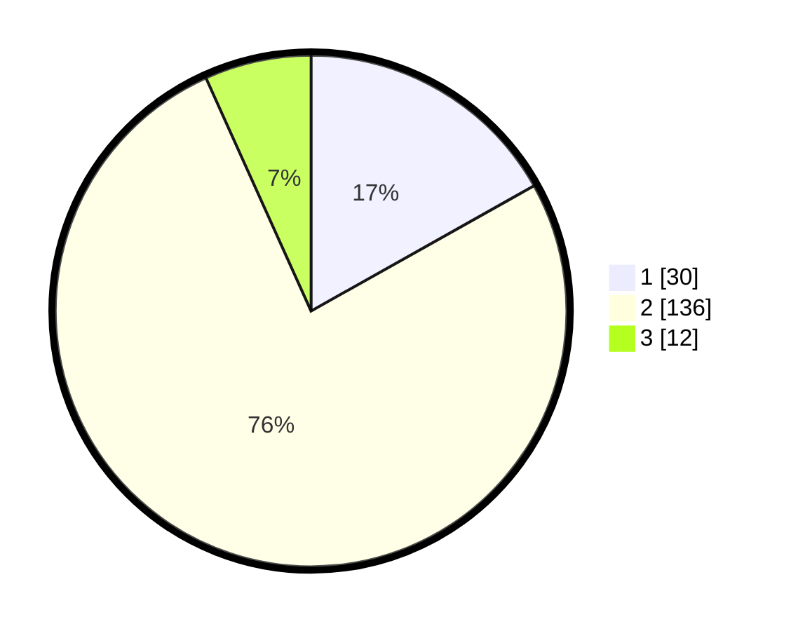

# Hasil

## Grafik

## Tabel

| No. | Nama Paslon    | Suara | Suara (raw) | Persentase |
|:--- |:-------------- | -----:| -----------:| ----------:|
| 1   | ANIES MUHAIMIN | 30    | [30][p-1]   | 16,85      |
| 2   | PRABOWO GIBRAN | 136   | [136][p-2]  | 76,40      |
| 3   | GANJAR MAHFUD  | 12    | [12][p-3]   | 6,74       |

[p-1]: https://github.com/gigit-pemilu/pemilu-2024/blob/main/pilpres/hitung-suara/sub/19-kepulauan-bangka-belitung/sub/01-bangka/sub/01-sungailiat/sub/1001-sungailiat/sub/004-tps/sub/paslon-1.txt
[p-2]: https://github.com/gigit-pemilu/pemilu-2024/blob/main/pilpres/hitung-suara/sub/19-kepulauan-bangka-belitung/sub/01-bangka/sub/01-sungailiat/sub/1001-sungailiat/sub/004-tps/sub/paslon-2.txt
[p-3]: https://github.com/gigit-pemilu/pemilu-2024/blob/main/pilpres/hitung-suara/sub/19-kepulauan-bangka-belitung/sub/01-bangka/sub/01-sungailiat/sub/1001-sungailiat/sub/004-tps/sub/paslon-3.txt

## Foto C Plano

https://sirekap-obj-formc.kpu.go.id/1e79/pemilu/ppwp/19/01/01/10/01/1901011001004-20240216-132052--b48ce211-b403-447e-a0e4-2c286cf581a1.jpg

https://sirekap-obj-formc.kpu.go.id/1e79/pemilu/ppwp/19/01/01/10/01/1901011001004-20240216-132054--c7098ed4-0576-4776-bae9-29fe18127bbf.jpg

https://sirekap-obj-formc.kpu.go.id/1e79/pemilu/ppwp/19/01/01/10/01/1901011001004-20240216-132053--0844a14c-d97a-4358-b9bc-cebd75a52324.jpg

## Metadata

| Key        | Value               |
| ---------- | ------------------- |
| Time Stamp | 2024-02-16 13:30:32 |

## DATA PEMILIH TETAP

Jumlah pemilih dalam DPT: **223**.
 * L: **122**.
 * P: **101**.

## DATA PENGGUNA HAK PILIH

Jumlah pengguna hak pilih dalam DPT: **176**.
 * L: **94**.
 * P: **82**.

Jumlah pengguna hak pilih dalam DPTb: **2**.
 * L: **1**.
 * P: **1**.

Jumlah pengguna hak pilih dalam DPK: **0**.
 * L: **0**.
 * P: **0**.

Jumlah pengguna hak pilih: **178**.
 * L: **95**.
 * P: **83**.

## JUMLAH SUARA SAH DAN TIDAK SAH

JUMLAH SELURUH SUARA SAH: **178**.

JUMLAH SUARA TIDAK SAH: **0**.

JUMLAH SELURUH SUARA SAH DAN SUARA TIDAK SAH: **178**.

