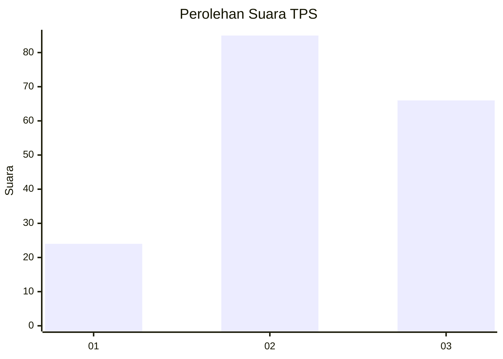
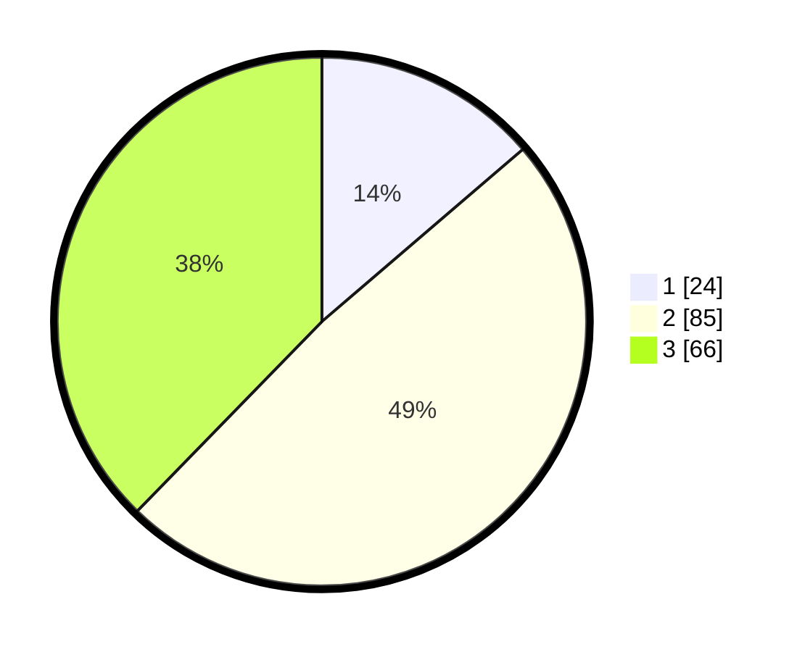

# Hasil

## Grafik

## Tabel

| No. | Nama Paslon    | Suara | Suara (raw) | Persentase |
|:--- |:-------------- | -----:| -----------:| ----------:|
| 1   | ANIES MUHAIMIN | 24    | [24][p-1]   | 13,71      |
| 2   | PRABOWO GIBRAN | 85    | [85][p-2]   | 48,57      |
| 3   | GANJAR MAHFUD  | 66    | [66][p-3]   | 37,71      |

[p-1]: https://github.com/gigit-pemilu/pemilu-2024-19-kepulauan-bangka-belitung/blob/main/pilpres/hitung-suara/sub/19-kepulauan-bangka-belitung/sub/01-bangka/sub/01-sungailiat/sub/1001-sungailiat/sub/011-tps/sub/paslon-1.txt
[p-2]: https://github.com/gigit-pemilu/pemilu-2024-19-kepulauan-bangka-belitung/blob/main/pilpres/hitung-suara/sub/19-kepulauan-bangka-belitung/sub/01-bangka/sub/01-sungailiat/sub/1001-sungailiat/sub/011-tps/sub/paslon-2.txt
[p-3]: https://github.com/gigit-pemilu/pemilu-2024-19-kepulauan-bangka-belitung/blob/main/pilpres/hitung-suara/sub/19-kepulauan-bangka-belitung/sub/01-bangka/sub/01-sungailiat/sub/1001-sungailiat/sub/011-tps/sub/paslon-3.txt

## Foto C Plano

https://sirekap-obj-formc.kpu.go.id/2cb9/pemilu/ppwp/19/01/01/10/01/1901011001011-20240214-235041--559c600b-3f2b-4e0e-ad9a-5ccbcc2d42f4.jpg

https://sirekap-obj-formc.kpu.go.id/2cb9/pemilu/ppwp/19/01/01/10/01/1901011001011-20240214-235357--b6ee1756-f590-484a-b193-af8a2663bc69.jpg

https://sirekap-obj-formc.kpu.go.id/2cb9/pemilu/ppwp/19/01/01/10/01/1901011001011-20240214-235532--36fa35fd-7f29-40aa-aa1a-ad23578a7ada.jpg

## Metadata

| Key        | Value               |
| ---------- | ------------------- |
| Time Stamp | 2024-02-17 14:45:18 |

