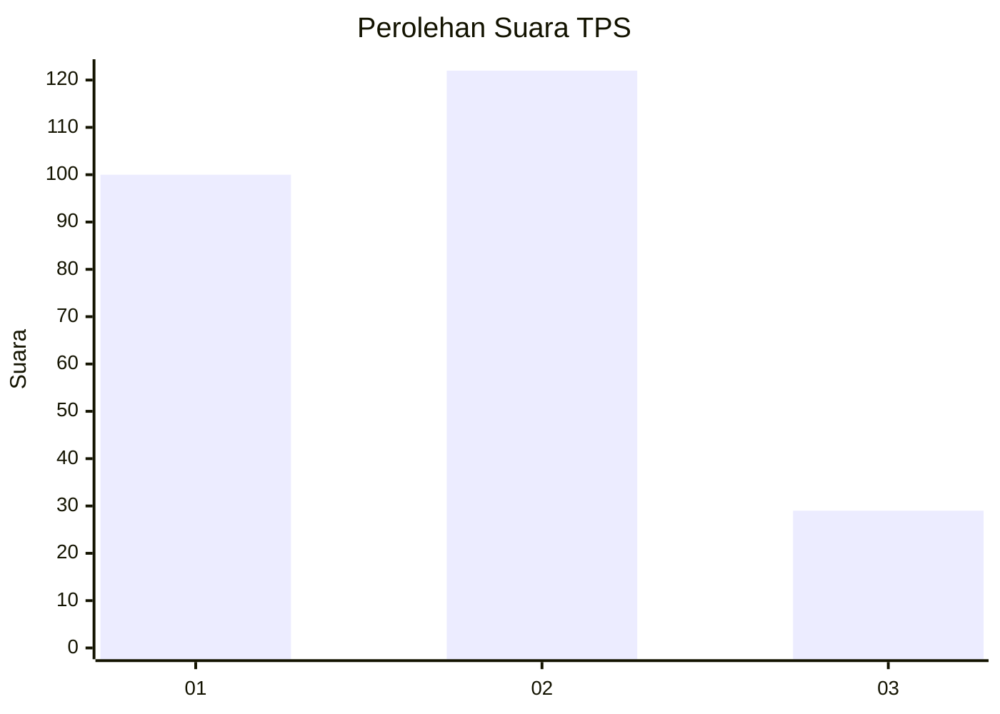
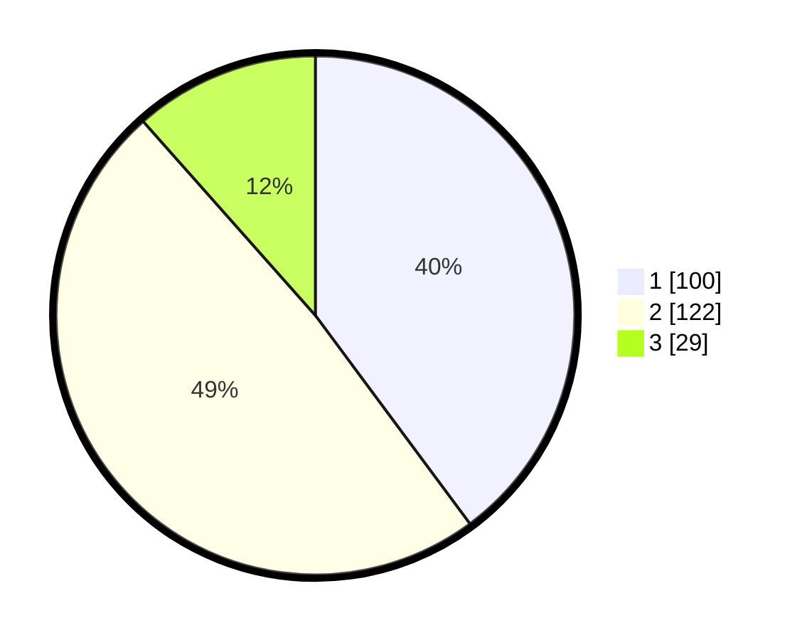

# Hasil

## Grafik

## Tabel

| No. | Nama Paslon    | Suara | Suara (raw) | Persentase |
|:--- |:-------------- | -----:| -----------:| ----------:|
| 1   | ANIES MUHAIMIN | 100   | [100][p-1]  | 39,84      |
| 2   | PRABOWO GIBRAN | 122   | [122][p-2]  | 48,61      |
| 3   | GANJAR MAHFUD  | 29    | [29][p-3]   | 11,55      |

[p-1]: https://github.com/gigit-pemilu/pemilu-2024-19-kepulauan-bangka-belitung/blob/main/pilpres/hitung-suara/sub/19-kepulauan-bangka-belitung/sub/01-bangka/sub/01-sungailiat/sub/1002-sri-menanti/sub/021-tps/sub/paslon-1.txt
[p-2]: https://github.com/gigit-pemilu/pemilu-2024-19-kepulauan-bangka-belitung/blob/main/pilpres/hitung-suara/sub/19-kepulauan-bangka-belitung/sub/01-bangka/sub/01-sungailiat/sub/1002-sri-menanti/sub/021-tps/sub/paslon-2.txt
[p-3]: https://github.com/gigit-pemilu/pemilu-2024-19-kepulauan-bangka-belitung/blob/main/pilpres/hitung-suara/sub/19-kepulauan-bangka-belitung/sub/01-bangka/sub/01-sungailiat/sub/1002-sri-menanti/sub/021-tps/sub/paslon-3.txt

## Foto C Plano

https://sirekap-obj-formc.kpu.go.id/7293/pemilu/ppwp/19/01/01/10/02/1901011002021-20240215-012050--fe549e25-ed51-4db3-8e61-0c2372901951.jpg

https://sirekap-obj-formc.kpu.go.id/7293/pemilu/ppwp/19/01/01/10/02/1901011002021-20240215-012216--d4088a5d-fb44-4b5a-bb80-0c2c2d82a9dd.jpg

https://sirekap-obj-formc.kpu.go.id/7293/pemilu/ppwp/19/01/01/10/02/1901011002021-20240215-012342--8333099f-0b0f-4418-a46b-3fdde8e60a71.jpg

## Metadata

| Key        | Value               |
| ---------- | ------------------- |
| Time Stamp | 2024-02-24 22:31:28 |

