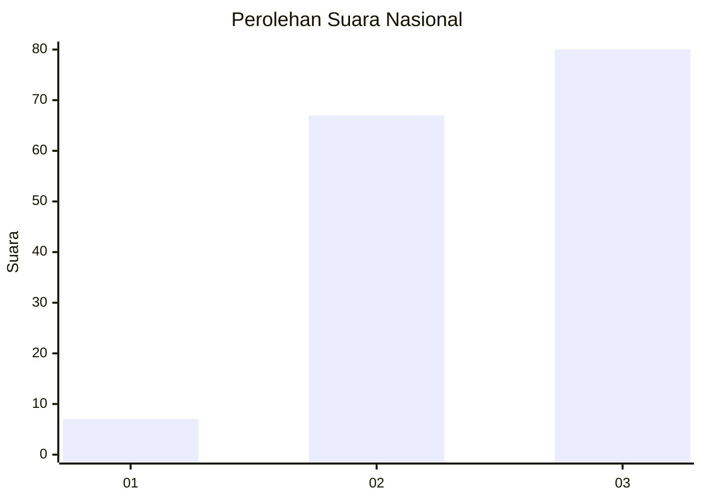
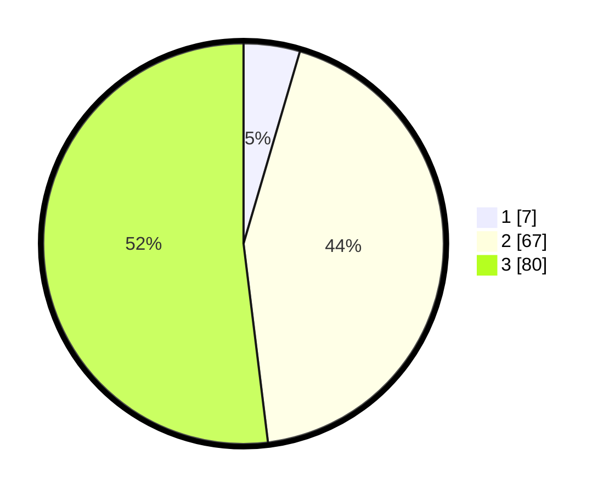

# Hasil

## Grafik

## Tabel

| No. | Nama Paslon    | Suara | Suara (raw) | Persentase |
|:--- |:-------------- | -----:| -----------:| ----------:|
| 1   | ANIES MUHAIMIN | 7     | [7][p-1]    | 4,55       |
| 2   | PRABOWO GIBRAN | 67    | [67][p-2]   | 43,51      |
| 3   | GANJAR MAHFUD  | 80    | [80][p-3]   | 51,95      |

[p-1]: https://github.com/gigit-pemilu/pemilu-2024/blob/main/pilpres/hitung-suara/sub/19-kepulauan-bangka-belitung/sub/01-bangka/sub/01-sungailiat/sub/1005-kenanga/sub/014-tps/sub/paslon-1.txt
[p-2]: https://github.com/gigit-pemilu/pemilu-2024/blob/main/pilpres/hitung-suara/sub/19-kepulauan-bangka-belitung/sub/01-bangka/sub/01-sungailiat/sub/1005-kenanga/sub/014-tps/sub/paslon-2.txt
[p-3]: https://github.com/gigit-pemilu/pemilu-2024/blob/main/pilpres/hitung-suara/sub/19-kepulauan-bangka-belitung/sub/01-bangka/sub/01-sungailiat/sub/1005-kenanga/sub/014-tps/sub/paslon-3.txt

## Foto C Plano

https://sirekap-obj-formc.kpu.go.id/19e1/pemilu/ppwp/19/01/01/10/05/1901011005014-20240215-014645--6e8d8e36-10b9-4073-a709-d0fef333637c.jpg

https://sirekap-obj-formc.kpu.go.id/19e1/pemilu/ppwp/19/01/01/10/05/1901011005014-20240215-014000--7836eb72-b178-4a23-b40b-5b1f45fdb017.jpg

https://sirekap-obj-formc.kpu.go.id/19e1/pemilu/ppwp/19/01/01/10/05/1901011005014-20240215-014442--29715b38-f8a7-4ffe-b4cb-717682418224.jpg

## Metadata

| Key        | Value               |
| ---------- | ------------------- |
| Time Stamp | 2024-02-19 06:16:00 |

