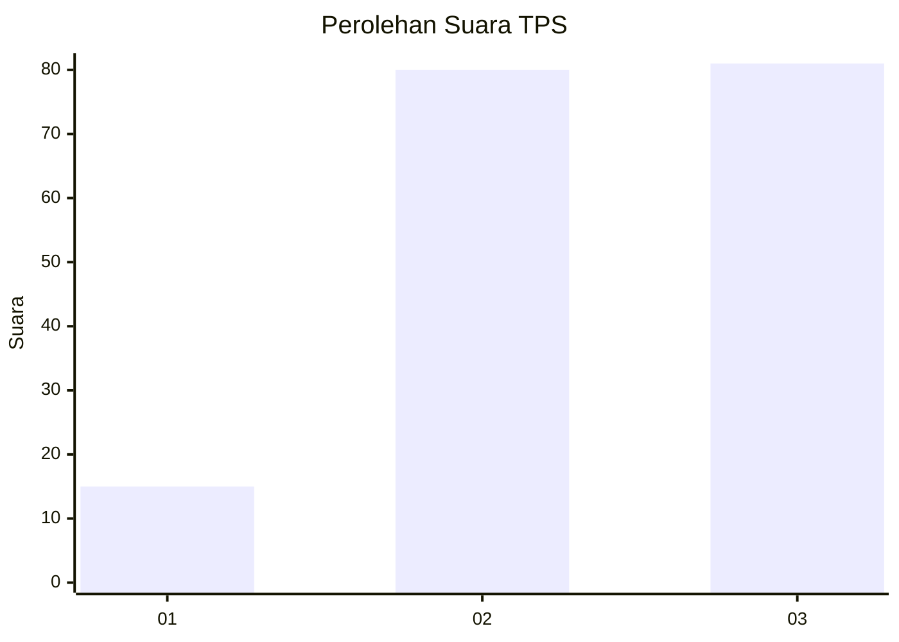
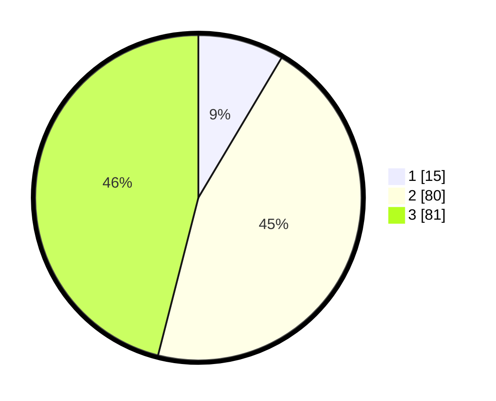

# Hasil

## Grafik

## Tabel

| No. | Nama Paslon    | Suara | Suara (raw) | Persentase |
|:--- |:-------------- | -----:| -----------:| ----------:|
| 1   | ANIES MUHAIMIN | 15    | [15][p-1]   | 8,52       |
| 2   | PRABOWO GIBRAN | 80    | [80][p-2]   | 45,45      |
| 3   | GANJAR MAHFUD  | 81    | [81][p-3]   | 46,02      |

[p-1]: https://github.com/gigit-pemilu/pemilu-2024-19-kepulauan-bangka-belitung/blob/main/pilpres/hitung-suara/sub/19-kepulauan-bangka-belitung/sub/01-bangka/sub/01-sungailiat/sub/1009-matras/sub/001-tps/sub/paslon-1.txt
[p-2]: https://github.com/gigit-pemilu/pemilu-2024-19-kepulauan-bangka-belitung/blob/main/pilpres/hitung-suara/sub/19-kepulauan-bangka-belitung/sub/01-bangka/sub/01-sungailiat/sub/1009-matras/sub/001-tps/sub/paslon-2.txt
[p-3]: https://github.com/gigit-pemilu/pemilu-2024-19-kepulauan-bangka-belitung/blob/main/pilpres/hitung-suara/sub/19-kepulauan-bangka-belitung/sub/01-bangka/sub/01-sungailiat/sub/1009-matras/sub/001-tps/sub/paslon-3.txt

## Foto C Plano

https://sirekap-obj-formc.kpu.go.id/c63c/pemilu/ppwp/19/01/01/10/09/1901011009001-20240214-215754--acc55d90-3de9-47f5-96a0-efebf782fa09.jpg

https://sirekap-obj-formc.kpu.go.id/c63c/pemilu/ppwp/19/01/01/10/09/1901011009001-20240214-215846--dab78d59-b6d5-4fd3-974a-eeb5b1a46a33.jpg

https://sirekap-obj-formc.kpu.go.id/c63c/pemilu/ppwp/19/01/01/10/09/1901011009001-20240214-215945--4754ba5f-a6b5-4427-8ccd-f4d80d95e564.jpg

## Metadata

| Key        | Value               |
| ---------- | ------------------- |
| Time Stamp | 2024-02-17 14:56:33 |

