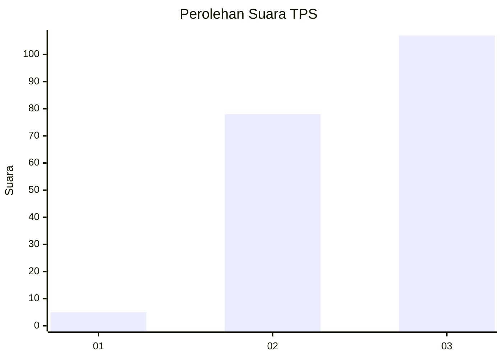
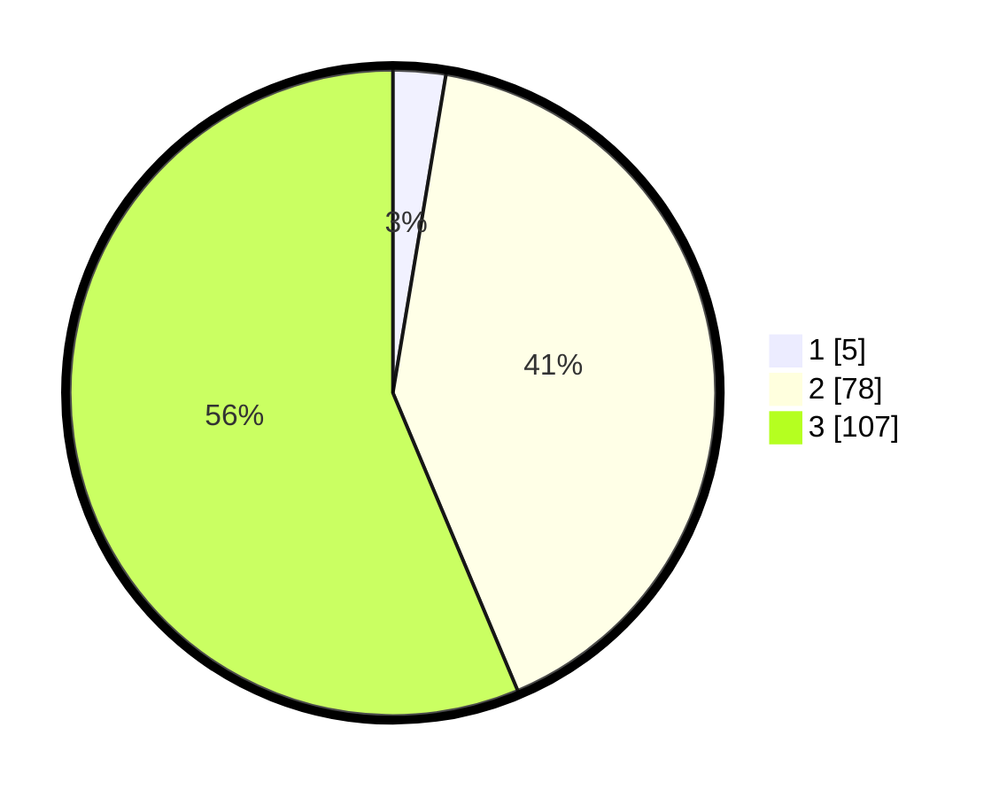

# Hasil

## Grafik

## Tabel

| No. | Nama Paslon    | Suara | Suara (raw) | Persentase |
|:--- |:-------------- | -----:| -----------:| ----------:|
| 1   | ANIES MUHAIMIN | 5     | [5][p-1]    | 2,63       |
| 2   | PRABOWO GIBRAN | 78    | [78][p-2]   | 41,05      |
| 3   | GANJAR MAHFUD  | 107   | [107][p-3]  | 56,32      |

[p-1]: https://github.com/gigit-pemilu/pemilu-2024-19-kepulauan-bangka-belitung/blob/main/pilpres/hitung-suara/sub/19-kepulauan-bangka-belitung/sub/01-bangka/sub/01-sungailiat/sub/1012-lubuk-kelik/sub/003-tps/sub/paslon-1.txt
[p-2]: https://github.com/gigit-pemilu/pemilu-2024-19-kepulauan-bangka-belitung/blob/main/pilpres/hitung-suara/sub/19-kepulauan-bangka-belitung/sub/01-bangka/sub/01-sungailiat/sub/1012-lubuk-kelik/sub/003-tps/sub/paslon-2.txt
[p-3]: https://github.com/gigit-pemilu/pemilu-2024-19-kepulauan-bangka-belitung/blob/main/pilpres/hitung-suara/sub/19-kepulauan-bangka-belitung/sub/01-bangka/sub/01-sungailiat/sub/1012-lubuk-kelik/sub/003-tps/sub/paslon-3.txt

## Foto C Plano

https://sirekap-obj-formc.kpu.go.id/5db3/pemilu/ppwp/19/01/01/10/12/1901011012003-20240214-231943--3ec85e11-39c3-43d2-aebd-42699d46f3a9.jpg

https://sirekap-obj-formc.kpu.go.id/5db3/pemilu/ppwp/19/01/01/10/12/1901011012003-20240214-232100--1bb79be4-75b5-4a59-9f09-4dc457c9605d.jpg

https://sirekap-obj-formc.kpu.go.id/5db3/pemilu/ppwp/19/01/01/10/12/1901011012003-20240214-232157--4710a4d4-8f57-4948-929b-c994cf06477a.jpg

## Metadata

| Key        | Value               |
| ---------- | ------------------- |
| Time Stamp | 2024-02-25 22:00:00 |

