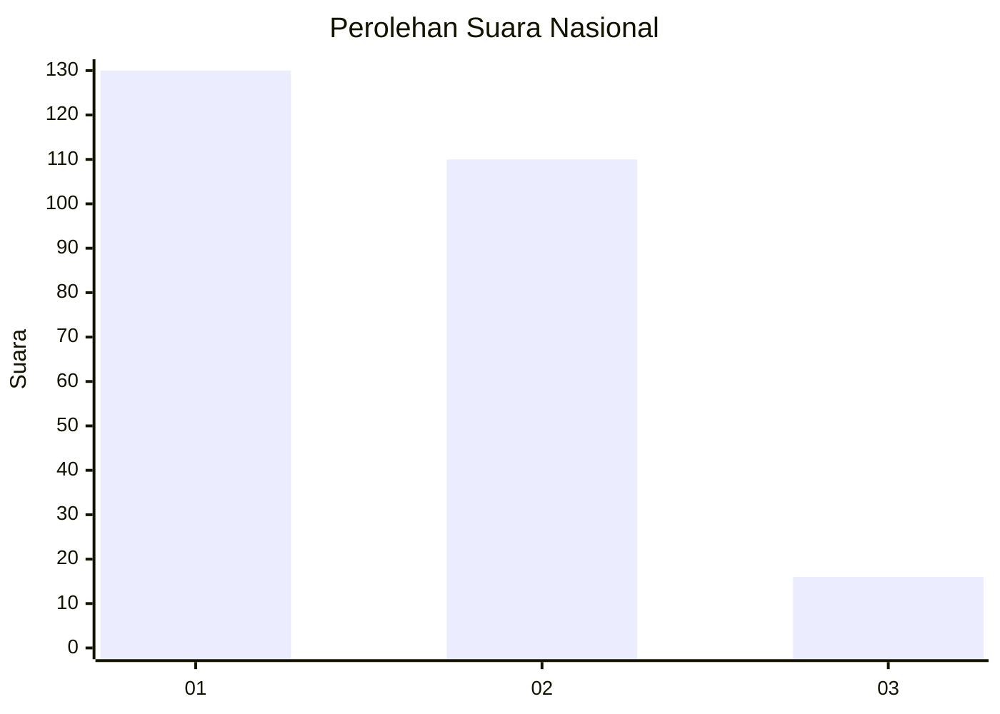
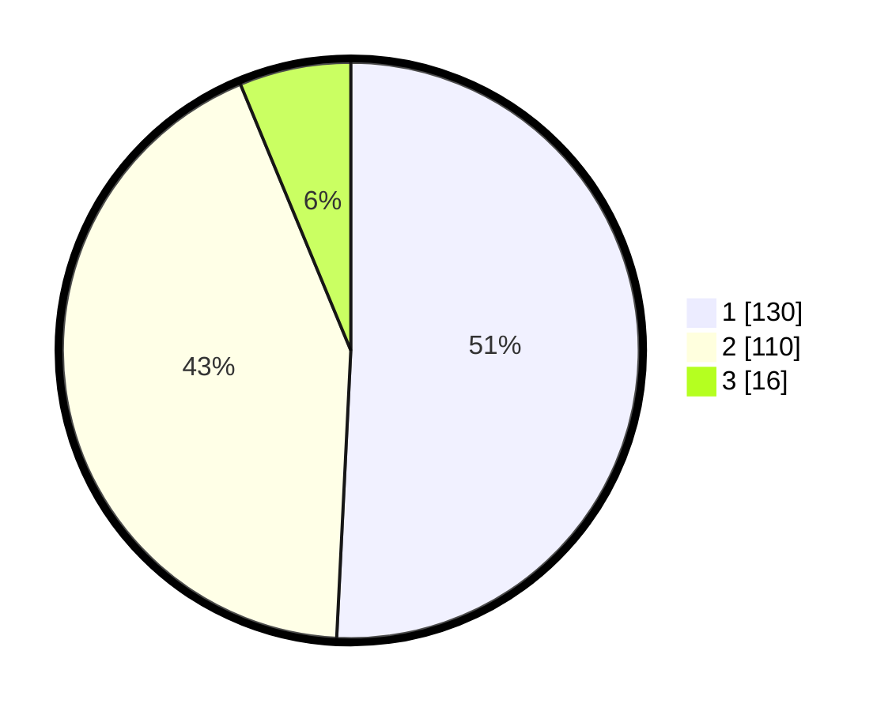

# Hasil

## Grafik

## Tabel

| No. | Nama Paslon    | Suara | Suara (raw) | Persentase |
|:--- |:-------------- | -----:| -----------:| ----------:|
| 1   | ANIES MUHAIMIN | 130   | [130][p-1]  | 50,78      |
| 2   | PRABOWO GIBRAN | 110   | [110][p-2]  | 42,97      |
| 3   | GANJAR MAHFUD  | 16    | [16][p-3]   | 6,25       |

[p-1]: https://github.com/gigit-pemilu/pemilu-2024/blob/main/pilpres/hitung-suara/sub/19-kepulauan-bangka-belitung/sub/01-bangka/sub/01-sungailiat/sub/1013-bukit-betung/sub/011-tps/sub/paslon-1.txt
[p-2]: https://github.com/gigit-pemilu/pemilu-2024/blob/main/pilpres/hitung-suara/sub/19-kepulauan-bangka-belitung/sub/01-bangka/sub/01-sungailiat/sub/1013-bukit-betung/sub/011-tps/sub/paslon-2.txt
[p-3]: https://github.com/gigit-pemilu/pemilu-2024/blob/main/pilpres/hitung-suara/sub/19-kepulauan-bangka-belitung/sub/01-bangka/sub/01-sungailiat/sub/1013-bukit-betung/sub/011-tps/sub/paslon-3.txt

## Foto C Plano

https://sirekap-obj-formc.kpu.go.id/eaf7/pemilu/ppwp/19/01/01/10/13/1901011013011-20240214-215847--bf8bf77d-b632-4288-a079-b83d1dbb2913.jpg

https://sirekap-obj-formc.kpu.go.id/eaf7/pemilu/ppwp/19/01/01/10/13/1901011013011-20240218-103100--82109913-1c2b-437f-9a7c-fd08ec950c61.jpg

https://sirekap-obj-formc.kpu.go.id/eaf7/pemilu/ppwp/19/01/01/10/13/1901011013011-20240214-220219--3417e236-02fd-4d4f-800a-486780e8d9f7.jpg

## Metadata

| Key        | Value               |
| ---------- | ------------------- |
| Time Stamp | 2024-02-19 06:16:00 |

