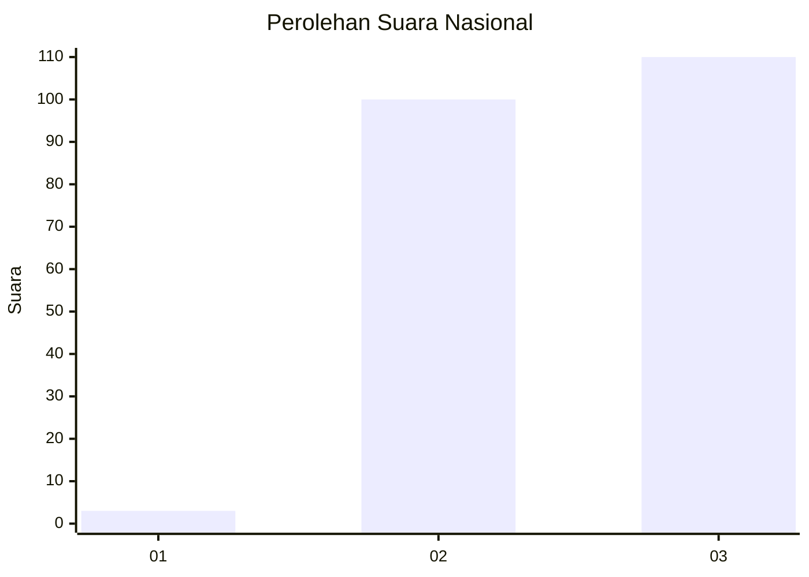
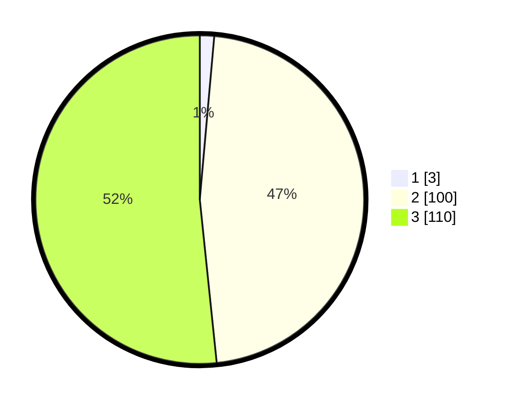

# Hasil

## Grafik

## Tabel

| No. | Nama Paslon    | Suara | Suara (raw) | Persentase |
|:--- |:-------------- | -----:| -----------:| ----------:|
| 1   | ANIES MUHAIMIN | 3     | [3][p-1]    | 1,41       |
| 2   | PRABOWO GIBRAN | 100   | [100][p-2]  | 46,95      |
| 3   | GANJAR MAHFUD  | 110   | [110][p-3]  | 51,64      |

[p-1]: https://github.com/gigit-pemilu/pemilu-2024/blob/main/pilpres/hitung-suara/sub/19-kepulauan-bangka-belitung/sub/01-bangka/sub/01-sungailiat/sub/2007-rebo/sub/002-tps/sub/paslon-1.txt
[p-2]: https://github.com/gigit-pemilu/pemilu-2024/blob/main/pilpres/hitung-suara/sub/19-kepulauan-bangka-belitung/sub/01-bangka/sub/01-sungailiat/sub/2007-rebo/sub/002-tps/sub/paslon-2.txt
[p-3]: https://github.com/gigit-pemilu/pemilu-2024/blob/main/pilpres/hitung-suara/sub/19-kepulauan-bangka-belitung/sub/01-bangka/sub/01-sungailiat/sub/2007-rebo/sub/002-tps/sub/paslon-3.txt

## Foto C Plano

https://sirekap-obj-formc.kpu.go.id/57b4/pemilu/ppwp/19/01/01/20/07/1901012007002-20240214-202632--e2f89edb-fb48-44ac-93db-ed7280029ea9.jpg

https://sirekap-obj-formc.kpu.go.id/57b4/pemilu/ppwp/19/01/01/20/07/1901012007002-20240214-202452--ac65e1b8-4d52-4bd7-942e-66ebfd0ae1cd.jpg

https://sirekap-obj-formc.kpu.go.id/57b4/pemilu/ppwp/19/01/01/20/07/1901012007002-20240214-202808--4257dad6-50c7-4c07-9f35-b591dc49d2bb.jpg

## Metadata

| Key        | Value               |
| ---------- | ------------------- |
| Time Stamp | 2024-02-25 13:00:00 |

