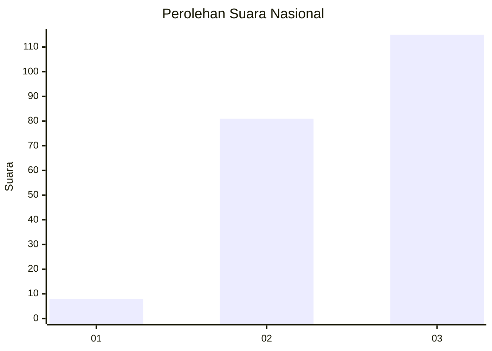
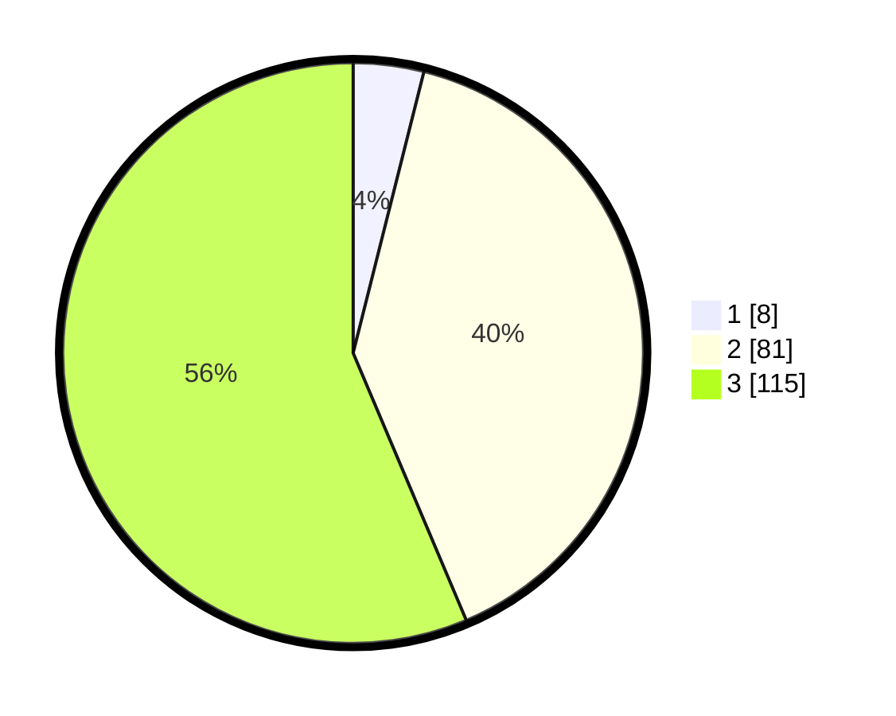

# Hasil

## Grafik

## Tabel

| No. | Nama Paslon    | Suara | Suara (raw) | Persentase |
|:--- |:-------------- | -----:| -----------:| ----------:|
| 1   | ANIES MUHAIMIN | 8     | [8][p-1]    | 3,92       |
| 2   | PRABOWO GIBRAN | 81    | [81][p-2]   | 39,71      |
| 3   | GANJAR MAHFUD  | 115   | [115][p-3]  | 56,37      |

[p-1]: https://github.com/gigit-pemilu/pemilu-2024/blob/main/pilpres/hitung-suara/sub/19-kepulauan-bangka-belitung/sub/01-bangka/sub/01-sungailiat/sub/2007-rebo/sub/004-tps/sub/paslon-1.txt
[p-2]: https://github.com/gigit-pemilu/pemilu-2024/blob/main/pilpres/hitung-suara/sub/19-kepulauan-bangka-belitung/sub/01-bangka/sub/01-sungailiat/sub/2007-rebo/sub/004-tps/sub/paslon-2.txt
[p-3]: https://github.com/gigit-pemilu/pemilu-2024/blob/main/pilpres/hitung-suara/sub/19-kepulauan-bangka-belitung/sub/01-bangka/sub/01-sungailiat/sub/2007-rebo/sub/004-tps/sub/paslon-3.txt

## Foto C Plano

https://sirekap-obj-formc.kpu.go.id/c707/pemilu/ppwp/19/01/01/20/07/1901012007004-20240214-210132--94078fa0-d280-4124-825e-4fcbf45ab120.jpg

https://sirekap-obj-formc.kpu.go.id/c707/pemilu/ppwp/19/01/01/20/07/1901012007004-20240214-210307--2a8567f7-c0e7-4e81-86e4-33f66f1d238e.jpg

https://sirekap-obj-formc.kpu.go.id/c707/pemilu/ppwp/19/01/01/20/07/1901012007004-20240214-210436--de385704-2059-4dc5-a44d-1e8cd03064d0.jpg

## Metadata

| Key        | Value               |
| ---------- | ------------------- |
| Time Stamp | 2024-02-25 16:00:00 |

