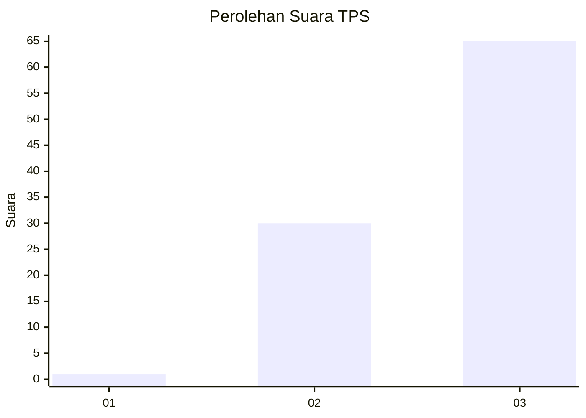
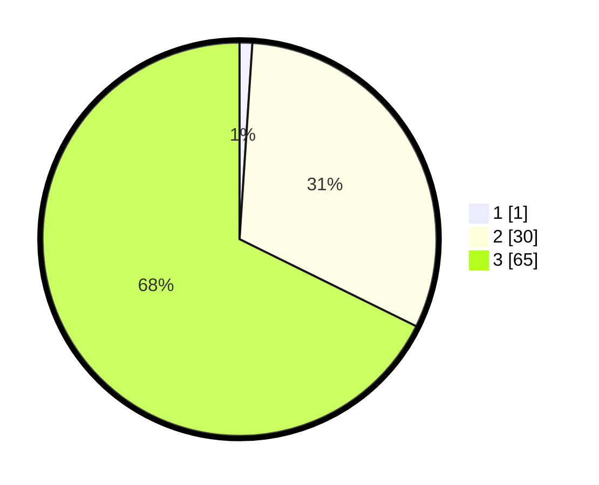

# Hasil

## Grafik

## Tabel

| No. | Nama Paslon    | Suara | Suara (raw) | Persentase |
|:--- |:-------------- | -----:| -----------:| ----------:|
| 1   | ANIES MUHAIMIN | 1     | [1][p-1]    | 1,04       |
| 2   | PRABOWO GIBRAN | 30    | [30][p-2]   | 31,25      |
| 3   | GANJAR MAHFUD  | 65    | [65][p-3]   | 67,71      |

[p-1]: https://github.com/gigit-pemilu/pemilu-2024-19-kepulauan-bangka-belitung/blob/main/pilpres/hitung-suara/sub/19-kepulauan-bangka-belitung/sub/01-bangka/sub/02-belinyu/sub/1001-kuto-panji/sub/010-tps/sub/paslon-1.txt
[p-2]: https://github.com/gigit-pemilu/pemilu-2024-19-kepulauan-bangka-belitung/blob/main/pilpres/hitung-suara/sub/19-kepulauan-bangka-belitung/sub/01-bangka/sub/02-belinyu/sub/1001-kuto-panji/sub/010-tps/sub/paslon-2.txt
[p-3]: https://github.com/gigit-pemilu/pemilu-2024-19-kepulauan-bangka-belitung/blob/main/pilpres/hitung-suara/sub/19-kepulauan-bangka-belitung/sub/01-bangka/sub/02-belinyu/sub/1001-kuto-panji/sub/010-tps/sub/paslon-3.txt

## Foto C Plano

https://sirekap-obj-formc.kpu.go.id/9c64/pemilu/ppwp/19/01/02/10/01/1901021001010-20240214-215345--3c59153d-cf4f-4c83-8d91-b5ee582a508b.jpg

https://sirekap-obj-formc.kpu.go.id/9c64/pemilu/ppwp/19/01/02/10/01/1901021001010-20240219-133531--4a076f62-afe5-45ae-bc7b-aa08810505ec.jpg

https://sirekap-obj-formc.kpu.go.id/9c64/pemilu/ppwp/19/01/02/10/01/1901021001010-20240214-215656--cc4e9dad-608a-4842-9092-163e3c84faea.jpg

## Metadata

| Key        | Value               |
| ---------- | ------------------- |
| Time Stamp | 2024-02-25 12:00:00 |

