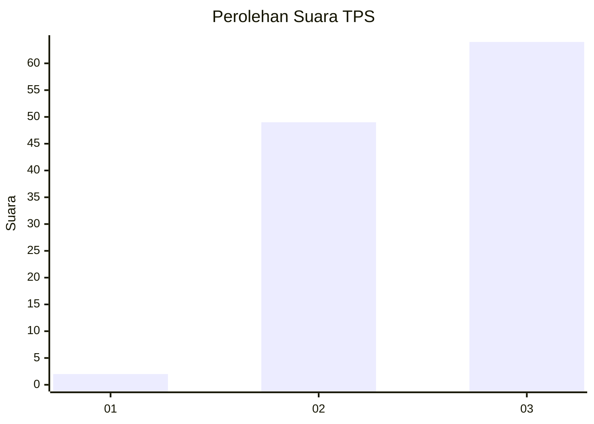
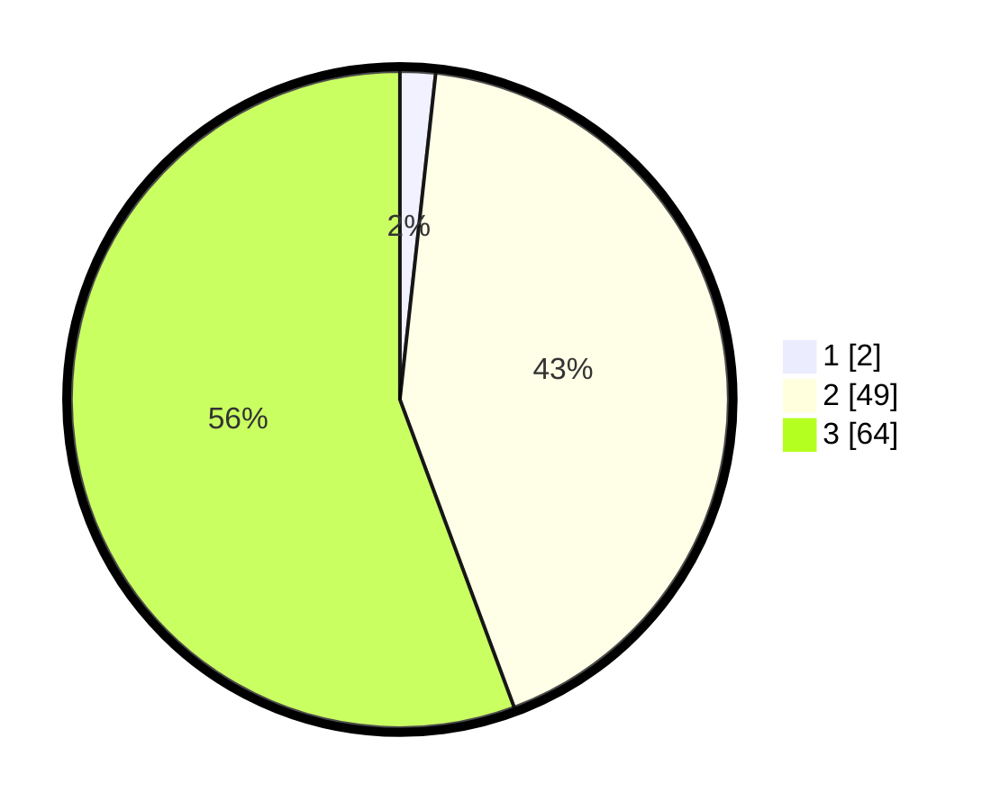

# Hasil

## Grafik

## Tabel

| No. | Nama Paslon    | Suara | Suara (raw) | Persentase |
|:--- |:-------------- | -----:| -----------:| ----------:|
| 1   | ANIES MUHAIMIN | 2     | [2][p-1]    | 1,74       |
| 2   | PRABOWO GIBRAN | 49    | [49][p-2]   | 42,61      |
| 3   | GANJAR MAHFUD  | 64    | [64][p-3]   | 55,65      |

[p-1]: https://github.com/gigit-pemilu/pemilu-2024-19-kepulauan-bangka-belitung/blob/main/pilpres/hitung-suara/sub/19-kepulauan-bangka-belitung/sub/01-bangka/sub/02-belinyu/sub/1001-kuto-panji/sub/012-tps/sub/paslon-1.txt
[p-2]: https://github.com/gigit-pemilu/pemilu-2024-19-kepulauan-bangka-belitung/blob/main/pilpres/hitung-suara/sub/19-kepulauan-bangka-belitung/sub/01-bangka/sub/02-belinyu/sub/1001-kuto-panji/sub/012-tps/sub/paslon-2.txt
[p-3]: https://github.com/gigit-pemilu/pemilu-2024-19-kepulauan-bangka-belitung/blob/main/pilpres/hitung-suara/sub/19-kepulauan-bangka-belitung/sub/01-bangka/sub/02-belinyu/sub/1001-kuto-panji/sub/012-tps/sub/paslon-3.txt

## Foto C Plano

https://sirekap-obj-formc.kpu.go.id/3ac5/pemilu/ppwp/19/01/02/10/01/1901021001012-20240221-173725--4f0f8206-f5b1-4410-83ad-8ccc5c965319.jpg

https://sirekap-obj-formc.kpu.go.id/3ac5/pemilu/ppwp/19/01/02/10/01/1901021001012-20240221-173847--4e69b239-b38a-4588-aac2-eecbb38432cf.jpg

https://sirekap-obj-formc.kpu.go.id/3ac5/pemilu/ppwp/19/01/02/10/01/1901021001012-20240221-174007--def0b075-dcc4-48b9-9e24-5dd0bfcf1f4e.jpg

## Metadata

| Key        | Value               |
| ---------- | ------------------- |
| Time Stamp | 2024-02-25 10:00:00 |

