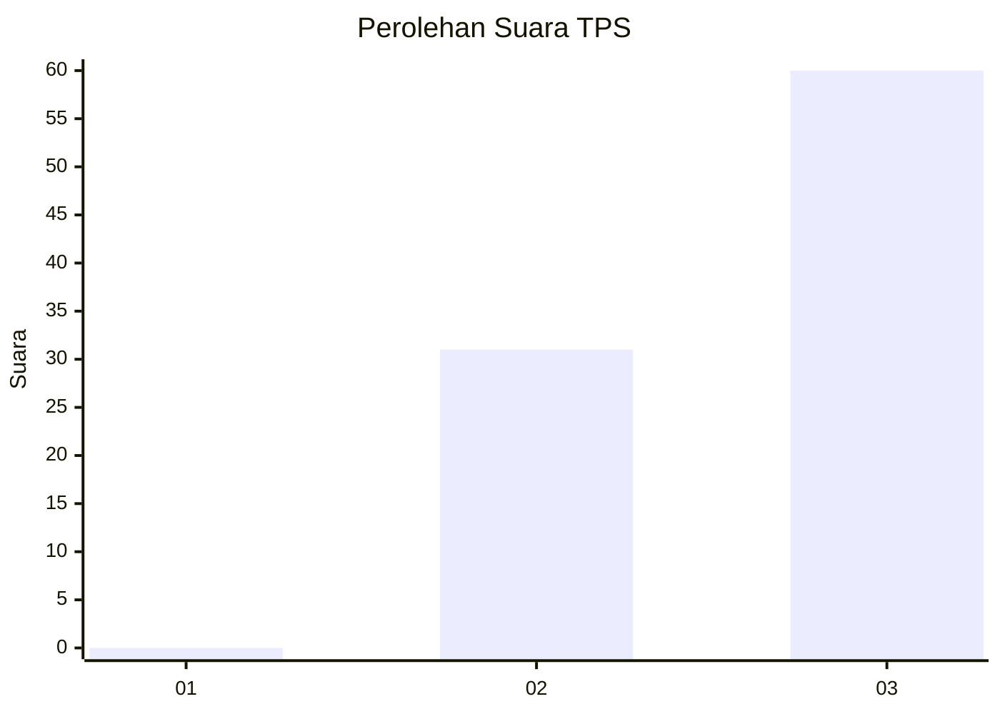
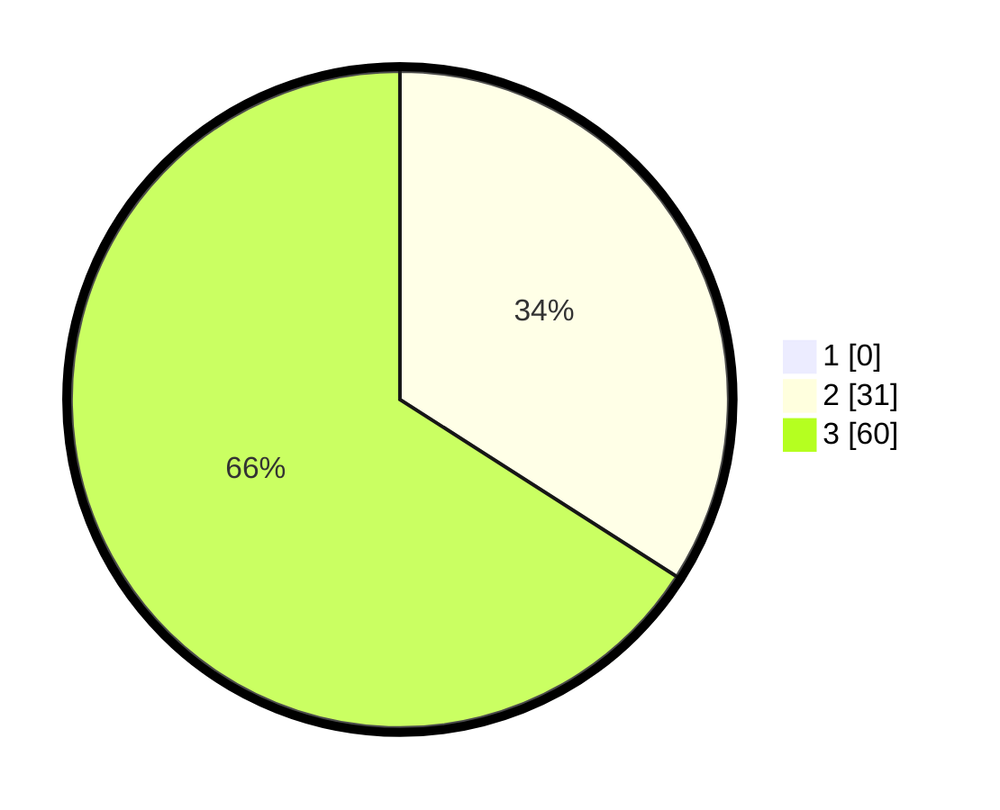

# Hasil

## Grafik

## Tabel

| No. | Nama Paslon    | Suara | Suara (raw) | Persentase |
|:--- |:-------------- | -----:| -----------:| ----------:|
| 1   | ANIES MUHAIMIN | 0     | [0][p-1]    | 0,00       |
| 2   | PRABOWO GIBRAN | 31    | [31][p-2]   | 34,07      |
| 3   | GANJAR MAHFUD  | 60    | [60][p-3]   | 65,93      |

[p-1]: https://github.com/gigit-pemilu/pemilu-2024-19-kepulauan-bangka-belitung/blob/main/pilpres/hitung-suara/sub/19-kepulauan-bangka-belitung/sub/01-bangka/sub/02-belinyu/sub/1012-belinyu/sub/001-tps/sub/paslon-1.txt
[p-2]: https://github.com/gigit-pemilu/pemilu-2024-19-kepulauan-bangka-belitung/blob/main/pilpres/hitung-suara/sub/19-kepulauan-bangka-belitung/sub/01-bangka/sub/02-belinyu/sub/1012-belinyu/sub/001-tps/sub/paslon-2.txt
[p-3]: https://github.com/gigit-pemilu/pemilu-2024-19-kepulauan-bangka-belitung/blob/main/pilpres/hitung-suara/sub/19-kepulauan-bangka-belitung/sub/01-bangka/sub/02-belinyu/sub/1012-belinyu/sub/001-tps/sub/paslon-3.txt

## Foto C Plano

https://sirekap-obj-formc.kpu.go.id/a165/pemilu/ppwp/19/01/02/10/12/1901021012001-20240214-230614--92913a44-9b53-4025-884b-4150544a659e.jpg

https://sirekap-obj-formc.kpu.go.id/a165/pemilu/ppwp/19/01/02/10/12/1901021012001-20240214-230642--e80ec5b3-aac0-4c63-8171-ba8e539c2533.jpg

https://sirekap-obj-formc.kpu.go.id/a165/pemilu/ppwp/19/01/02/10/12/1901021012001-20240214-230701--758f7d0e-32b4-460f-9dec-77faf07450c3.jpg

## Metadata

| Key        | Value               |
| ---------- | ------------------- |
| Time Stamp | 2024-02-17 14:45:18 |

