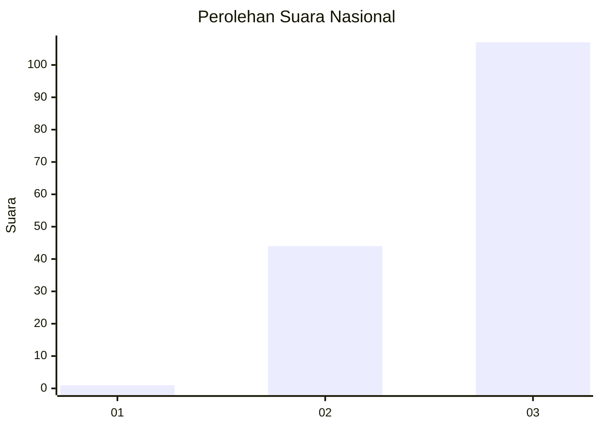
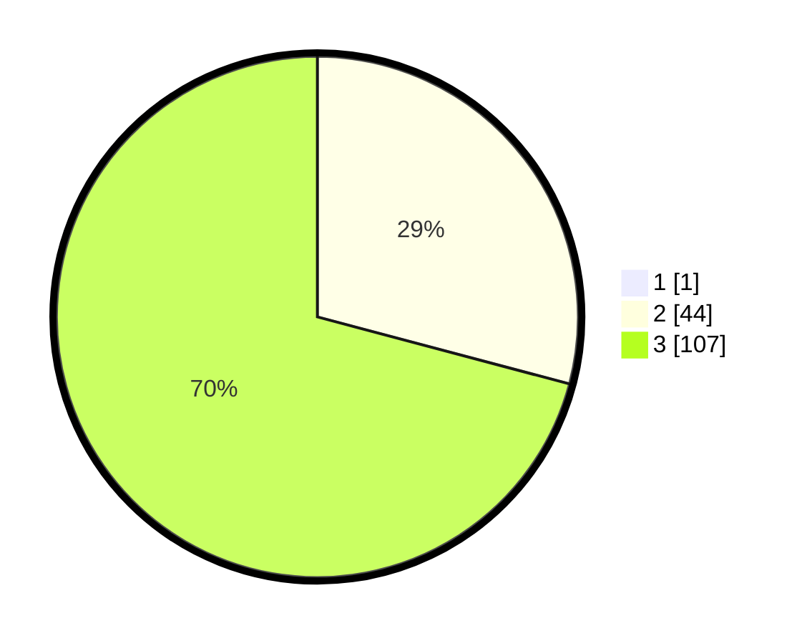

# Hasil

## Grafik

## Tabel

| No. | Nama Paslon    | Suara | Suara (raw) | Persentase |
|:--- |:-------------- | -----:| -----------:| ----------:|
| 1   | ANIES MUHAIMIN | 1     | [1][p-1]    | 0,66       |
| 2   | PRABOWO GIBRAN | 44    | [44][p-2]   | 28,95      |
| 3   | GANJAR MAHFUD  | 107   | [107][p-3]  | 70,39      |

[p-1]: https://github.com/gigit-pemilu/pemilu-2024/blob/main/pilpres/hitung-suara/sub/19-kepulauan-bangka-belitung/sub/01-bangka/sub/02-belinyu/sub/2008-bintet/sub/007-tps/sub/paslon-1.txt
[p-2]: https://github.com/gigit-pemilu/pemilu-2024/blob/main/pilpres/hitung-suara/sub/19-kepulauan-bangka-belitung/sub/01-bangka/sub/02-belinyu/sub/2008-bintet/sub/007-tps/sub/paslon-2.txt
[p-3]: https://github.com/gigit-pemilu/pemilu-2024/blob/main/pilpres/hitung-suara/sub/19-kepulauan-bangka-belitung/sub/01-bangka/sub/02-belinyu/sub/2008-bintet/sub/007-tps/sub/paslon-3.txt

## Foto C Plano

https://sirekap-obj-formc.kpu.go.id/dc71/pemilu/ppwp/19/01/02/20/08/1901022008007-20240215-005722--6f404154-64d5-4359-891c-1b03d9048436.jpg

https://sirekap-obj-formc.kpu.go.id/dc71/pemilu/ppwp/19/01/02/20/08/1901022008007-20240215-005831--3ea4d715-dd25-4500-8a25-31965fc9e1a0.jpg

https://sirekap-obj-formc.kpu.go.id/dc71/pemilu/ppwp/19/01/02/20/08/1901022008007-20240215-005423--d5596f85-2afa-4774-8f1d-56b1edd0d8fb.jpg

## Metadata

| Key        | Value               |
| ---------- | ------------------- |
| Time Stamp | 2024-02-17 14:45:18 |

