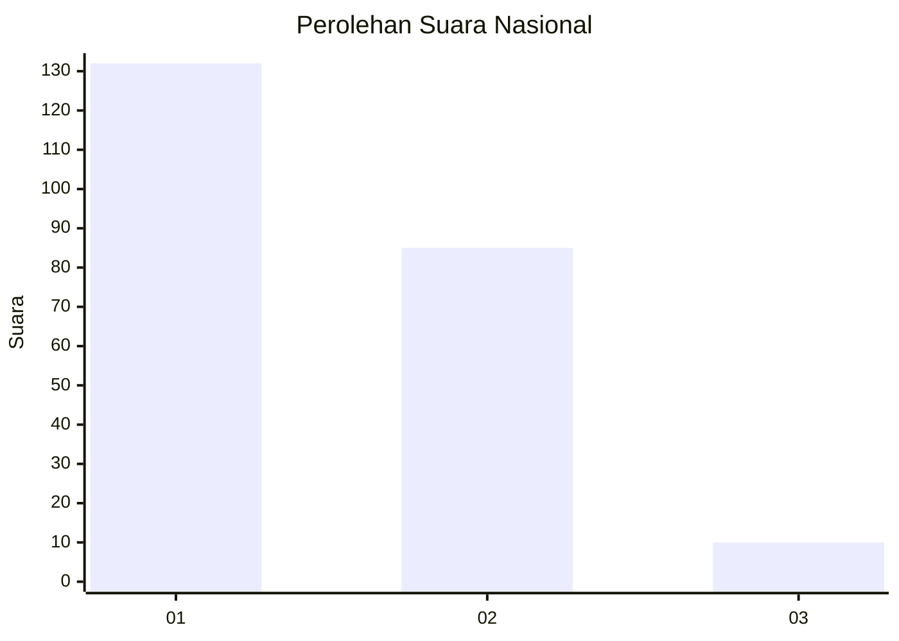
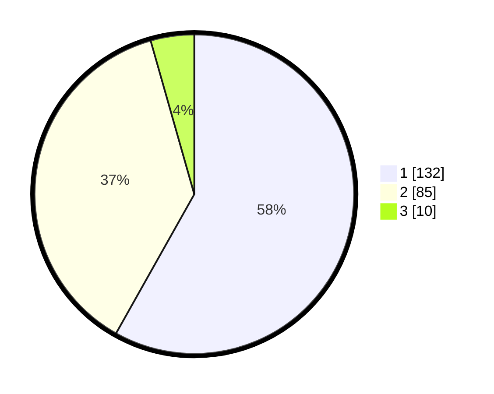

# Hasil

## Grafik

## Tabel

| No. | Nama Paslon    | Suara | Suara (raw) | Persentase |
|:--- |:-------------- | -----:| -----------:| ----------:|
| 1   | ANIES MUHAIMIN | 132   | [132][p-1]  | 58,15      |
| 2   | PRABOWO GIBRAN | 85    | [85][p-2]   | 37,44      |
| 3   | GANJAR MAHFUD  | 10    | [10][p-3]   | 4,41       |

[p-1]: https://github.com/gigit-pemilu/pemilu-2024/blob/main/pilpres/hitung-suara/sub/19-kepulauan-bangka-belitung/sub/01-bangka/sub/03-merawang/sub/2001-batu-rusa/sub/003-tps/sub/paslon-1.txt
[p-2]: https://github.com/gigit-pemilu/pemilu-2024/blob/main/pilpres/hitung-suara/sub/19-kepulauan-bangka-belitung/sub/01-bangka/sub/03-merawang/sub/2001-batu-rusa/sub/003-tps/sub/paslon-2.txt
[p-3]: https://github.com/gigit-pemilu/pemilu-2024/blob/main/pilpres/hitung-suara/sub/19-kepulauan-bangka-belitung/sub/01-bangka/sub/03-merawang/sub/2001-batu-rusa/sub/003-tps/sub/paslon-3.txt

## Foto C Plano

https://sirekap-obj-formc.kpu.go.id/eb0a/pemilu/ppwp/19/01/03/20/01/1901032001003-20240221-201906--eb60fee7-497a-4da2-85ce-1a441046e5de.jpg

https://sirekap-obj-formc.kpu.go.id/eb0a/pemilu/ppwp/19/01/03/20/01/1901032001003-20240221-202031--1af7310b-72fd-4d9c-adfa-826049bd2b87.jpg

https://sirekap-obj-formc.kpu.go.id/eb0a/pemilu/ppwp/19/01/03/20/01/1901032001003-20240221-202209--244927a5-2048-4ef3-a020-97bdb1cd6fb9.jpg

## Metadata

| Key        | Value               |
| ---------- | ------------------- |
| Time Stamp | 2024-02-24 22:31:28 |

