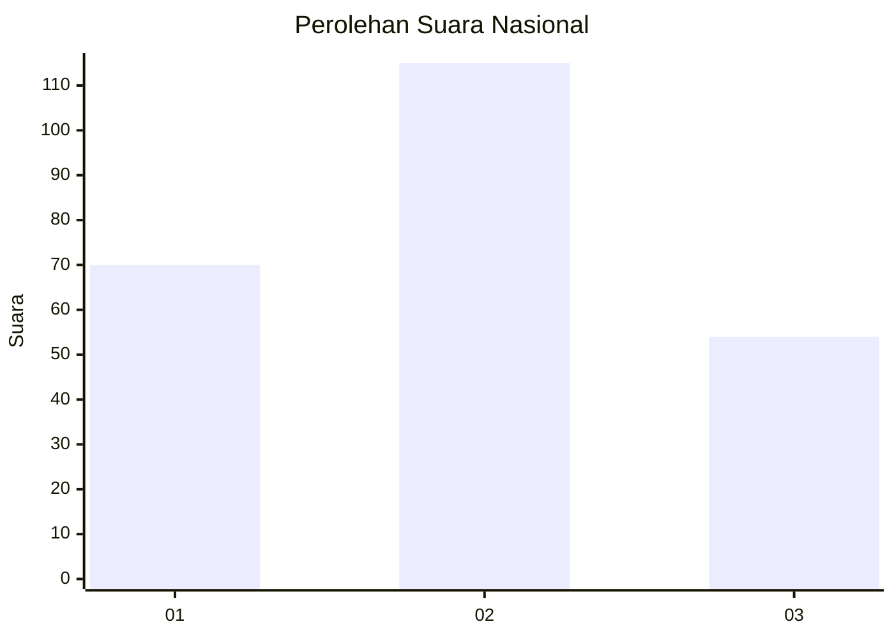
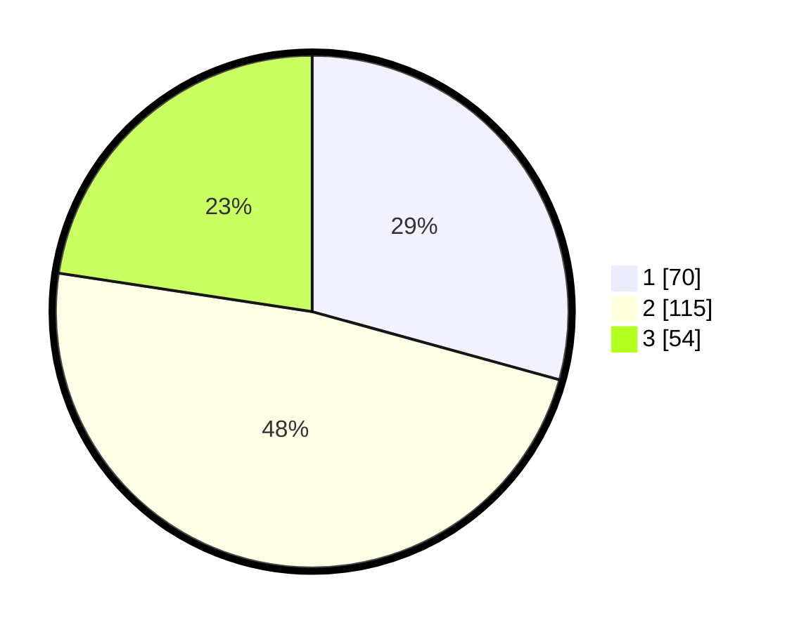

# Hasil

## Grafik

## Tabel

| No. | Nama Paslon    | Suara | Suara (raw) | Persentase |
|:--- |:-------------- | -----:| -----------:| ----------:|
| 1   | ANIES MUHAIMIN | 70    | [70][p-1]   | 29,29      |
| 2   | PRABOWO GIBRAN | 115   | [115][p-2]  | 48,12      |
| 3   | GANJAR MAHFUD  | 54    | [54][p-3]   | 22,59      |

[p-1]: https://github.com/gigit-pemilu/pemilu-2024/blob/main/pilpres/hitung-suara/sub/19-kepulauan-bangka-belitung/sub/01-bangka/sub/03-merawang/sub/2001-batu-rusa/sub/006-tps/sub/paslon-1.txt
[p-2]: https://github.com/gigit-pemilu/pemilu-2024/blob/main/pilpres/hitung-suara/sub/19-kepulauan-bangka-belitung/sub/01-bangka/sub/03-merawang/sub/2001-batu-rusa/sub/006-tps/sub/paslon-2.txt
[p-3]: https://github.com/gigit-pemilu/pemilu-2024/blob/main/pilpres/hitung-suara/sub/19-kepulauan-bangka-belitung/sub/01-bangka/sub/03-merawang/sub/2001-batu-rusa/sub/006-tps/sub/paslon-3.txt

## Foto C Plano

https://sirekap-obj-formc.kpu.go.id/5081/pemilu/ppwp/19/01/03/20/01/1901032001006-20240215-004617--c716c33f-1e88-43d6-a910-fa5fad62a45f.jpg

https://sirekap-obj-formc.kpu.go.id/5081/pemilu/ppwp/19/01/03/20/01/1901032001006-20240215-004720--47c23c2a-3a9f-4c8e-a972-e880dc9436e7.jpg

https://sirekap-obj-formc.kpu.go.id/5081/pemilu/ppwp/19/01/03/20/01/1901032001006-20240215-004826--9cfce271-4c39-45b3-b20d-d4637576dd85.jpg

## Metadata

| Key        | Value               |
| ---------- | ------------------- |
| Time Stamp | 2024-02-25 14:00:00 |

