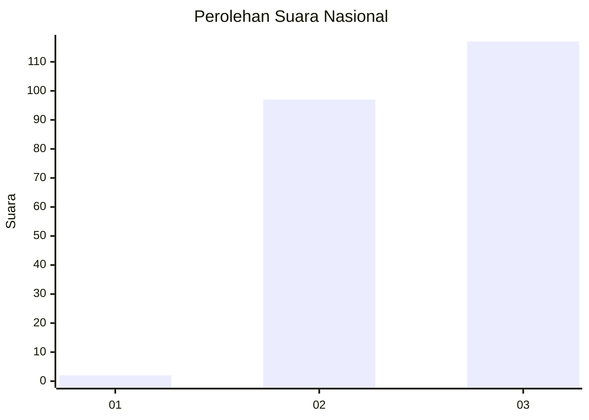
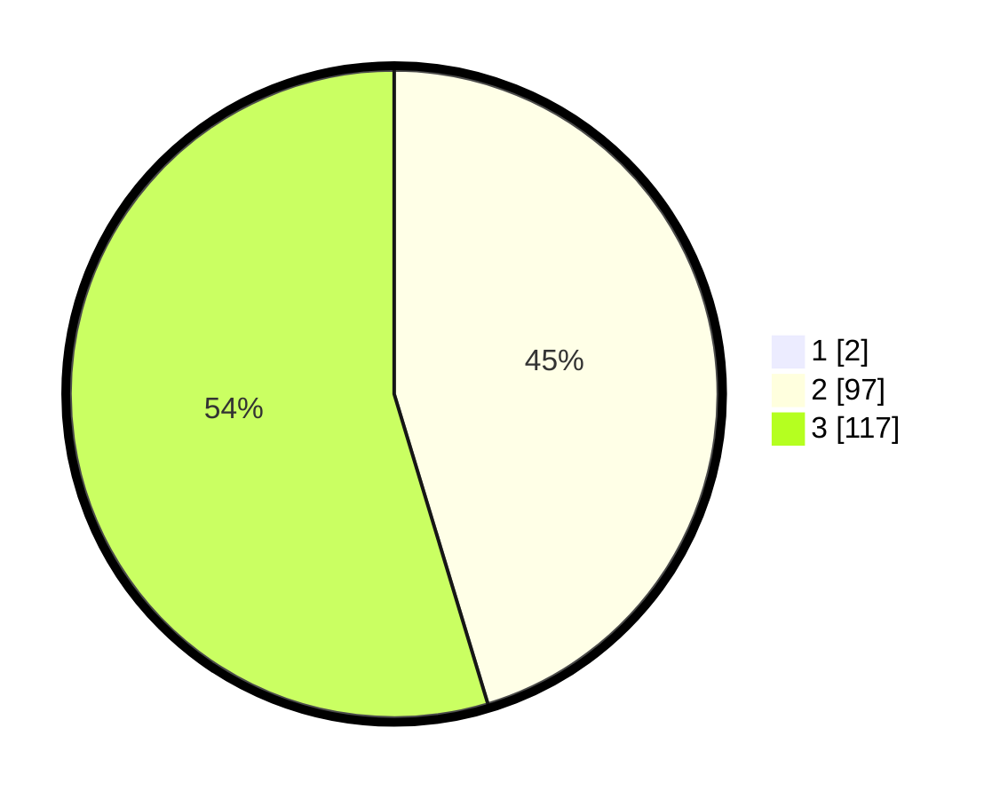

# Hasil

## Grafik

## Tabel

| No. | Nama Paslon    | Suara | Suara (raw) | Persentase |
|:--- |:-------------- | -----:| -----------:| ----------:|
| 1   | ANIES MUHAIMIN | 2     | [2][p-1]    | 0,93       |
| 2   | PRABOWO GIBRAN | 97    | [97][p-2]   | 44,91      |
| 3   | GANJAR MAHFUD  | 117   | [117][p-3]  | 54,17      |

[p-1]: https://github.com/gigit-pemilu/pemilu-2024/blob/main/pilpres/hitung-suara/sub/19-kepulauan-bangka-belitung/sub/01-bangka/sub/03-merawang/sub/2003-riding-panjang/sub/005-tps/sub/paslon-1.txt
[p-2]: https://github.com/gigit-pemilu/pemilu-2024/blob/main/pilpres/hitung-suara/sub/19-kepulauan-bangka-belitung/sub/01-bangka/sub/03-merawang/sub/2003-riding-panjang/sub/005-tps/sub/paslon-2.txt
[p-3]: https://github.com/gigit-pemilu/pemilu-2024/blob/main/pilpres/hitung-suara/sub/19-kepulauan-bangka-belitung/sub/01-bangka/sub/03-merawang/sub/2003-riding-panjang/sub/005-tps/sub/paslon-3.txt

## Foto C Plano

https://sirekap-obj-formc.kpu.go.id/8a44/pemilu/ppwp/19/01/03/20/03/1901032003005-20240221-150948--d33afbbf-ce4c-46c0-be06-1a7fe814e83a.jpg

https://sirekap-obj-formc.kpu.go.id/8a44/pemilu/ppwp/19/01/03/20/03/1901032003005-20240221-150735--b1d0082b-b346-4c48-bfc9-600dc14156fe.jpg

https://sirekap-obj-formc.kpu.go.id/8a44/pemilu/ppwp/19/01/03/20/03/1901032003005-20240221-150816--6745ce3a-910f-4c06-a0c4-9c76fc3f5d5c.jpg

## Metadata

| Key        | Value               |
| ---------- | ------------------- |
| Time Stamp | 2024-02-24 22:31:28 |

