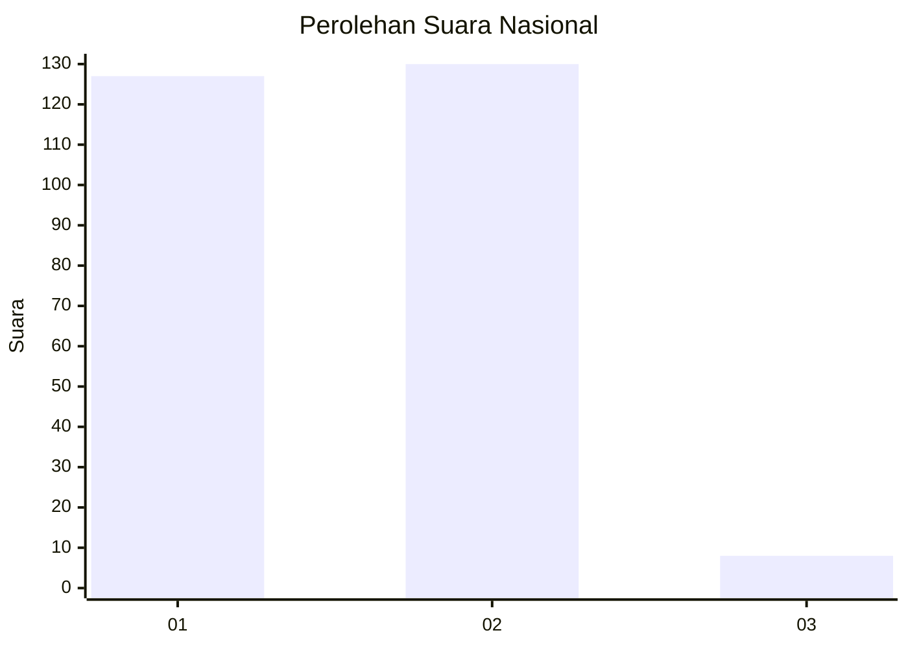
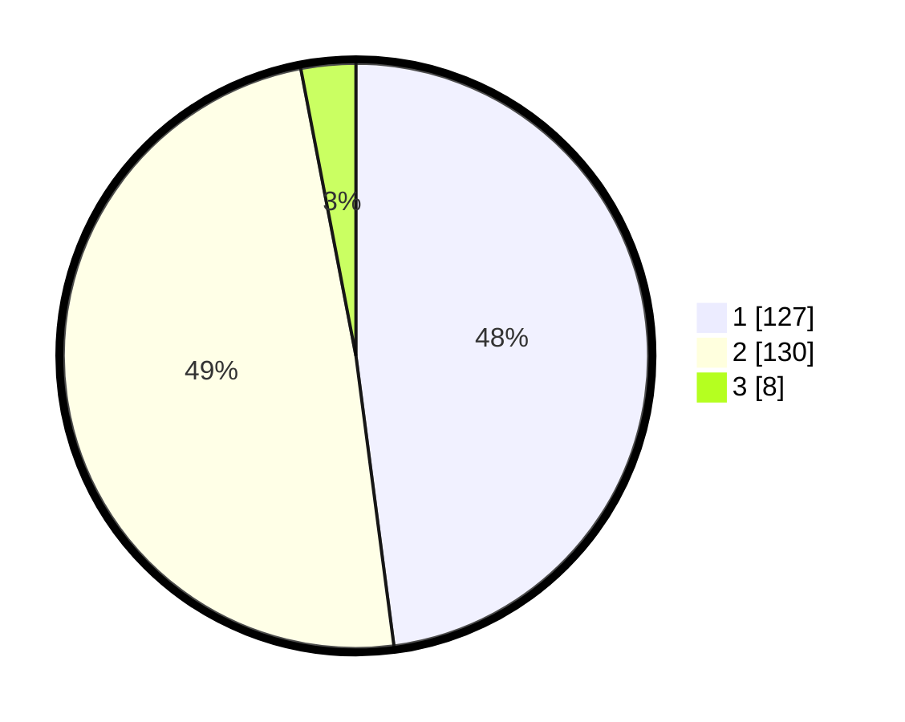

# Hasil

## Grafik

## Tabel

| No. | Nama Paslon    | Suara | Suara (raw) | Persentase |
|:--- |:-------------- | -----:| -----------:| ----------:|
| 1   | ANIES MUHAIMIN | 127   | [127][p-1]  | 47,92      |
| 2   | PRABOWO GIBRAN | 130   | [130][p-2]  | 49,06      |
| 3   | GANJAR MAHFUD  | 8     | [8][p-3]    | 3,02       |

[p-1]: https://github.com/gigit-pemilu/pemilu-2024/blob/main/pilpres/hitung-suara/sub/19-kepulauan-bangka-belitung/sub/01-bangka/sub/03-merawang/sub/2005-kimak/sub/003-tps/sub/paslon-1.txt
[p-2]: https://github.com/gigit-pemilu/pemilu-2024/blob/main/pilpres/hitung-suara/sub/19-kepulauan-bangka-belitung/sub/01-bangka/sub/03-merawang/sub/2005-kimak/sub/003-tps/sub/paslon-2.txt
[p-3]: https://github.com/gigit-pemilu/pemilu-2024/blob/main/pilpres/hitung-suara/sub/19-kepulauan-bangka-belitung/sub/01-bangka/sub/03-merawang/sub/2005-kimak/sub/003-tps/sub/paslon-3.txt

## Foto C Plano

https://sirekap-obj-formc.kpu.go.id/e8e1/pemilu/ppwp/19/01/03/20/05/1901032005003-20240215-035956--9d341b22-23b9-454f-ac50-56fd684d01dc.jpg

https://sirekap-obj-formc.kpu.go.id/e8e1/pemilu/ppwp/19/01/03/20/05/1901032005003-20240214-222517--497742ed-2f4b-420b-99eb-9b34a3e63327.jpg

https://sirekap-obj-formc.kpu.go.id/e8e1/pemilu/ppwp/19/01/03/20/05/1901032005003-20240214-223445--87c01436-04d0-4551-853c-35e7c2e688d7.jpg

## Metadata

| Key        | Value               |
| ---------- | ------------------- |
| Time Stamp | 2024-02-17 14:45:18 |

