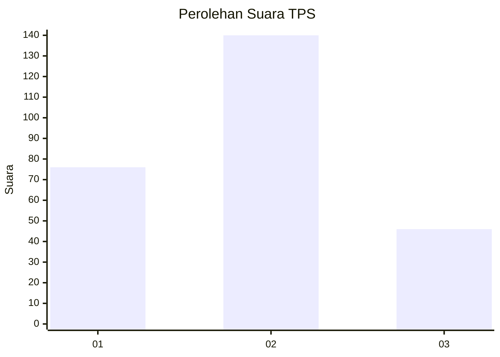
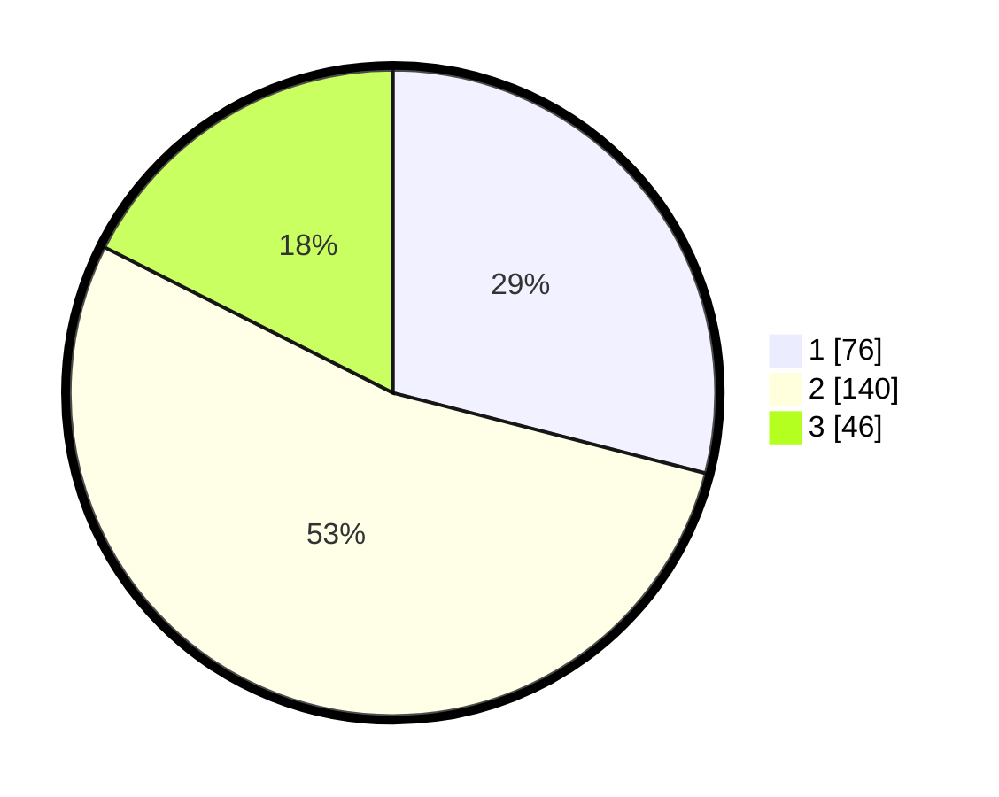

# Hasil

## Grafik

## Tabel

| No. | Nama Paslon    | Suara | Suara (raw) | Persentase |
|:--- |:-------------- | -----:| -----------:| ----------:|
| 1   | ANIES MUHAIMIN | 76    | [76][p-1]   | 29,01      |
| 2   | PRABOWO GIBRAN | 140   | [140][p-2]  | 53,44      |
| 3   | GANJAR MAHFUD  | 46    | [46][p-3]   | 17,56      |

[p-1]: https://github.com/gigit-pemilu/pemilu-2024-19-kepulauan-bangka-belitung/blob/main/pilpres/hitung-suara/sub/19-kepulauan-bangka-belitung/sub/01-bangka/sub/03-merawang/sub/2008-air-anyir/sub/001-tps/sub/paslon-1.txt
[p-2]: https://github.com/gigit-pemilu/pemilu-2024-19-kepulauan-bangka-belitung/blob/main/pilpres/hitung-suara/sub/19-kepulauan-bangka-belitung/sub/01-bangka/sub/03-merawang/sub/2008-air-anyir/sub/001-tps/sub/paslon-2.txt
[p-3]: https://github.com/gigit-pemilu/pemilu-2024-19-kepulauan-bangka-belitung/blob/main/pilpres/hitung-suara/sub/19-kepulauan-bangka-belitung/sub/01-bangka/sub/03-merawang/sub/2008-air-anyir/sub/001-tps/sub/paslon-3.txt

## Foto C Plano

https://sirekap-obj-formc.kpu.go.id/79d1/pemilu/ppwp/19/01/03/20/08/1901032008001-20240221-144458--b5e9f25d-0802-42e8-b911-a5cc12ec760f.jpg

https://sirekap-obj-formc.kpu.go.id/79d1/pemilu/ppwp/19/01/03/20/08/1901032008001-20240221-144639--edd5e0bc-5555-415e-bf8e-38bcd6468c3d.jpg

https://sirekap-obj-formc.kpu.go.id/79d1/pemilu/ppwp/19/01/03/20/08/1901032008001-20240221-144801--63fe6a66-0034-4219-85af-b40039d3d1e4.jpg

## Metadata

| Key        | Value               |
| ---------- | ------------------- |
| Time Stamp | 2024-02-25 14:00:00 |

