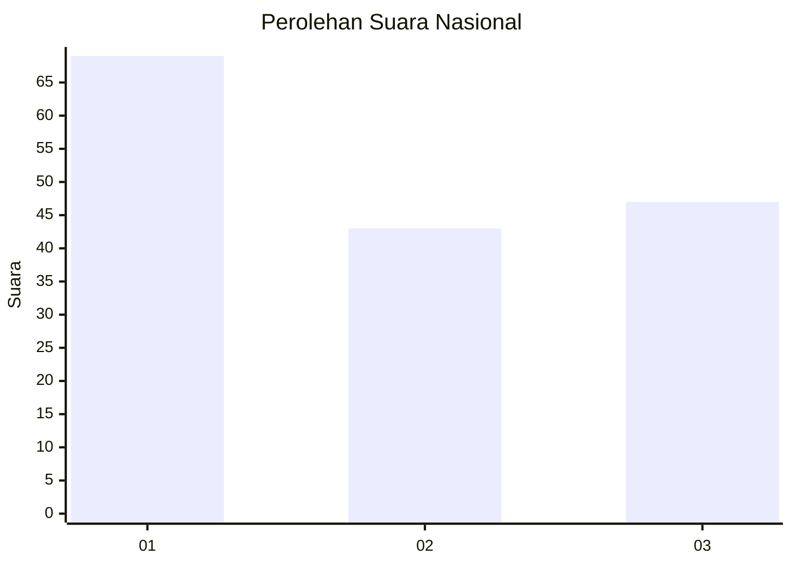
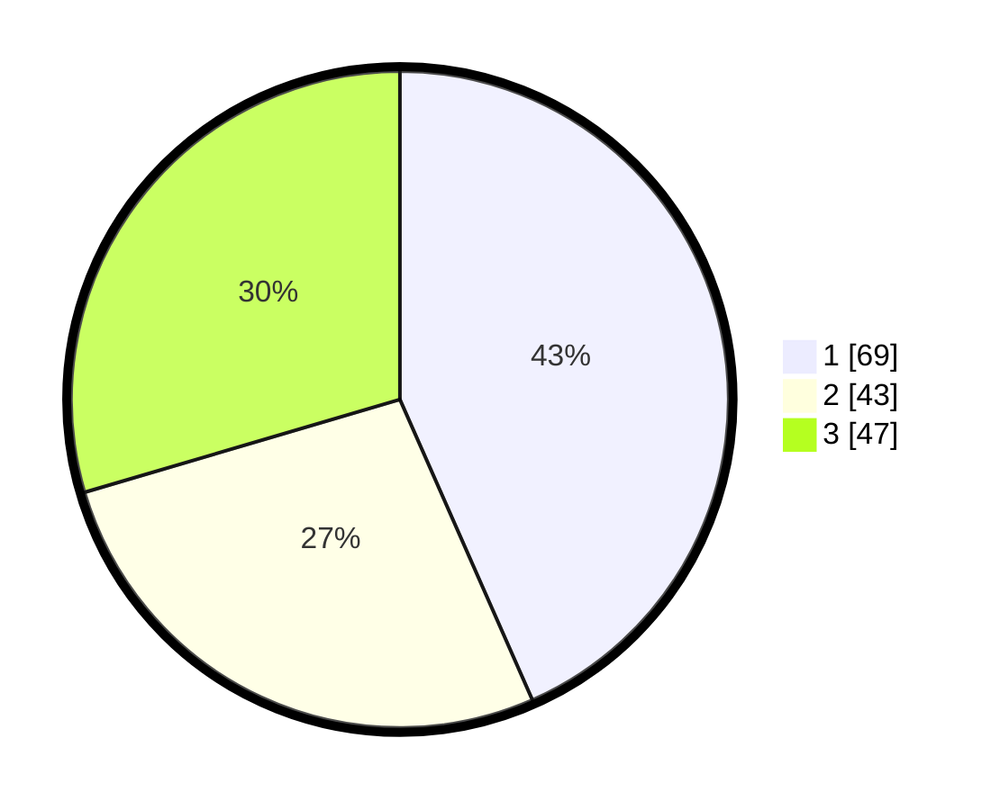

# Hasil

## Grafik

## Tabel

| No. | Nama Paslon    | Suara | Suara (raw) | Persentase |
|:--- |:-------------- | -----:| -----------:| ----------:|
| 1   | ANIES MUHAIMIN | 69    | [69][p-1]   | 43,40      |
| 2   | PRABOWO GIBRAN | 43    | [43][p-2]   | 27,04      |
| 3   | GANJAR MAHFUD  | 47    | [47][p-3]   | 29,56      |

[p-1]: https://github.com/gigit-pemilu/pemilu-2024/blob/main/pilpres/hitung-suara/sub/19-kepulauan-bangka-belitung/sub/01-bangka/sub/03-merawang/sub/2008-air-anyir/sub/005-tps/sub/paslon-1.txt
[p-2]: https://github.com/gigit-pemilu/pemilu-2024/blob/main/pilpres/hitung-suara/sub/19-kepulauan-bangka-belitung/sub/01-bangka/sub/03-merawang/sub/2008-air-anyir/sub/005-tps/sub/paslon-2.txt
[p-3]: https://github.com/gigit-pemilu/pemilu-2024/blob/main/pilpres/hitung-suara/sub/19-kepulauan-bangka-belitung/sub/01-bangka/sub/03-merawang/sub/2008-air-anyir/sub/005-tps/sub/paslon-3.txt

## Foto C Plano

https://sirekap-obj-formc.kpu.go.id/3163/pemilu/ppwp/19/01/03/20/08/1901032008005-20240221-111618--c24295ba-abe9-472a-87c9-e5c05781bfd3.jpg

https://sirekap-obj-formc.kpu.go.id/3163/pemilu/ppwp/19/01/03/20/08/1901032008005-20240221-111756--686232d6-3695-4078-81be-4a487c458b6b.jpg

https://sirekap-obj-formc.kpu.go.id/3163/pemilu/ppwp/19/01/03/20/08/1901032008005-20240221-111854--de52fae9-85e5-400f-b873-0453a6287f67.jpg

## Metadata

| Key        | Value               |
| ---------- | ------------------- |
| Time Stamp | 2024-02-25 15:00:00 |

