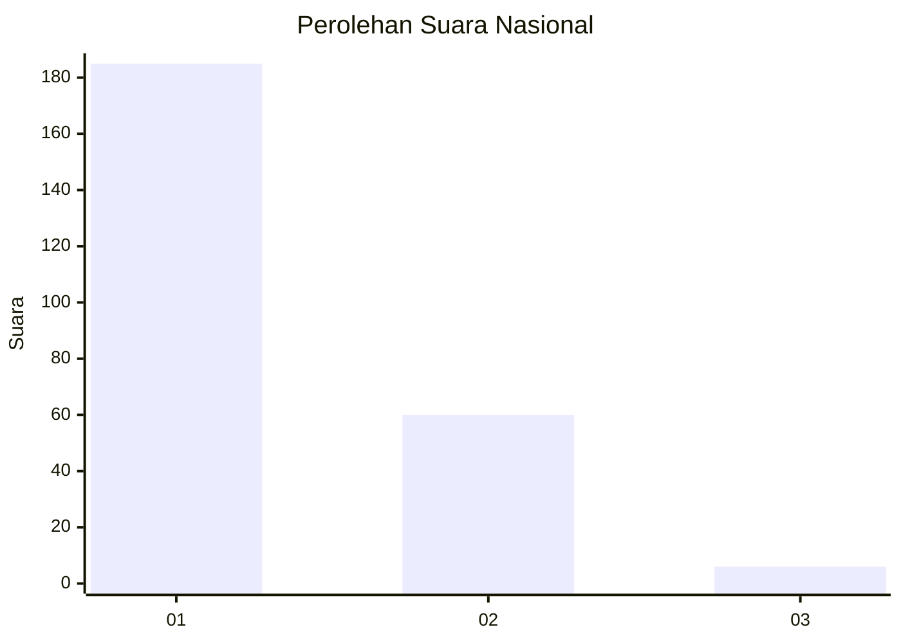
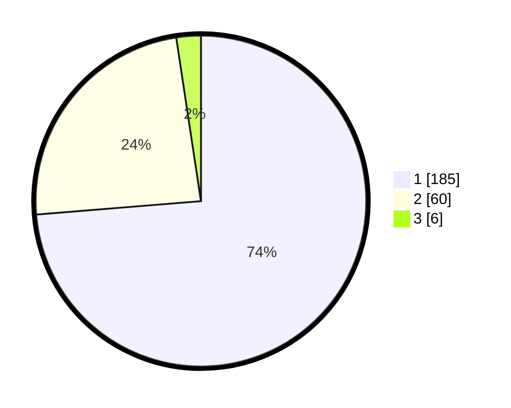

# Hasil

## Grafik

## Tabel

| No. | Nama Paslon    | Suara | Suara (raw) | Persentase |
|:--- |:-------------- | -----:| -----------:| ----------:|
| 1   | ANIES MUHAIMIN | 185   | [185][p-1]  | 73,71      |
| 2   | PRABOWO GIBRAN | 60    | [60][p-2]   | 23,90      |
| 3   | GANJAR MAHFUD  | 6     | [6][p-3]    | 2,39       |

[p-1]: https://github.com/gigit-pemilu/pemilu-2024/blob/main/pilpres/hitung-suara/sub/19-kepulauan-bangka-belitung/sub/01-bangka/sub/03-merawang/sub/2010-jada-bahrin/sub/005-tps/sub/paslon-1.txt
[p-2]: https://github.com/gigit-pemilu/pemilu-2024/blob/main/pilpres/hitung-suara/sub/19-kepulauan-bangka-belitung/sub/01-bangka/sub/03-merawang/sub/2010-jada-bahrin/sub/005-tps/sub/paslon-2.txt
[p-3]: https://github.com/gigit-pemilu/pemilu-2024/blob/main/pilpres/hitung-suara/sub/19-kepulauan-bangka-belitung/sub/01-bangka/sub/03-merawang/sub/2010-jada-bahrin/sub/005-tps/sub/paslon-3.txt

## Foto C Plano

https://sirekap-obj-formc.kpu.go.id/507e/pemilu/ppwp/19/01/03/20/10/1901032010005-20240215-004425--9849e405-8ab3-4bce-b781-71fc3a545606.jpg

https://sirekap-obj-formc.kpu.go.id/507e/pemilu/ppwp/19/01/03/20/10/1901032010005-20240215-032501--de550a63-5fdc-497c-9b84-d259036d19de.jpg

https://sirekap-obj-formc.kpu.go.id/507e/pemilu/ppwp/19/01/03/20/10/1901032010005-20240215-004833--1e99f58c-68a6-4dbd-96fa-e50e1f669e83.jpg

## Metadata

| Key        | Value               |
| ---------- | ------------------- |
| Time Stamp | 2024-02-17 14:45:18 |

