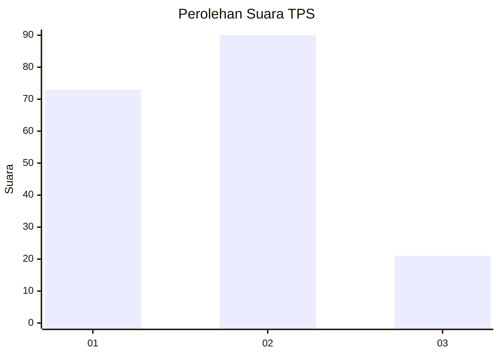
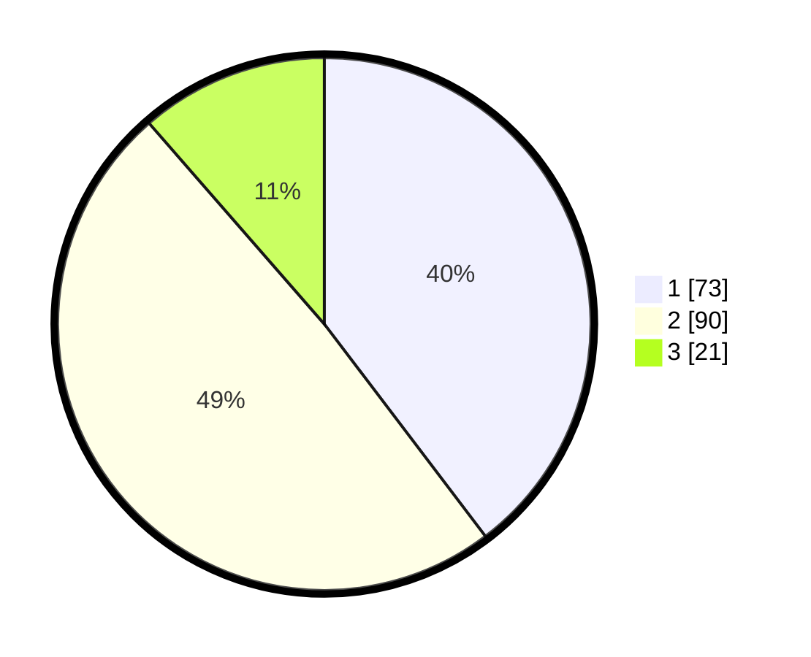

# Hasil

## Grafik

## Tabel

| No. | Nama Paslon    | Suara | Suara (raw) | Persentase |
|:--- |:-------------- | -----:| -----------:| ----------:|
| 1   | ANIES MUHAIMIN | 73    | [73][p-1]   | 39,67      |
| 2   | PRABOWO GIBRAN | 90    | [90][p-2]   | 48,91      |
| 3   | GANJAR MAHFUD  | 21    | [21][p-3]   | 11,41      |

[p-1]: https://github.com/gigit-pemilu/pemilu-2024-19-kepulauan-bangka-belitung/blob/main/pilpres/hitung-suara/sub/19-kepulauan-bangka-belitung/sub/01-bangka/sub/04-mendo-barat/sub/2001-petaling/sub/001-tps/sub/paslon-1.txt
[p-2]: https://github.com/gigit-pemilu/pemilu-2024-19-kepulauan-bangka-belitung/blob/main/pilpres/hitung-suara/sub/19-kepulauan-bangka-belitung/sub/01-bangka/sub/04-mendo-barat/sub/2001-petaling/sub/001-tps/sub/paslon-2.txt
[p-3]: https://github.com/gigit-pemilu/pemilu-2024-19-kepulauan-bangka-belitung/blob/main/pilpres/hitung-suara/sub/19-kepulauan-bangka-belitung/sub/01-bangka/sub/04-mendo-barat/sub/2001-petaling/sub/001-tps/sub/paslon-3.txt

## Foto C Plano

https://sirekap-obj-formc.kpu.go.id/91f0/pemilu/ppwp/19/01/04/20/01/1901042001001-20240221-142710--f3adb5d2-5074-4a41-81bf-6918e1fa4a9b.jpg

https://sirekap-obj-formc.kpu.go.id/91f0/pemilu/ppwp/19/01/04/20/01/1901042001001-20240221-171558--6f442782-21b1-4c9c-84c5-72d40e0ceb0a.jpg

https://sirekap-obj-formc.kpu.go.id/91f0/pemilu/ppwp/19/01/04/20/01/1901042001001-20240221-171707--3c0f180c-a008-41b8-87de-a0a971812eb3.jpg

## Metadata

| Key        | Value               |
| ---------- | ------------------- |
| Time Stamp | 2024-02-24 22:31:28 |

