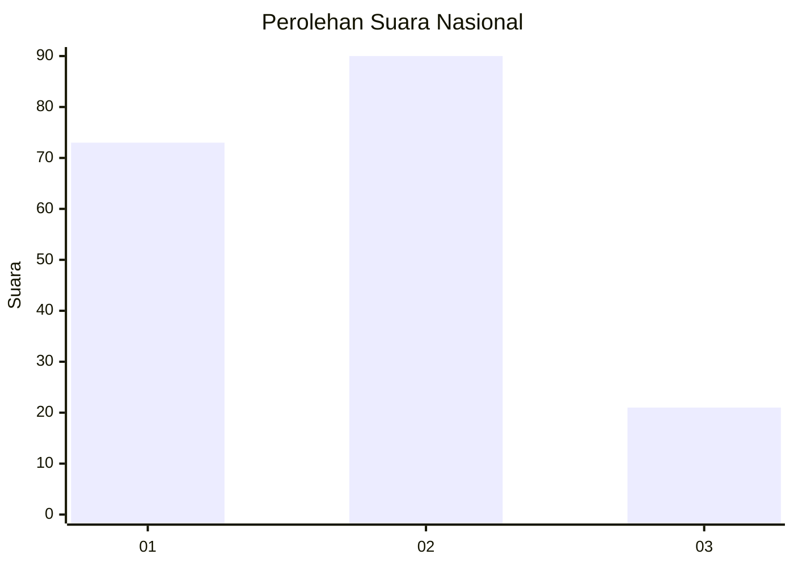
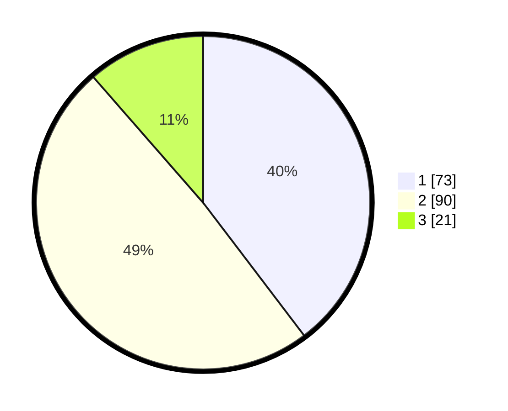

# Hasil

## Grafik

## Tabel

| No. | Nama Paslon    | Suara | Suara (raw) | Persentase |
|:--- |:-------------- | -----:| -----------:| ----------:|
| 1   | ANIES MUHAIMIN | 73    | [73][p-1]   | 39,67      |
| 2   | PRABOWO GIBRAN | 90    | [90][p-2]   | 48,91      |
| 3   | GANJAR MAHFUD  | 21    | [21][p-3]   | 11,41      |

[p-1]: https://github.com/gigit-pemilu/pemilu-2024/blob/main/pilpres/hitung-suara/sub/19-kepulauan-bangka-belitung/sub/01-bangka/sub/04-mendo-barat/sub/2001-petaling/sub/003-tps/sub/paslon-1.txt
[p-2]: https://github.com/gigit-pemilu/pemilu-2024/blob/main/pilpres/hitung-suara/sub/19-kepulauan-bangka-belitung/sub/01-bangka/sub/04-mendo-barat/sub/2001-petaling/sub/003-tps/sub/paslon-2.txt
[p-3]: https://github.com/gigit-pemilu/pemilu-2024/blob/main/pilpres/hitung-suara/sub/19-kepulauan-bangka-belitung/sub/01-bangka/sub/04-mendo-barat/sub/2001-petaling/sub/003-tps/sub/paslon-3.txt

## Foto C Plano

https://sirekap-obj-formc.kpu.go.id/39df/pemilu/ppwp/19/01/04/20/01/1901042001003-20240221-194653--80d06af2-b50d-4dd0-9e0f-6f50623f8691.jpg

https://sirekap-obj-formc.kpu.go.id/39df/pemilu/ppwp/19/01/04/20/01/1901042001003-20240221-194757--63fb6f26-18f1-4167-8cb6-e30f3df6f3b3.jpg

https://sirekap-obj-formc.kpu.go.id/39df/pemilu/ppwp/19/01/04/20/01/1901042001003-20240221-195104--c45c2dad-c576-4d17-88a1-12e4bf693de6.jpg

## Metadata

| Key        | Value               |
| ---------- | ------------------- |
| Time Stamp | 2024-02-26 15:00:00 |

