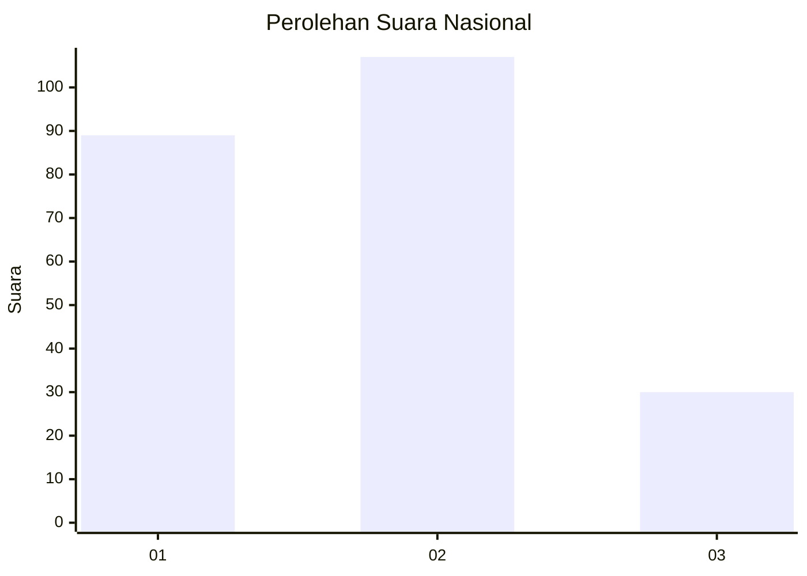
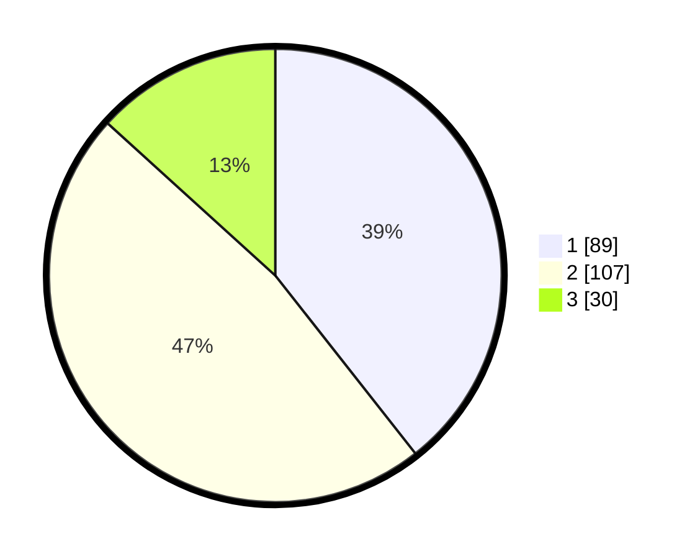

# Hasil

## Grafik

## Tabel

| No. | Nama Paslon    | Suara | Suara (raw) | Persentase |
|:--- |:-------------- | -----:| -----------:| ----------:|
| 1   | ANIES MUHAIMIN | 89    | [89][p-1]   | 39,38      |
| 2   | PRABOWO GIBRAN | 107   | [107][p-2]  | 47,35      |
| 3   | GANJAR MAHFUD  | 30    | [30][p-3]   | 13,27      |

[p-1]: https://github.com/gigit-pemilu/pemilu-2024/blob/main/pilpres/hitung-suara/sub/19-kepulauan-bangka-belitung/sub/01-bangka/sub/04-mendo-barat/sub/2001-petaling/sub/004-tps/sub/paslon-1.txt
[p-2]: https://github.com/gigit-pemilu/pemilu-2024/blob/main/pilpres/hitung-suara/sub/19-kepulauan-bangka-belitung/sub/01-bangka/sub/04-mendo-barat/sub/2001-petaling/sub/004-tps/sub/paslon-2.txt
[p-3]: https://github.com/gigit-pemilu/pemilu-2024/blob/main/pilpres/hitung-suara/sub/19-kepulauan-bangka-belitung/sub/01-bangka/sub/04-mendo-barat/sub/2001-petaling/sub/004-tps/sub/paslon-3.txt

## Foto C Plano

https://sirekap-obj-formc.kpu.go.id/4361/pemilu/ppwp/19/01/04/20/01/1901042001004-20240224-235417--3ddea259-82ef-476c-a63f-2c513f24e2dc.jpg

https://sirekap-obj-formc.kpu.go.id/4361/pemilu/ppwp/19/01/04/20/01/1901042001004-20240225-000214--d1f230c6-a757-4f90-ac5c-065f8aacffb2.jpg

https://sirekap-obj-formc.kpu.go.id/4361/pemilu/ppwp/19/01/04/20/01/1901042001004-20240224-235911--5b1b8b0a-c77a-4bf7-90ff-0dac82510078.jpg

## Metadata

| Key        | Value               |
| ---------- | ------------------- |
| Time Stamp | 2024-02-25 13:00:00 |

