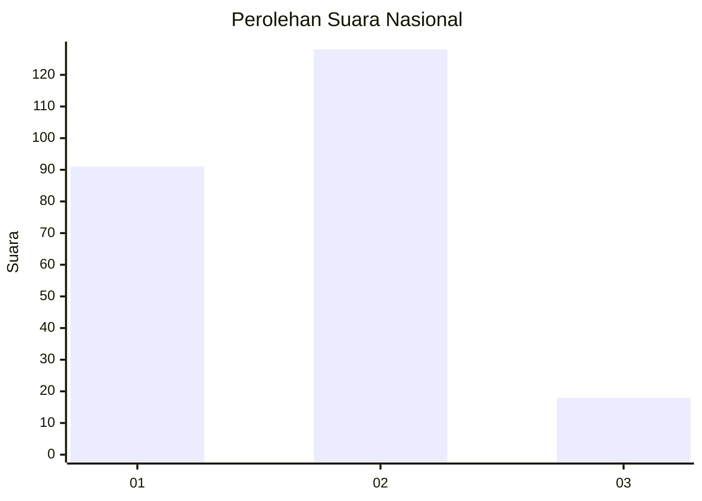

# Hasil

## Grafik

## Tabel

| No. | Nama Paslon    | Suara | Suara (raw) | Persentase |
|:--- |:-------------- | -----:| -----------:| ----------:|
| 1   | ANIES MUHAIMIN | 91    | [91][p-1]   | 38,40      |
| 2   | PRABOWO GIBRAN | 128   | [128][p-2]  | 54,01      |
| 3   | GANJAR MAHFUD  | 18    | [18][p-3]   | 7,59       |

[p-1]: https://github.com/gigit-pemilu/pemilu-2024/blob/main/pilpres/hitung-suara/sub/19-kepulauan-bangka-belitung/sub/01-bangka/sub/04-mendo-barat/sub/2001-petaling/sub/005-tps/sub/paslon-1.txt
[p-2]: https://github.com/gigit-pemilu/pemilu-2024/blob/main/pilpres/hitung-suara/sub/19-kepulauan-bangka-belitung/sub/01-bangka/sub/04-mendo-barat/sub/2001-petaling/sub/005-tps/sub/paslon-2.txt
[p-3]: https://github.com/gigit-pemilu/pemilu-2024/blob/main/pilpres/hitung-suara/sub/19-kepulauan-bangka-belitung/sub/01-bangka/sub/04-mendo-barat/sub/2001-petaling/sub/005-tps/sub/paslon-3.txt

## Foto C Plano

https://sirekap-obj-formc.kpu.go.id/62d6/pemilu/ppwp/19/01/04/20/01/1901042001005-20240221-200828--b19a515c-dc4b-4eb6-b8b2-4f26cf11d81f.jpg

https://sirekap-obj-formc.kpu.go.id/62d6/pemilu/ppwp/19/01/04/20/01/1901042001005-20240221-160801--b72c11cb-4e51-4a44-b55f-7d2a1f714682.jpg

https://sirekap-obj-formc.kpu.go.id/62d6/pemilu/ppwp/19/01/04/20/01/1901042001005-20240221-160901--6e6734b7-0ed3-4bba-9609-019e1c2d4382.jpg

## Metadata

| Key        | Value               |
| ---------- | ------------------- |
| Time Stamp | 2024-02-25 15:00:00 |

