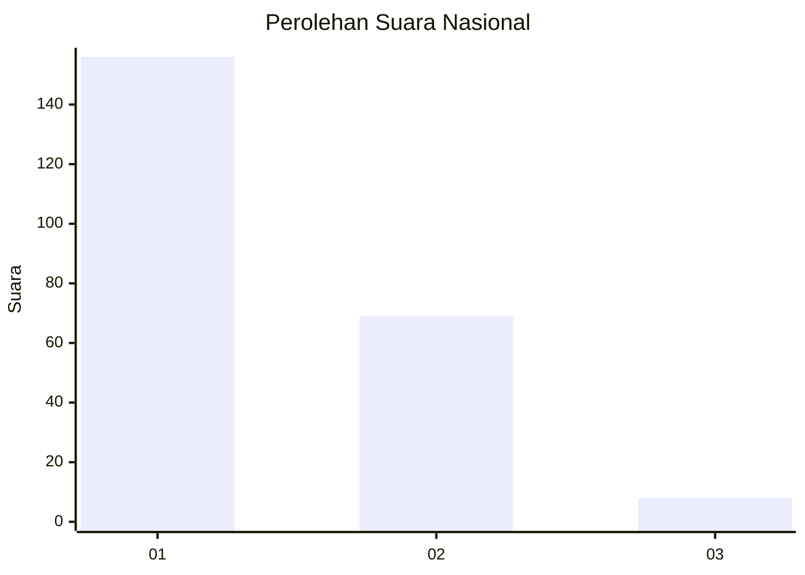
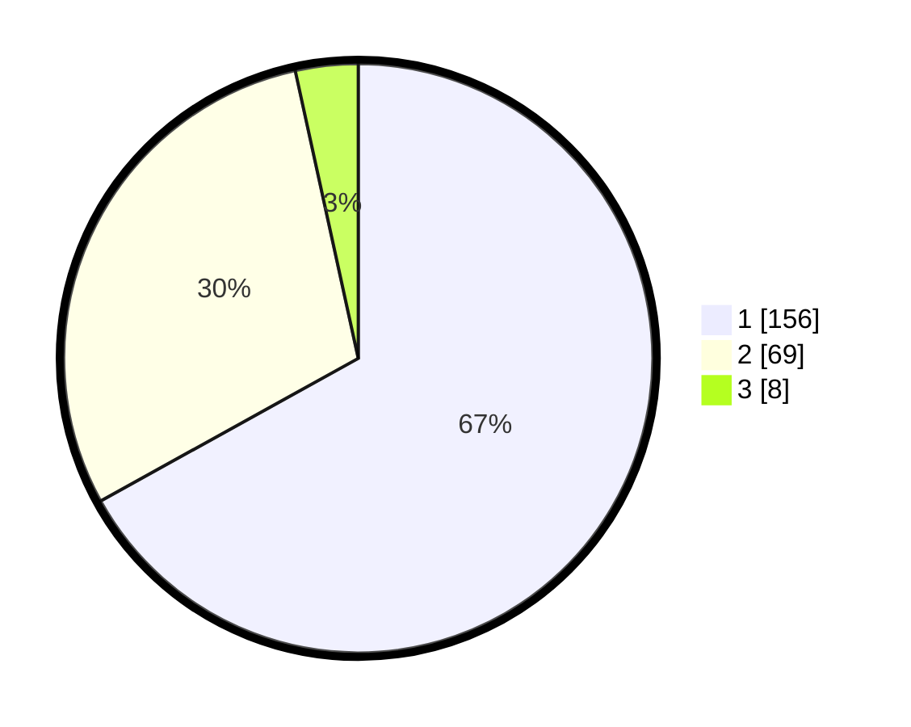

# Hasil

## Grafik

## Tabel

| No. | Nama Paslon    | Suara | Suara (raw) | Persentase |
|:--- |:-------------- | -----:| -----------:| ----------:|
| 1   | ANIES MUHAIMIN | 156   | [156][p-1]  | 66,95      |
| 2   | PRABOWO GIBRAN | 69    | [69][p-2]   | 29,61      |
| 3   | GANJAR MAHFUD  | 8     | [8][p-3]    | 3,43       |

[p-1]: https://github.com/gigit-pemilu/pemilu-2024/blob/main/pilpres/hitung-suara/sub/19-kepulauan-bangka-belitung/sub/01-bangka/sub/04-mendo-barat/sub/2001-petaling/sub/008-tps/sub/paslon-1.txt
[p-2]: https://github.com/gigit-pemilu/pemilu-2024/blob/main/pilpres/hitung-suara/sub/19-kepulauan-bangka-belitung/sub/01-bangka/sub/04-mendo-barat/sub/2001-petaling/sub/008-tps/sub/paslon-2.txt
[p-3]: https://github.com/gigit-pemilu/pemilu-2024/blob/main/pilpres/hitung-suara/sub/19-kepulauan-bangka-belitung/sub/01-bangka/sub/04-mendo-barat/sub/2001-petaling/sub/008-tps/sub/paslon-3.txt

## Foto C Plano

https://sirekap-obj-formc.kpu.go.id/43cc/pemilu/ppwp/19/01/04/20/01/1901042001008-20240222-171915--63e7dd03-ac39-4a7e-a4d7-5feb58f5b6eb.jpg

https://sirekap-obj-formc.kpu.go.id/43cc/pemilu/ppwp/19/01/04/20/01/1901042001008-20240222-172113--a647b656-ea4d-4383-b5c3-df345b59e016.jpg

https://sirekap-obj-formc.kpu.go.id/43cc/pemilu/ppwp/19/01/04/20/01/1901042001008-20240222-172739--284c55de-c89b-4bba-a16d-aa07ad27f1ce.jpg

## Metadata

| Key        | Value               |
| ---------- | ------------------- |
| Time Stamp | 2024-02-25 21:00:00 |

