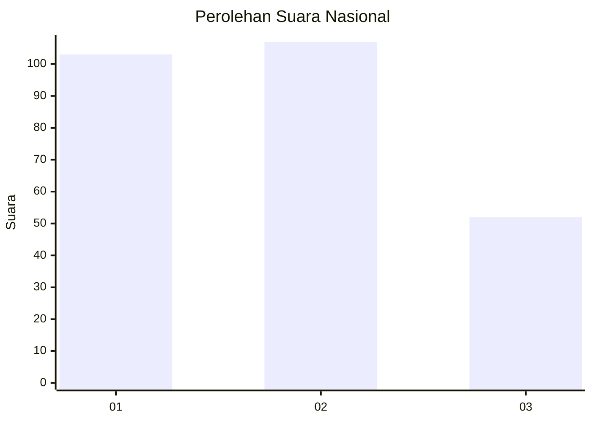
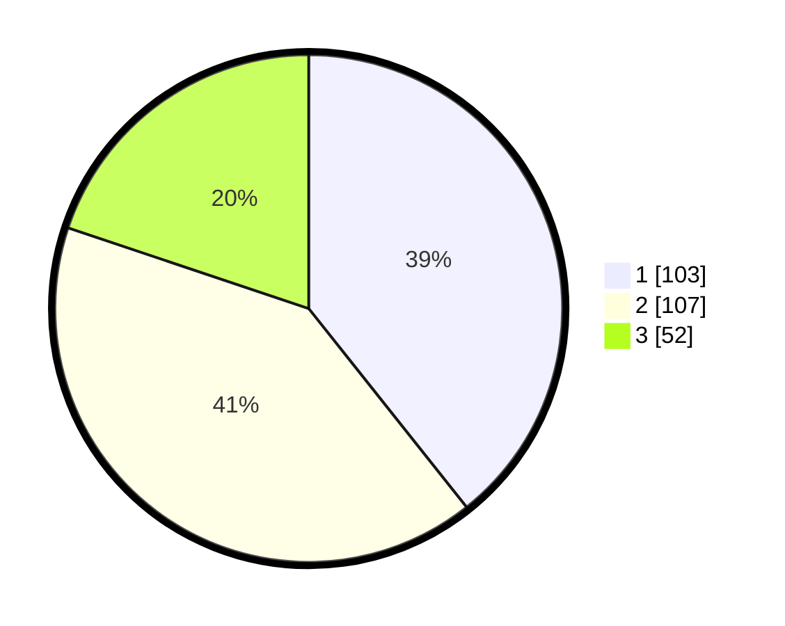

# Hasil

## Grafik

## Tabel

| No. | Nama Paslon    | Suara | Suara (raw) | Persentase |
|:--- |:-------------- | -----:| -----------:| ----------:|
| 1   | ANIES MUHAIMIN | 103   | [103][p-1]  | 39,31      |
| 2   | PRABOWO GIBRAN | 107   | [107][p-2]  | 40,84      |
| 3   | GANJAR MAHFUD  | 52    | [52][p-3]   | 19,85      |

[p-1]: https://github.com/gigit-pemilu/pemilu-2024/blob/main/pilpres/hitung-suara/sub/19-kepulauan-bangka-belitung/sub/01-bangka/sub/04-mendo-barat/sub/2002-penagan/sub/009-tps/sub/paslon-1.txt
[p-2]: https://github.com/gigit-pemilu/pemilu-2024/blob/main/pilpres/hitung-suara/sub/19-kepulauan-bangka-belitung/sub/01-bangka/sub/04-mendo-barat/sub/2002-penagan/sub/009-tps/sub/paslon-2.txt
[p-3]: https://github.com/gigit-pemilu/pemilu-2024/blob/main/pilpres/hitung-suara/sub/19-kepulauan-bangka-belitung/sub/01-bangka/sub/04-mendo-barat/sub/2002-penagan/sub/009-tps/sub/paslon-3.txt

## Foto C Plano

https://sirekap-obj-formc.kpu.go.id/f904/pemilu/ppwp/19/01/04/20/02/1901042002009-20240223-161239--1fbc7530-d81a-41d8-b896-f4eab9a12a86.jpg

https://sirekap-obj-formc.kpu.go.id/f904/pemilu/ppwp/19/01/04/20/02/1901042002009-20240223-161401--748957a4-41fb-44b2-9f09-89e75972f667.jpg

https://sirekap-obj-formc.kpu.go.id/f904/pemilu/ppwp/19/01/04/20/02/1901042002009-20240223-161548--cd81c1ad-061d-42e8-8fee-89eb0837cdfc.jpg

## Metadata

| Key        | Value               |
| ---------- | ------------------- |
| Time Stamp | 2024-02-26 16:00:00 |

