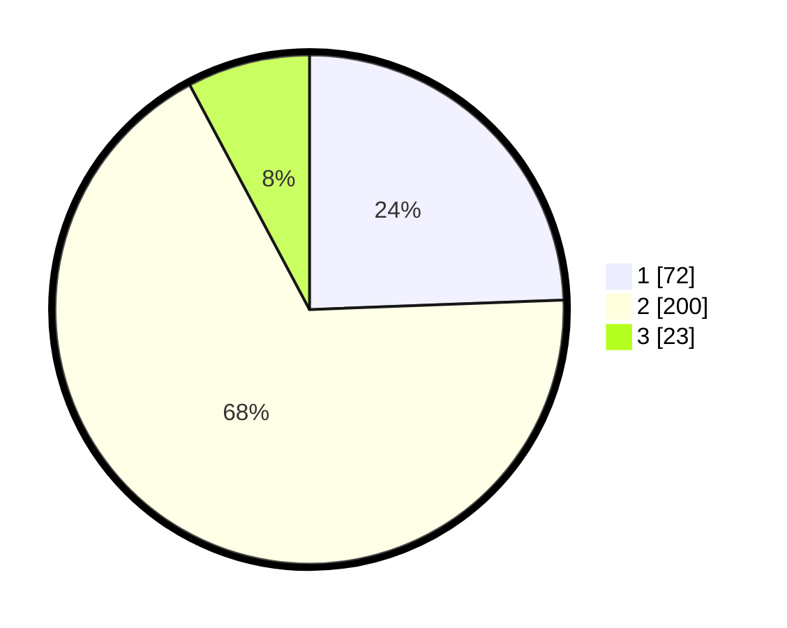

# Hasil

## Grafik

## Tabel

| No. | Nama Paslon    | Suara | Suara (raw) | Persentase |
|:--- |:-------------- | -----:| -----------:| ----------:|
| 1   | ANIES MUHAIMIN | 72    | [72][p-1]   | 24,41      |
| 2   | PRABOWO GIBRAN | 200   | [200][p-2]  | 67,80      |
| 3   | GANJAR MAHFUD  | 23    | [23][p-3]   | 7,80       |

[p-1]: https://github.com/gigit-pemilu/pemilu-2024-19-kepulauan-bangka-belitung/blob/main/pilpres/hitung-suara/sub/19-kepulauan-bangka-belitung/sub/01-bangka/sub/04-mendo-barat/sub/2002-penagan/sub/010-tps/sub/paslon-1.txt
[p-2]: https://github.com/gigit-pemilu/pemilu-2024-19-kepulauan-bangka-belitung/blob/main/pilpres/hitung-suara/sub/19-kepulauan-bangka-belitung/sub/01-bangka/sub/04-mendo-barat/sub/2002-penagan/sub/010-tps/sub/paslon-2.txt
[p-3]: https://github.com/gigit-pemilu/pemilu-2024-19-kepulauan-bangka-belitung/blob/main/pilpres/hitung-suara/sub/19-kepulauan-bangka-belitung/sub/01-bangka/sub/04-mendo-barat/sub/2002-penagan/sub/010-tps/sub/paslon-3.txt

## Foto C Plano

https://sirekap-obj-formc.kpu.go.id/0241/pemilu/ppwp/19/01/04/20/02/1901042002010-20240223-155825--b0873555-d1d1-4414-a779-c2091f754807.jpg

https://sirekap-obj-formc.kpu.go.id/0241/pemilu/ppwp/19/01/04/20/02/1901042002010-20240223-160022--8b659337-58bf-4925-9815-7fc2be0b3f7b.jpg

https://sirekap-obj-formc.kpu.go.id/0241/pemilu/ppwp/19/01/04/20/02/1901042002010-20240223-160158--53e069e3-5159-4e8a-92d2-a5a380ad9ef2.jpg

## Metadata

| Key        | Value               |
| ---------- | ------------------- |
| Time Stamp | 2024-02-24 22:31:28 |

## DATA PEMILIH TETAP

Jumlah pemilih dalam DPT: **289**.
 * L: **333**.
 * P: **395**.

## DATA PENGGUNA HAK PILIH

Jumlah pengguna hak pilih dalam DPT: **288**.
 * L: **490**.
 * P: **908**.

Jumlah pengguna hak pilih dalam DPTb: **880**.
 * L: **888**.
 * P: **888**.

Jumlah pengguna hak pilih dalam DPK: **0**.
 * L: **0**.
 * P: **0**.

Jumlah pengguna hak pilih: **213**.
 * L: **970**.
 * P: **601**.

## JUMLAH SUARA SAH DAN TIDAK SAH

JUMLAH SELURUH SUARA SAH: **205**.

JUMLAH SUARA TIDAK SAH: **86**.

JUMLAH SELURUH SUARA SAH DAN SUARA TIDAK SAH: **232**.

