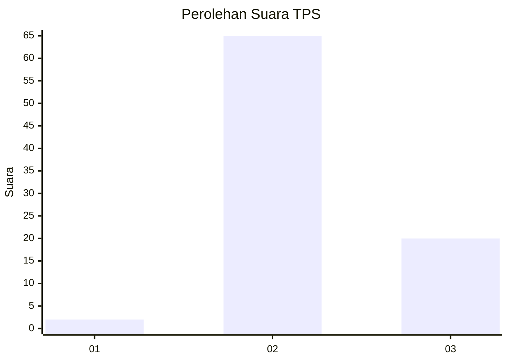
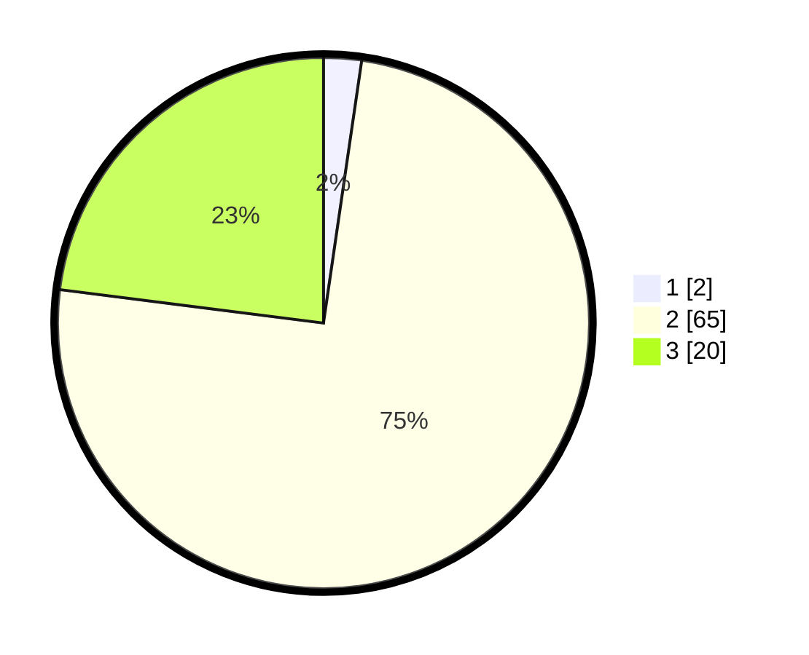

# Hasil

## Grafik

## Tabel

| No. | Nama Paslon    | Suara | Suara (raw) | Persentase |
|:--- |:-------------- | -----:| -----------:| ----------:|
| 1   | ANIES MUHAIMIN | 2     | [2][p-1]    | 2,30       |
| 2   | PRABOWO GIBRAN | 65    | [65][p-2]   | 74,71      |
| 3   | GANJAR MAHFUD  | 20    | [20][p-3]   | 22,99      |

[p-1]: https://github.com/gigit-pemilu/pemilu-2024-19-kepulauan-bangka-belitung/blob/main/pilpres/hitung-suara/sub/19-kepulauan-bangka-belitung/sub/01-bangka/sub/04-mendo-barat/sub/2002-penagan/sub/014-tps/sub/paslon-1.txt
[p-2]: https://github.com/gigit-pemilu/pemilu-2024-19-kepulauan-bangka-belitung/blob/main/pilpres/hitung-suara/sub/19-kepulauan-bangka-belitung/sub/01-bangka/sub/04-mendo-barat/sub/2002-penagan/sub/014-tps/sub/paslon-2.txt
[p-3]: https://github.com/gigit-pemilu/pemilu-2024-19-kepulauan-bangka-belitung/blob/main/pilpres/hitung-suara/sub/19-kepulauan-bangka-belitung/sub/01-bangka/sub/04-mendo-barat/sub/2002-penagan/sub/014-tps/sub/paslon-3.txt

## Foto C Plano

https://sirekap-obj-formc.kpu.go.id/11e1/pemilu/ppwp/19/01/04/20/02/1901042002014-20240223-171204--656ecd38-f0d9-4f3d-8598-619dc310e9fe.jpg

https://sirekap-obj-formc.kpu.go.id/11e1/pemilu/ppwp/19/01/04/20/02/1901042002014-20240223-171249--ce1b29aa-86f3-4a8e-9b90-67799e8f04d8.jpg

https://sirekap-obj-formc.kpu.go.id/11e1/pemilu/ppwp/19/01/04/20/02/1901042002014-20240223-171327--a4843b15-abbc-4f02-bcaf-055ca26d2034.jpg

## Metadata

| Key        | Value               |
| ---------- | ------------------- |
| Time Stamp | 2024-02-24 22:31:28 |

## DATA PEMILIH TETAP

Jumlah pemilih dalam DPT: **298**.
 * L: **343**.
 * P: **424**.

## DATA PENGGUNA HAK PILIH

Jumlah pengguna hak pilih dalam DPT: **257**.
 * L: **143**.
 * P: **4**.

Jumlah pengguna hak pilih dalam DPTb: **0**.
 * L: **8**.
 * P: **800**.

Jumlah pengguna hak pilih dalam DPK: **0**.
 * L: **0**.
 * P: **808**.

Jumlah pengguna hak pilih: **257**.
 * L: **643**.
 * P: **404**.

## JUMLAH SUARA SAH DAN TIDAK SAH

JUMLAH SELURUH SUARA SAH: **290**.

JUMLAH SUARA TIDAK SAH: **67**.

JUMLAH SELURUH SUARA SAH DAN SUARA TIDAK SAH: **253**.

