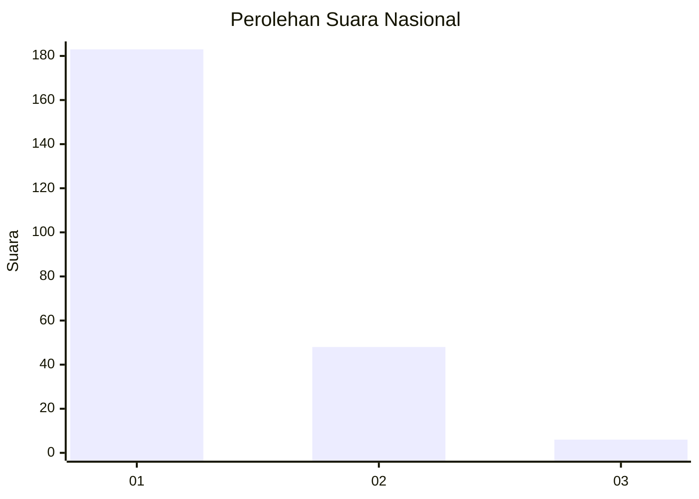
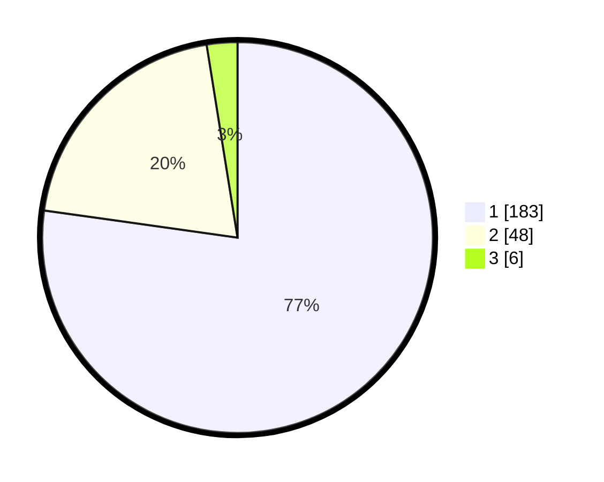

# Hasil

## Grafik

## Tabel

| No. | Nama Paslon    | Suara | Suara (raw) | Persentase |
|:--- |:-------------- | -----:| -----------:| ----------:|
| 1   | ANIES MUHAIMIN | 183   | [183][p-1]  | 77,22      |
| 2   | PRABOWO GIBRAN | 48    | [48][p-2]   | 20,25      |
| 3   | GANJAR MAHFUD  | 6     | [6][p-3]    | 2,53       |

[p-1]: https://github.com/gigit-pemilu/pemilu-2024/blob/main/pilpres/hitung-suara/sub/19-kepulauan-bangka-belitung/sub/01-bangka/sub/04-mendo-barat/sub/2003-zed/sub/001-tps/sub/paslon-1.txt
[p-2]: https://github.com/gigit-pemilu/pemilu-2024/blob/main/pilpres/hitung-suara/sub/19-kepulauan-bangka-belitung/sub/01-bangka/sub/04-mendo-barat/sub/2003-zed/sub/001-tps/sub/paslon-2.txt
[p-3]: https://github.com/gigit-pemilu/pemilu-2024/blob/main/pilpres/hitung-suara/sub/19-kepulauan-bangka-belitung/sub/01-bangka/sub/04-mendo-barat/sub/2003-zed/sub/001-tps/sub/paslon-3.txt

## Foto C Plano

https://sirekap-obj-formc.kpu.go.id/3cf5/pemilu/ppwp/19/01/04/20/03/1901042003001-20240214-205204--e20cc392-fc92-4326-97f9-70543556e769.jpg

https://sirekap-obj-formc.kpu.go.id/3cf5/pemilu/ppwp/19/01/04/20/03/1901042003001-20240214-205231--a0b9d18f-64df-42b1-a5ce-2f97b2ce101e.jpg

https://sirekap-obj-formc.kpu.go.id/3cf5/pemilu/ppwp/19/01/04/20/03/1901042003001-20240214-205217--503496f2-5d13-49ac-9184-7d0f02ead100.jpg

## Metadata

| Key        | Value               |
| ---------- | ------------------- |
| Time Stamp | 2024-02-15 15:00:29 |

