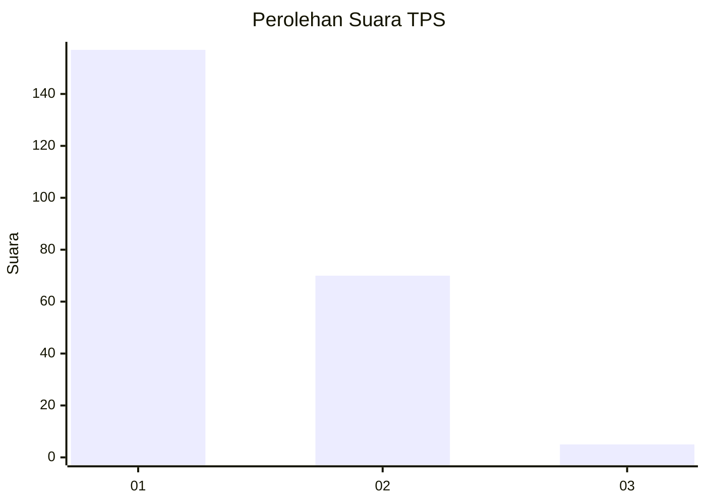
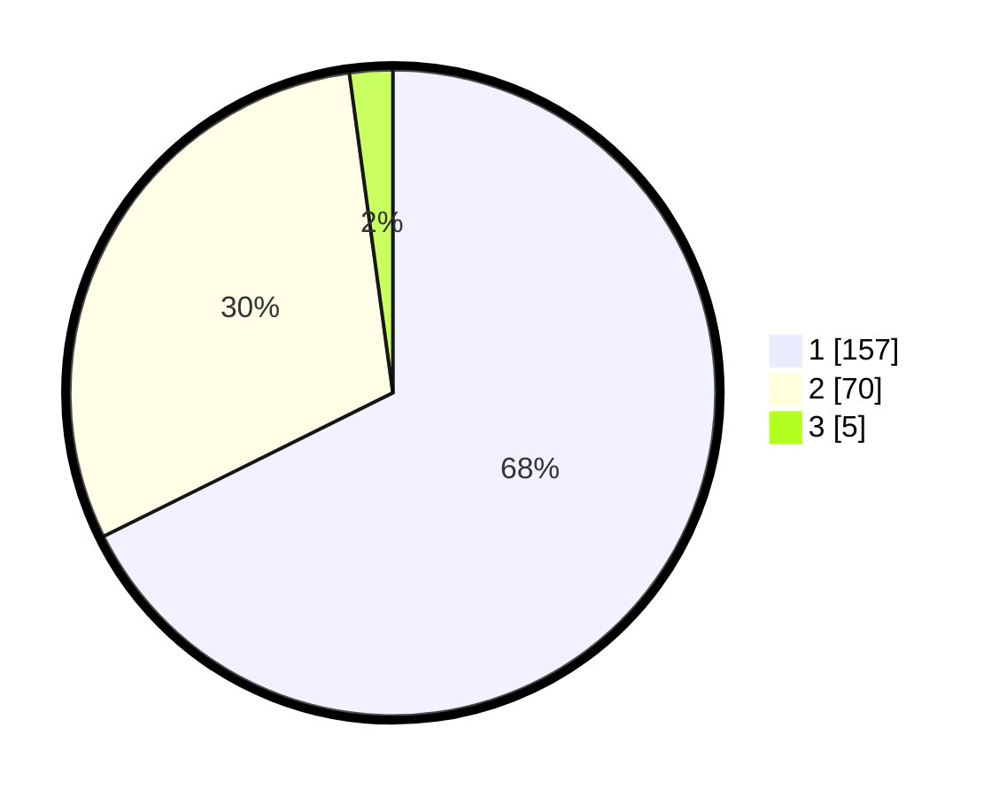

# Hasil

## Grafik

## Tabel

| No. | Nama Paslon    | Suara | Suara (raw) | Persentase |
|:--- |:-------------- | -----:| -----------:| ----------:|
| 1   | ANIES MUHAIMIN | 157   | [157][p-1]  | 67,67      |
| 2   | PRABOWO GIBRAN | 70    | [70][p-2]   | 30,17      |
| 3   | GANJAR MAHFUD  | 5     | [5][p-3]    | 2,16       |

[p-1]: https://github.com/gigit-pemilu/pemilu-2024-19-kepulauan-bangka-belitung/blob/main/pilpres/hitung-suara/sub/19-kepulauan-bangka-belitung/sub/01-bangka/sub/04-mendo-barat/sub/2003-zed/sub/002-tps/sub/paslon-1.txt
[p-2]: https://github.com/gigit-pemilu/pemilu-2024-19-kepulauan-bangka-belitung/blob/main/pilpres/hitung-suara/sub/19-kepulauan-bangka-belitung/sub/01-bangka/sub/04-mendo-barat/sub/2003-zed/sub/002-tps/sub/paslon-2.txt
[p-3]: https://github.com/gigit-pemilu/pemilu-2024-19-kepulauan-bangka-belitung/blob/main/pilpres/hitung-suara/sub/19-kepulauan-bangka-belitung/sub/01-bangka/sub/04-mendo-barat/sub/2003-zed/sub/002-tps/sub/paslon-3.txt

## Foto C Plano

https://sirekap-obj-formc.kpu.go.id/f8cb/pemilu/ppwp/19/01/04/20/03/1901042003002-20240221-085801--1c034a45-c1e4-4580-8e3e-89aecd231fe2.jpg

https://sirekap-obj-formc.kpu.go.id/f8cb/pemilu/ppwp/19/01/04/20/03/1901042003002-20240221-084937--56e48250-4e58-45ac-ae31-60db89676871.jpg

https://sirekap-obj-formc.kpu.go.id/f8cb/pemilu/ppwp/19/01/04/20/03/1901042003002-20240221-090109--55cd97be-4e8e-45ae-a661-7d4752de888e.jpg

## Metadata

| Key        | Value               |
| ---------- | ------------------- |
| Time Stamp | 2024-02-25 13:00:00 |

