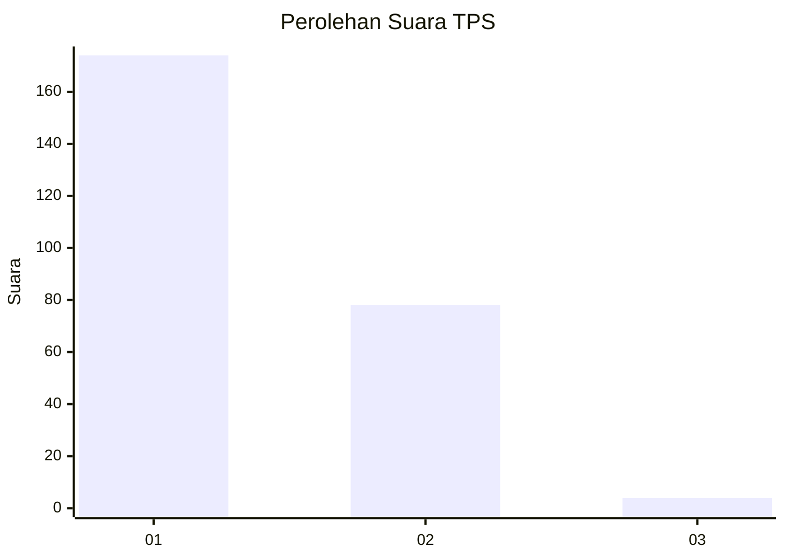
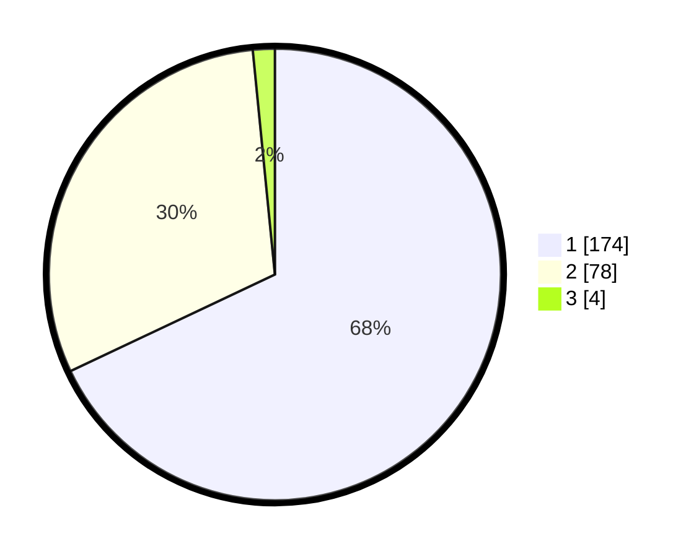

# Hasil

## Grafik

## Tabel

| No. | Nama Paslon    | Suara | Suara (raw) | Persentase |
|:--- |:-------------- | -----:| -----------:| ----------:|
| 1   | ANIES MUHAIMIN | 174   | [174][p-1]  | 67,97      |
| 2   | PRABOWO GIBRAN | 78    | [78][p-2]   | 30,47      |
| 3   | GANJAR MAHFUD  | 4     | [4][p-3]    | 1,56       |

[p-1]: https://github.com/gigit-pemilu/pemilu-2024-19-kepulauan-bangka-belitung/blob/main/pilpres/hitung-suara/sub/19-kepulauan-bangka-belitung/sub/01-bangka/sub/04-mendo-barat/sub/2003-zed/sub/006-tps/sub/paslon-1.txt
[p-2]: https://github.com/gigit-pemilu/pemilu-2024-19-kepulauan-bangka-belitung/blob/main/pilpres/hitung-suara/sub/19-kepulauan-bangka-belitung/sub/01-bangka/sub/04-mendo-barat/sub/2003-zed/sub/006-tps/sub/paslon-2.txt
[p-3]: https://github.com/gigit-pemilu/pemilu-2024-19-kepulauan-bangka-belitung/blob/main/pilpres/hitung-suara/sub/19-kepulauan-bangka-belitung/sub/01-bangka/sub/04-mendo-barat/sub/2003-zed/sub/006-tps/sub/paslon-3.txt

## Foto C Plano

https://sirekap-obj-formc.kpu.go.id/7dc7/pemilu/ppwp/19/01/04/20/03/1901042003006-20240215-000304--b9082952-113b-46c5-99e3-d1cb32596c8c.jpg

https://sirekap-obj-formc.kpu.go.id/7dc7/pemilu/ppwp/19/01/04/20/03/1901042003006-20240215-000752--0b914a33-9fd4-473d-9dfe-175ace42c997.jpg

https://sirekap-obj-formc.kpu.go.id/7dc7/pemilu/ppwp/19/01/04/20/03/1901042003006-20240215-001501--dce97bc6-d4ec-4926-baaa-93f26d329eee.jpg

## Metadata

| Key        | Value               |
| ---------- | ------------------- |
| Time Stamp | 2024-02-17 14:45:18 |

