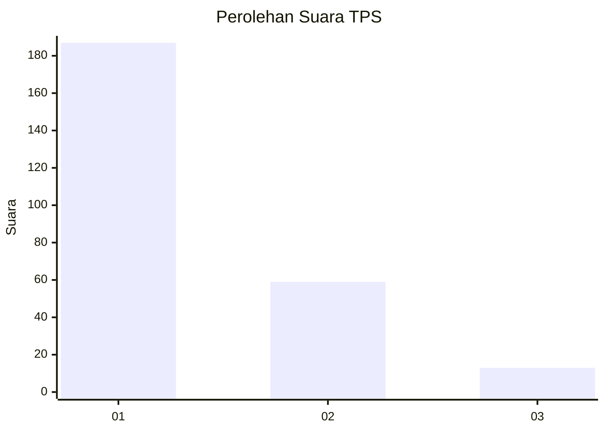
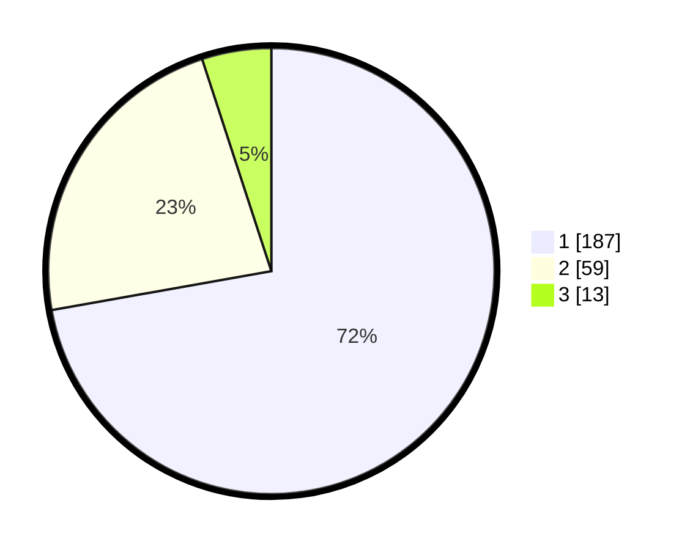

# Hasil

## Grafik

## Tabel

| No. | Nama Paslon    | Suara | Suara (raw) | Persentase |
|:--- |:-------------- | -----:| -----------:| ----------:|
| 1   | ANIES MUHAIMIN | 187   | [187][p-1]  | 72,20      |
| 2   | PRABOWO GIBRAN | 59    | [59][p-2]   | 22,78      |
| 3   | GANJAR MAHFUD  | 13    | [13][p-3]   | 5,02       |

[p-1]: https://github.com/gigit-pemilu/pemilu-2024-19-kepulauan-bangka-belitung/blob/main/pilpres/hitung-suara/sub/19-kepulauan-bangka-belitung/sub/01-bangka/sub/04-mendo-barat/sub/2003-zed/sub/007-tps/sub/paslon-1.txt
[p-2]: https://github.com/gigit-pemilu/pemilu-2024-19-kepulauan-bangka-belitung/blob/main/pilpres/hitung-suara/sub/19-kepulauan-bangka-belitung/sub/01-bangka/sub/04-mendo-barat/sub/2003-zed/sub/007-tps/sub/paslon-2.txt
[p-3]: https://github.com/gigit-pemilu/pemilu-2024-19-kepulauan-bangka-belitung/blob/main/pilpres/hitung-suara/sub/19-kepulauan-bangka-belitung/sub/01-bangka/sub/04-mendo-barat/sub/2003-zed/sub/007-tps/sub/paslon-3.txt

## Foto C Plano

https://sirekap-obj-formc.kpu.go.id/b337/pemilu/ppwp/19/01/04/20/03/1901042003007-20240214-201515--4f092597-0c74-481b-a363-9cd3e0414751.jpg

https://sirekap-obj-formc.kpu.go.id/b337/pemilu/ppwp/19/01/04/20/03/1901042003007-20240214-201737--d993bacd-5155-4ad4-938c-7b79db4c6ac6.jpg

https://sirekap-obj-formc.kpu.go.id/b337/pemilu/ppwp/19/01/04/20/03/1901042003007-20240214-210856--2cf17ae0-74b0-46c1-9126-2975384c680c.jpg

## Metadata

| Key        | Value               |
| ---------- | ------------------- |
| Time Stamp | 2024-02-15 22:40:13 |

