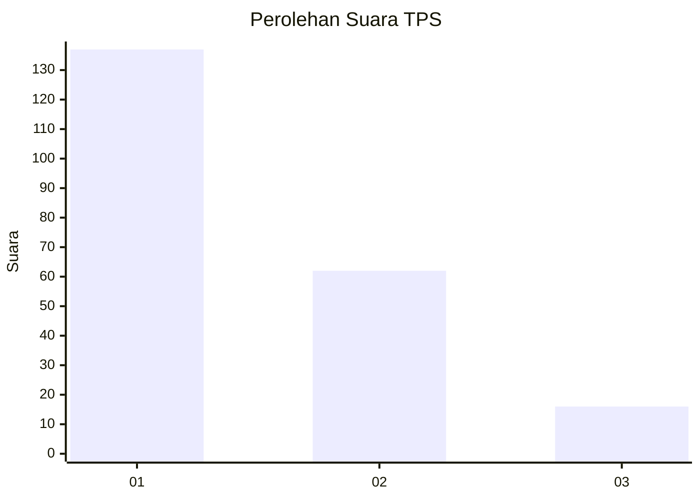
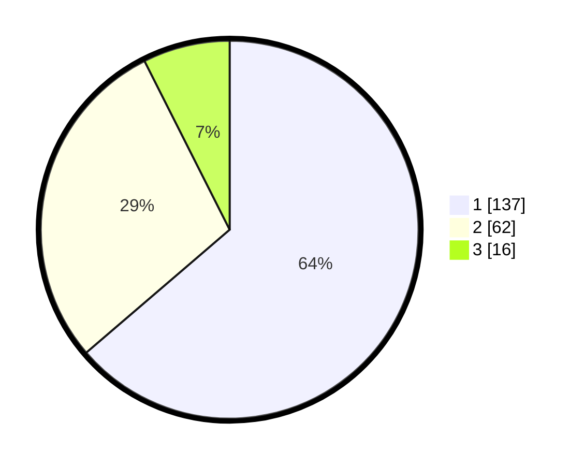

# Hasil

## Grafik

## Tabel

| No. | Nama Paslon    | Suara | Suara (raw) | Persentase |
|:--- |:-------------- | -----:| -----------:| ----------:|
| 1   | ANIES MUHAIMIN | 137   | [137][p-1]  | 63,72      |
| 2   | PRABOWO GIBRAN | 62    | [62][p-2]   | 28,84      |
| 3   | GANJAR MAHFUD  | 16    | [16][p-3]   | 7,44       |

[p-1]: https://github.com/gigit-pemilu/pemilu-2024-19-kepulauan-bangka-belitung/blob/main/pilpres/hitung-suara/sub/19-kepulauan-bangka-belitung/sub/01-bangka/sub/04-mendo-barat/sub/2004-mendo/sub/006-tps/sub/paslon-1.txt
[p-2]: https://github.com/gigit-pemilu/pemilu-2024-19-kepulauan-bangka-belitung/blob/main/pilpres/hitung-suara/sub/19-kepulauan-bangka-belitung/sub/01-bangka/sub/04-mendo-barat/sub/2004-mendo/sub/006-tps/sub/paslon-2.txt
[p-3]: https://github.com/gigit-pemilu/pemilu-2024-19-kepulauan-bangka-belitung/blob/main/pilpres/hitung-suara/sub/19-kepulauan-bangka-belitung/sub/01-bangka/sub/04-mendo-barat/sub/2004-mendo/sub/006-tps/sub/paslon-3.txt

## Foto C Plano

https://sirekap-obj-formc.kpu.go.id/6b68/pemilu/ppwp/19/01/04/20/04/1901042004006-20240223-105624--09814057-c20d-40ae-b88c-e73752c50614.jpg

https://sirekap-obj-formc.kpu.go.id/6b68/pemilu/ppwp/19/01/04/20/04/1901042004006-20240223-105725--995ed4d7-e5c1-4c97-a5e1-723452d69289.jpg

https://sirekap-obj-formc.kpu.go.id/6b68/pemilu/ppwp/19/01/04/20/04/1901042004006-20240223-105846--646bbbfc-5cdc-4142-a0ef-681b1c697b68.jpg

## Metadata

| Key        | Value               |
| ---------- | ------------------- |
| Time Stamp | 2024-02-25 16:00:00 |

