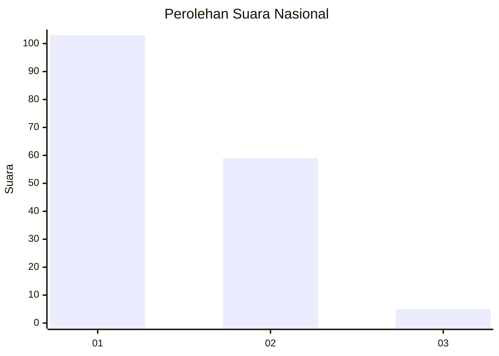
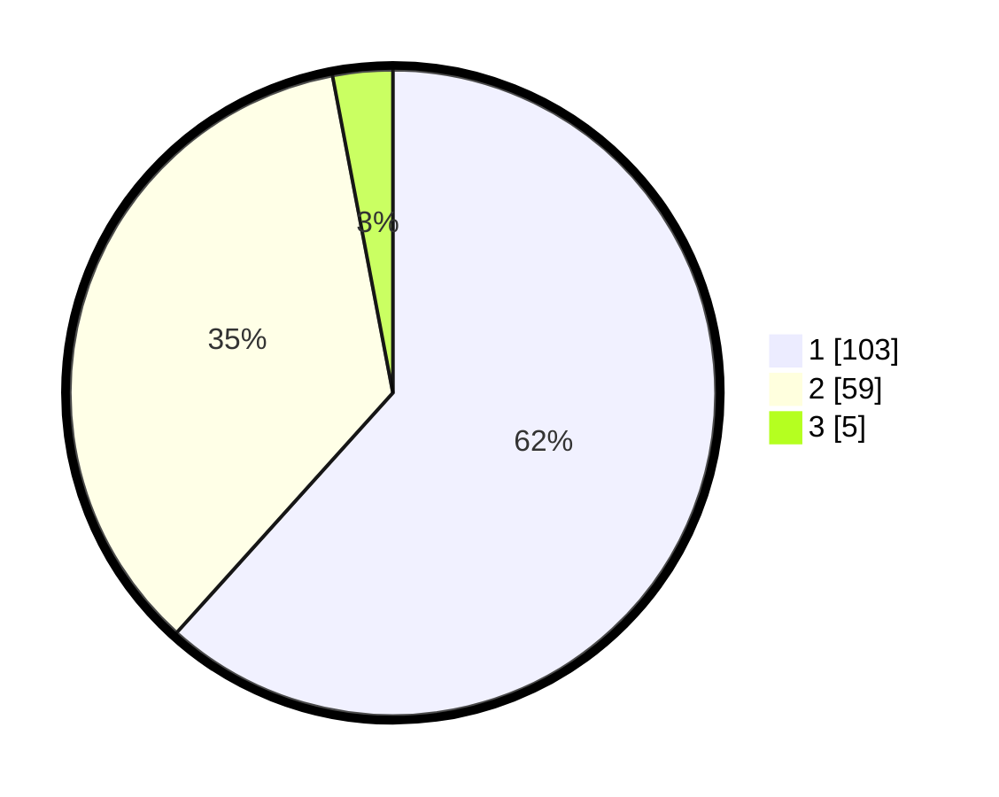

# Hasil

## Grafik

## Tabel

| No. | Nama Paslon    | Suara | Suara (raw) | Persentase |
|:--- |:-------------- | -----:| -----------:| ----------:|
| 1   | ANIES MUHAIMIN | 103   | [103][p-1]  | 61,68      |
| 2   | PRABOWO GIBRAN | 59    | [59][p-2]   | 35,33      |
| 3   | GANJAR MAHFUD  | 5     | [5][p-3]    | 2,99       |

[p-1]: https://github.com/gigit-pemilu/pemilu-2024/blob/main/pilpres/hitung-suara/sub/19-kepulauan-bangka-belitung/sub/01-bangka/sub/04-mendo-barat/sub/2004-mendo/sub/007-tps/sub/paslon-1.txt
[p-2]: https://github.com/gigit-pemilu/pemilu-2024/blob/main/pilpres/hitung-suara/sub/19-kepulauan-bangka-belitung/sub/01-bangka/sub/04-mendo-barat/sub/2004-mendo/sub/007-tps/sub/paslon-2.txt
[p-3]: https://github.com/gigit-pemilu/pemilu-2024/blob/main/pilpres/hitung-suara/sub/19-kepulauan-bangka-belitung/sub/01-bangka/sub/04-mendo-barat/sub/2004-mendo/sub/007-tps/sub/paslon-3.txt

## Foto C Plano

https://sirekap-obj-formc.kpu.go.id/008e/pemilu/ppwp/19/01/04/20/04/1901042004007-20240223-105743--d0f85cdf-5f4e-4659-89d5-3ff4713f4aea.jpg

https://sirekap-obj-formc.kpu.go.id/008e/pemilu/ppwp/19/01/04/20/04/1901042004007-20240223-105932--d21321ec-1dfa-48d8-af76-f5d6caa24fe9.jpg

https://sirekap-obj-formc.kpu.go.id/008e/pemilu/ppwp/19/01/04/20/04/1901042004007-20240223-110048--31711700-72c1-4eed-bcb5-c4293b18e8c5.jpg

## Metadata

| Key        | Value               |
| ---------- | ------------------- |
| Time Stamp | 2024-02-26 12:00:00 |

