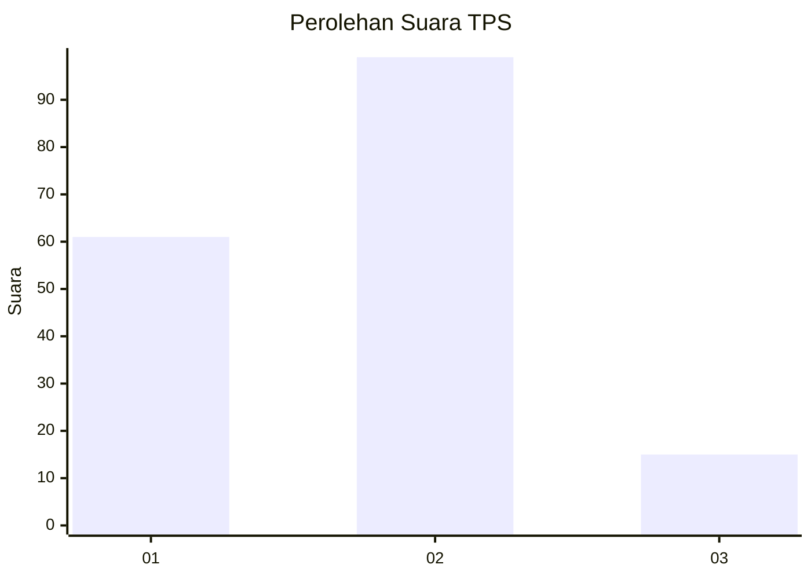
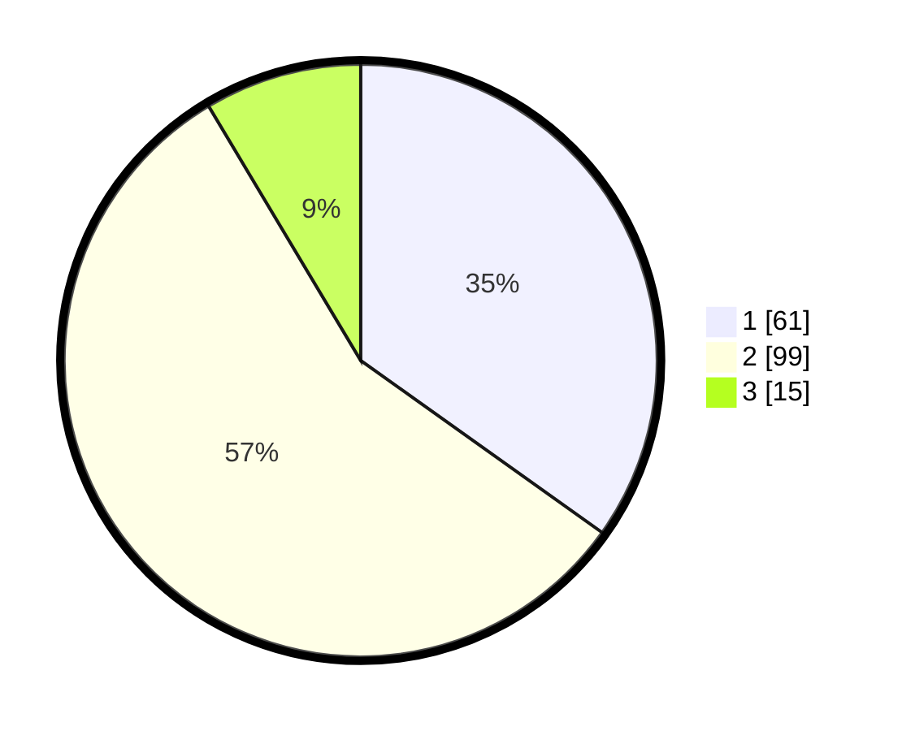

# Hasil

## Grafik

## Tabel

| No. | Nama Paslon    | Suara | Suara (raw) | Persentase |
|:--- |:-------------- | -----:| -----------:| ----------:|
| 1   | ANIES MUHAIMIN | 61    | [61][p-1]   | 34,86      |
| 2   | PRABOWO GIBRAN | 99    | [99][p-2]   | 56,57      |
| 3   | GANJAR MAHFUD  | 15    | [15][p-3]   | 8,57       |

[p-1]: https://github.com/gigit-pemilu/pemilu-2024-19-kepulauan-bangka-belitung/blob/main/pilpres/hitung-suara/sub/19-kepulauan-bangka-belitung/sub/01-bangka/sub/04-mendo-barat/sub/2005-paya-benua/sub/002-tps/sub/paslon-1.txt
[p-2]: https://github.com/gigit-pemilu/pemilu-2024-19-kepulauan-bangka-belitung/blob/main/pilpres/hitung-suara/sub/19-kepulauan-bangka-belitung/sub/01-bangka/sub/04-mendo-barat/sub/2005-paya-benua/sub/002-tps/sub/paslon-2.txt
[p-3]: https://github.com/gigit-pemilu/pemilu-2024-19-kepulauan-bangka-belitung/blob/main/pilpres/hitung-suara/sub/19-kepulauan-bangka-belitung/sub/01-bangka/sub/04-mendo-barat/sub/2005-paya-benua/sub/002-tps/sub/paslon-3.txt

## Foto C Plano

https://sirekap-obj-formc.kpu.go.id/96b4/pemilu/ppwp/19/01/04/20/05/1901042005002-20240222-134911--d9911afd-88ac-420e-bcae-7344ff6b84ec.jpg

https://sirekap-obj-formc.kpu.go.id/96b4/pemilu/ppwp/19/01/04/20/05/1901042005002-20240222-135302--d34cb4e8-0c19-4b1b-80a3-04e0554070fd.jpg

https://sirekap-obj-formc.kpu.go.id/96b4/pemilu/ppwp/19/01/04/20/05/1901042005002-20240222-135457--be2dfb2e-9786-4f75-b2dd-5cadcc45bc82.jpg

## Metadata

| Key        | Value               |
| ---------- | ------------------- |
| Time Stamp | 2024-02-22 14:00:00 |

## DATA PEMILIH TETAP

Jumlah pemilih dalam DPT: **41**.
 * L: **0**.
 * P: **70**.

## DATA PENGGUNA HAK PILIH

Jumlah pengguna hak pilih dalam DPT: **409**.
 * L: **50**.
 * P: **0**.

Jumlah pengguna hak pilih dalam DPTb: **0**.
 * L: **757**.
 * P: **554**.

Jumlah pengguna hak pilih dalam DPK: **754**.
 * L: **0**.
 * P: **1**.

Jumlah pengguna hak pilih: **777**.
 * L: **97**.
 * P: **87**.

## JUMLAH SUARA SAH DAN TIDAK SAH

JUMLAH SELURUH SUARA SAH: **179**.

JUMLAH SUARA TIDAK SAH: **5**.

JUMLAH SELURUH SUARA SAH DAN SUARA TIDAK SAH: **184**.

