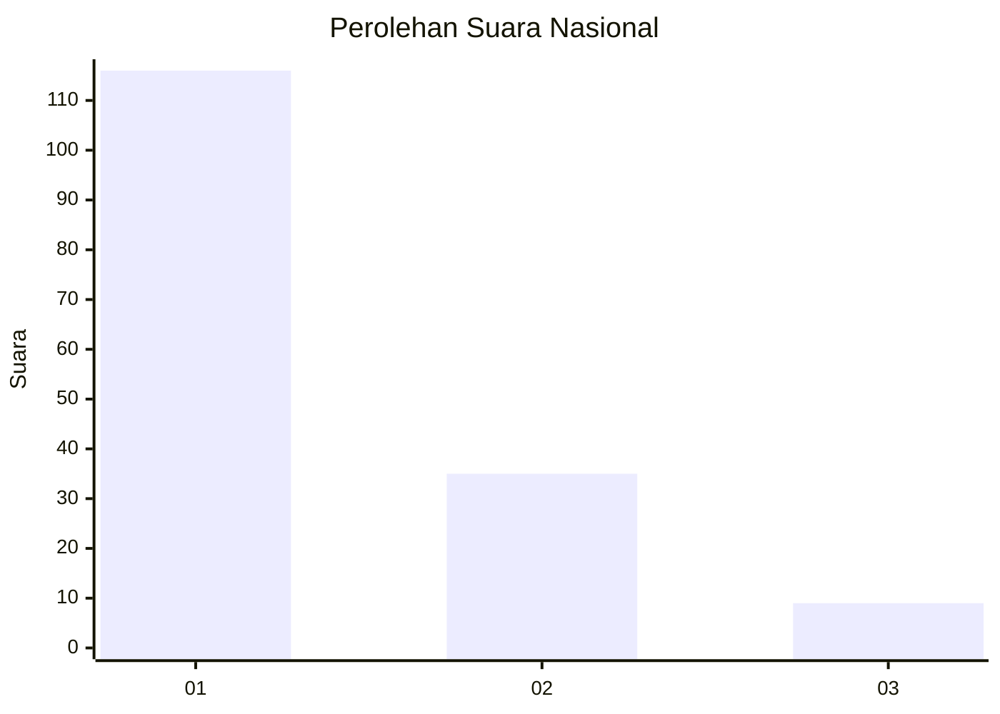
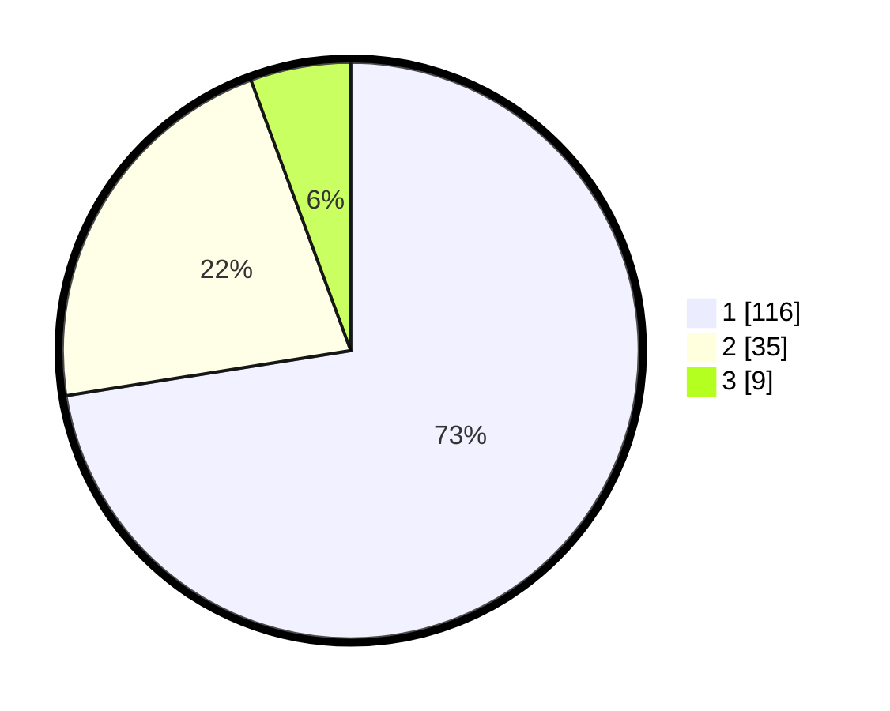

# Hasil

## Grafik

## Tabel

| No. | Nama Paslon    | Suara | Suara (raw) | Persentase |
|:--- |:-------------- | -----:| -----------:| ----------:|
| 1   | ANIES MUHAIMIN | 116   | [116][p-1]  | 72,50      |
| 2   | PRABOWO GIBRAN | 35    | [35][p-2]   | 21,88      |
| 3   | GANJAR MAHFUD  | 9     | [9][p-3]    | 5,63       |

[p-1]: https://github.com/gigit-pemilu/pemilu-2024/blob/main/pilpres/hitung-suara/sub/19-kepulauan-bangka-belitung/sub/01-bangka/sub/04-mendo-barat/sub/2005-paya-benua/sub/007-tps/sub/paslon-1.txt
[p-2]: https://github.com/gigit-pemilu/pemilu-2024/blob/main/pilpres/hitung-suara/sub/19-kepulauan-bangka-belitung/sub/01-bangka/sub/04-mendo-barat/sub/2005-paya-benua/sub/007-tps/sub/paslon-2.txt
[p-3]: https://github.com/gigit-pemilu/pemilu-2024/blob/main/pilpres/hitung-suara/sub/19-kepulauan-bangka-belitung/sub/01-bangka/sub/04-mendo-barat/sub/2005-paya-benua/sub/007-tps/sub/paslon-3.txt

## Foto C Plano

https://sirekap-obj-formc.kpu.go.id/417b/pemilu/ppwp/19/01/04/20/05/1901042005007-20240222-151308--92d471b7-ec54-4b2c-a577-9fd6bb5507f1.jpg

https://sirekap-obj-formc.kpu.go.id/417b/pemilu/ppwp/19/01/04/20/05/1901042005007-20240222-151745--11a8e6b5-63fa-4c92-9d58-90c02436cc8e.jpg

https://sirekap-obj-formc.kpu.go.id/417b/pemilu/ppwp/19/01/04/20/05/1901042005007-20240222-151859--876c9a55-58de-4590-b582-aab3cc7bf54d.jpg

## Metadata

| Key        | Value               |
| ---------- | ------------------- |
| Time Stamp | 2024-02-25 16:00:00 |

