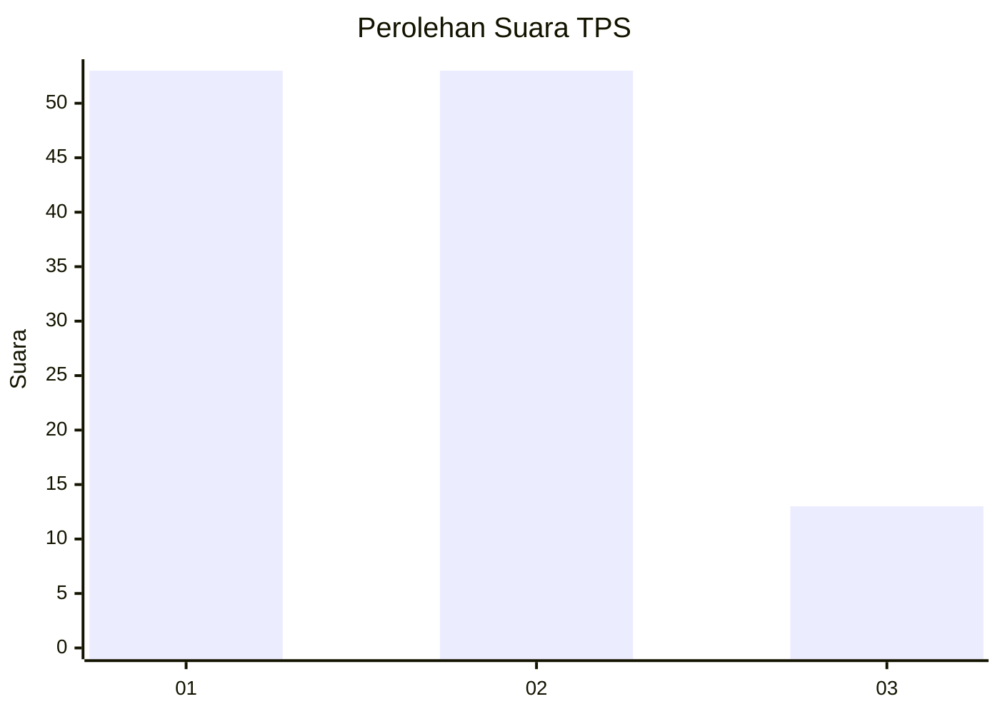
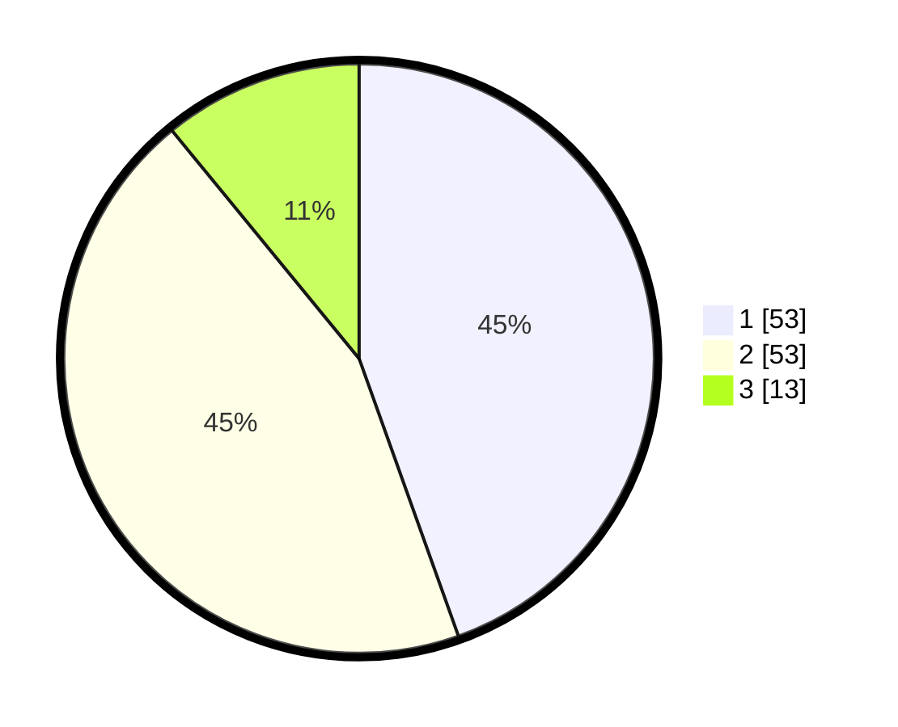

# Hasil

## Grafik

## Tabel

| No. | Nama Paslon    | Suara | Suara (raw) | Persentase |
|:--- |:-------------- | -----:| -----------:| ----------:|
| 1   | ANIES MUHAIMIN | 53    | [53][p-1]   | 44,54      |
| 2   | PRABOWO GIBRAN | 53    | [53][p-2]   | 44,54      |
| 3   | GANJAR MAHFUD  | 13    | [13][p-3]   | 10,92      |

[p-1]: https://github.com/gigit-pemilu/pemilu-2024-19-kepulauan-bangka-belitung/blob/main/pilpres/hitung-suara/sub/19-kepulauan-bangka-belitung/sub/01-bangka/sub/04-mendo-barat/sub/2005-paya-benua/sub/010-tps/sub/paslon-1.txt
[p-2]: https://github.com/gigit-pemilu/pemilu-2024-19-kepulauan-bangka-belitung/blob/main/pilpres/hitung-suara/sub/19-kepulauan-bangka-belitung/sub/01-bangka/sub/04-mendo-barat/sub/2005-paya-benua/sub/010-tps/sub/paslon-2.txt
[p-3]: https://github.com/gigit-pemilu/pemilu-2024-19-kepulauan-bangka-belitung/blob/main/pilpres/hitung-suara/sub/19-kepulauan-bangka-belitung/sub/01-bangka/sub/04-mendo-barat/sub/2005-paya-benua/sub/010-tps/sub/paslon-3.txt

## Foto C Plano

https://sirekap-obj-formc.kpu.go.id/9cb6/pemilu/ppwp/19/01/04/20/05/1901042005010-20240222-151507--9f766a8d-30a3-403e-816b-671dda428a8a.jpg

https://sirekap-obj-formc.kpu.go.id/9cb6/pemilu/ppwp/19/01/04/20/05/1901042005010-20240222-152013--76ed682c-24ce-4883-8bbf-12000b8ab473.jpg

https://sirekap-obj-formc.kpu.go.id/9cb6/pemilu/ppwp/19/01/04/20/05/1901042005010-20240222-152058--a0b08f25-50c9-4d7e-be65-9f8ce04c5a42.jpg

## Metadata

| Key        | Value               |
| ---------- | ------------------- |
| Time Stamp | 2024-02-24 22:31:28 |

