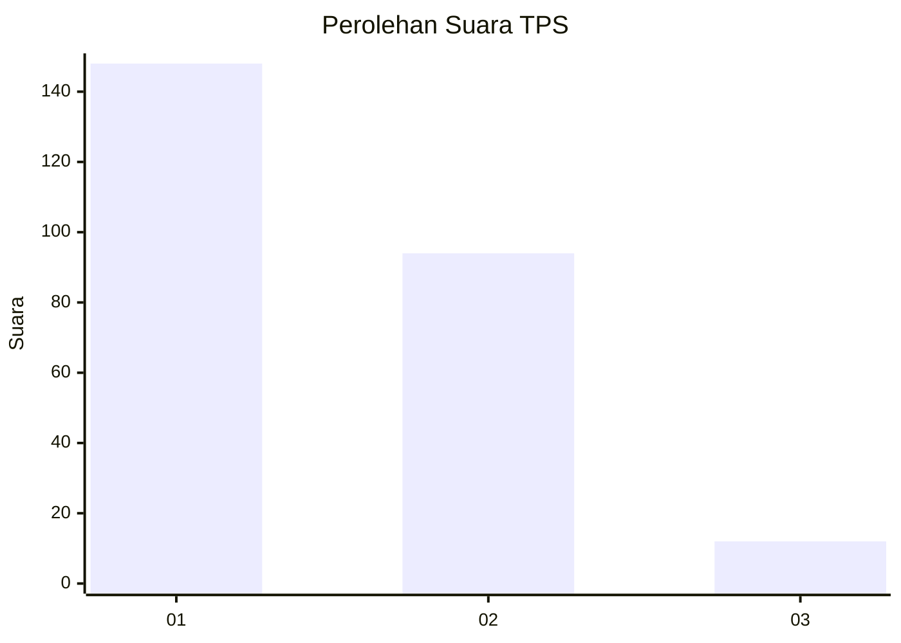
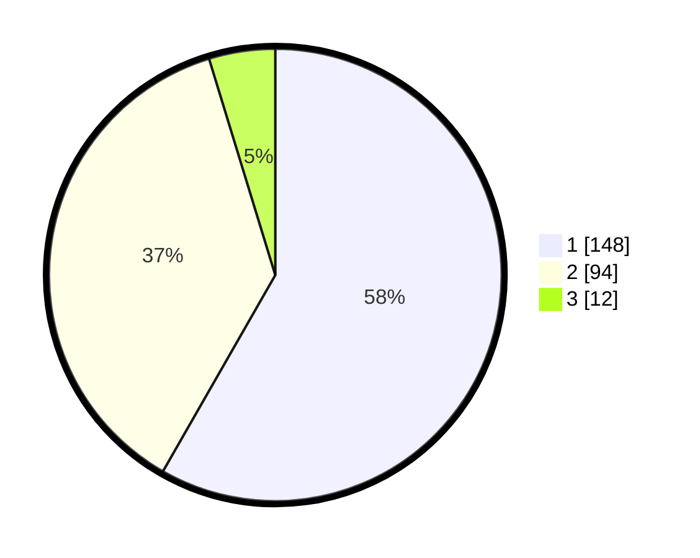

# Hasil

## Grafik

## Tabel

| No. | Nama Paslon    | Suara | Suara (raw) | Persentase |
|:--- |:-------------- | -----:| -----------:| ----------:|
| 1   | ANIES MUHAIMIN | 148   | [148][p-1]  | 58,27      |
| 2   | PRABOWO GIBRAN | 94    | [94][p-2]   | 37,01      |
| 3   | GANJAR MAHFUD  | 12    | [12][p-3]   | 4,72       |

[p-1]: https://github.com/gigit-pemilu/pemilu-2024-19-kepulauan-bangka-belitung/blob/main/pilpres/hitung-suara/sub/19-kepulauan-bangka-belitung/sub/01-bangka/sub/04-mendo-barat/sub/2006-cengkong-abang/sub/001-tps/sub/paslon-1.txt
[p-2]: https://github.com/gigit-pemilu/pemilu-2024-19-kepulauan-bangka-belitung/blob/main/pilpres/hitung-suara/sub/19-kepulauan-bangka-belitung/sub/01-bangka/sub/04-mendo-barat/sub/2006-cengkong-abang/sub/001-tps/sub/paslon-2.txt
[p-3]: https://github.com/gigit-pemilu/pemilu-2024-19-kepulauan-bangka-belitung/blob/main/pilpres/hitung-suara/sub/19-kepulauan-bangka-belitung/sub/01-bangka/sub/04-mendo-barat/sub/2006-cengkong-abang/sub/001-tps/sub/paslon-3.txt

## Foto C Plano

https://sirekap-obj-formc.kpu.go.id/a4d7/pemilu/ppwp/19/01/04/20/06/1901042006001-20240221-203012--1f28ca68-a387-475e-9395-c51f22ae8230.jpg

https://sirekap-obj-formc.kpu.go.id/a4d7/pemilu/ppwp/19/01/04/20/06/1901042006001-20240221-203411--6c54ede2-06c1-4c26-baf6-47c7dfefc493.jpg

https://sirekap-obj-formc.kpu.go.id/a4d7/pemilu/ppwp/19/01/04/20/06/1901042006001-20240221-212727--09cc8090-f34e-49c1-9e51-0172f7dbaa9a.jpg

## Metadata

| Key        | Value               |
| ---------- | ------------------- |
| Time Stamp | 2024-02-25 22:00:00 |

