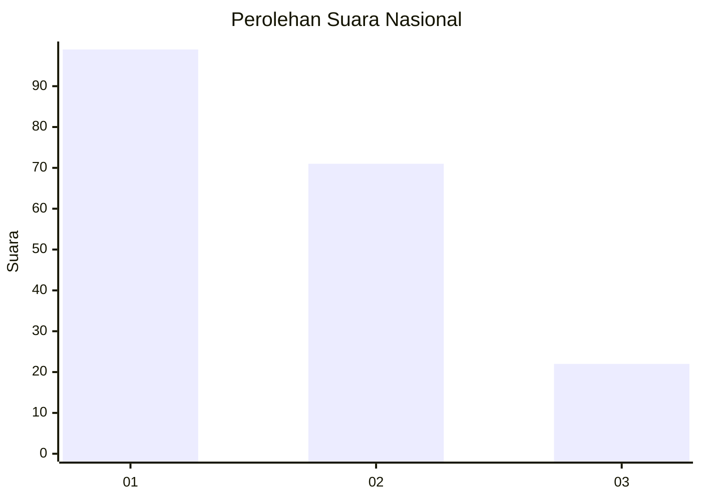
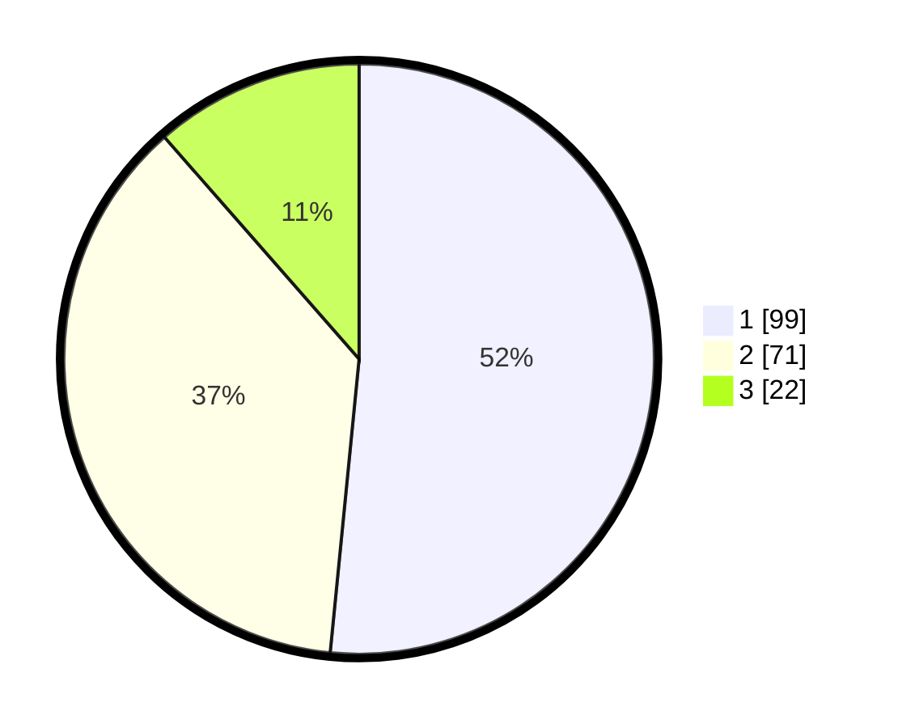

# Hasil

## Grafik

## Tabel

| No. | Nama Paslon    | Suara | Suara (raw) | Persentase |
|:--- |:-------------- | -----:| -----------:| ----------:|
| 1   | ANIES MUHAIMIN | 99    | [99][p-1]   | 51,56      |
| 2   | PRABOWO GIBRAN | 71    | [71][p-2]   | 36,98      |
| 3   | GANJAR MAHFUD  | 22    | [22][p-3]   | 11,46      |

[p-1]: https://github.com/gigit-pemilu/pemilu-2024/blob/main/pilpres/hitung-suara/sub/19-kepulauan-bangka-belitung/sub/01-bangka/sub/04-mendo-barat/sub/2006-cengkong-abang/sub/010-tps/sub/paslon-1.txt
[p-2]: https://github.com/gigit-pemilu/pemilu-2024/blob/main/pilpres/hitung-suara/sub/19-kepulauan-bangka-belitung/sub/01-bangka/sub/04-mendo-barat/sub/2006-cengkong-abang/sub/010-tps/sub/paslon-2.txt
[p-3]: https://github.com/gigit-pemilu/pemilu-2024/blob/main/pilpres/hitung-suara/sub/19-kepulauan-bangka-belitung/sub/01-bangka/sub/04-mendo-barat/sub/2006-cengkong-abang/sub/010-tps/sub/paslon-3.txt

## Foto C Plano

https://sirekap-obj-formc.kpu.go.id/6fab/pemilu/ppwp/19/01/04/20/06/1901042006010-20240222-192045--edd994e6-d17c-4f86-b018-8380d311f39d.jpg

https://sirekap-obj-formc.kpu.go.id/6fab/pemilu/ppwp/19/01/04/20/06/1901042006010-20240222-192204--e38e236c-d350-4952-bb25-5ec9c81e436a.jpg

https://sirekap-obj-formc.kpu.go.id/6fab/pemilu/ppwp/19/01/04/20/06/1901042006010-20240222-192404--be141b30-2a96-4cc7-ae66-3f6783dd4300.jpg

## Metadata

| Key        | Value               |
| ---------- | ------------------- |
| Time Stamp | 2024-03-01 23:00:00 |

