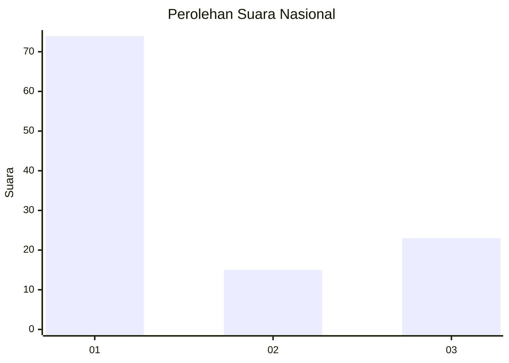
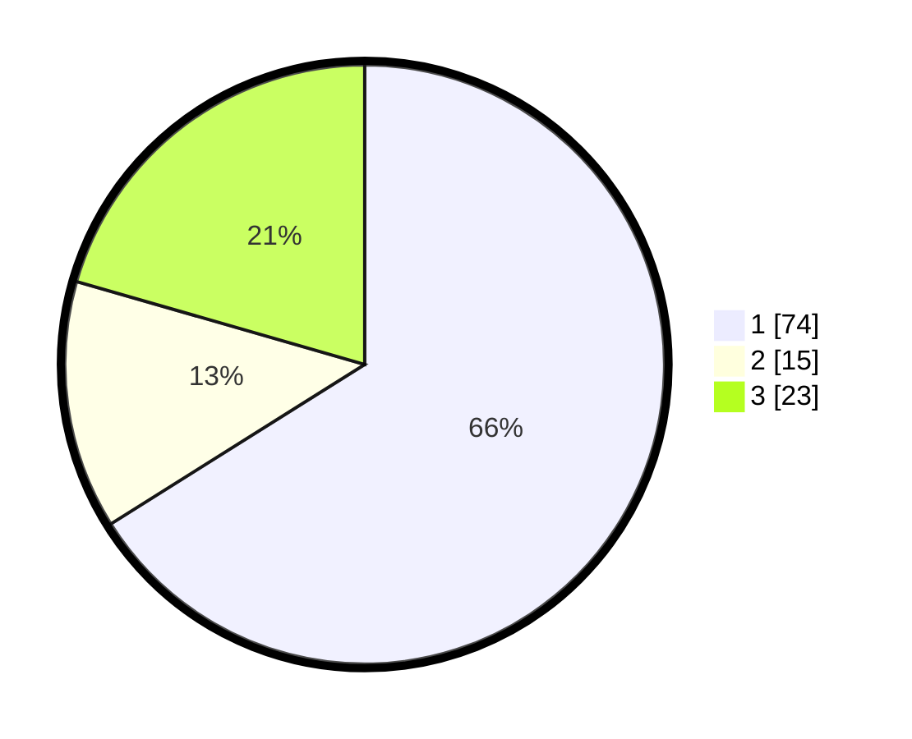

# Hasil

## Grafik

## Tabel

| No. | Nama Paslon    | Suara | Suara (raw) | Persentase |
|:--- |:-------------- | -----:| -----------:| ----------:|
| 1   | ANIES MUHAIMIN | 74    | [74][p-1]   | 66,07      |
| 2   | PRABOWO GIBRAN | 15    | [15][p-2]   | 13,39      |
| 3   | GANJAR MAHFUD  | 23    | [23][p-3]   | 20,54      |

[p-1]: https://github.com/gigit-pemilu/pemilu-2024/blob/main/pilpres/hitung-suara/sub/19-kepulauan-bangka-belitung/sub/01-bangka/sub/04-mendo-barat/sub/2007-kace/sub/007-tps/sub/paslon-1.txt
[p-2]: https://github.com/gigit-pemilu/pemilu-2024/blob/main/pilpres/hitung-suara/sub/19-kepulauan-bangka-belitung/sub/01-bangka/sub/04-mendo-barat/sub/2007-kace/sub/007-tps/sub/paslon-2.txt
[p-3]: https://github.com/gigit-pemilu/pemilu-2024/blob/main/pilpres/hitung-suara/sub/19-kepulauan-bangka-belitung/sub/01-bangka/sub/04-mendo-barat/sub/2007-kace/sub/007-tps/sub/paslon-3.txt

## Foto C Plano

https://sirekap-obj-formc.kpu.go.id/22e2/pemilu/ppwp/19/01/04/20/07/1901042007007-20240219-194109--041377f7-8e7b-4579-b878-27bbe6d52086.jpg

https://sirekap-obj-formc.kpu.go.id/22e2/pemilu/ppwp/19/01/04/20/07/1901042007007-20240219-193844--96624b96-81c3-4921-97f5-cb601f37fcd9.jpg

https://sirekap-obj-formc.kpu.go.id/22e2/pemilu/ppwp/19/01/04/20/07/1901042007007-20240219-193958--d37499a5-2533-46a0-9dcb-0c4ab93e71b4.jpg

## Metadata

| Key        | Value               |
| ---------- | ------------------- |
| Time Stamp | 2024-02-25 15:00:00 |

