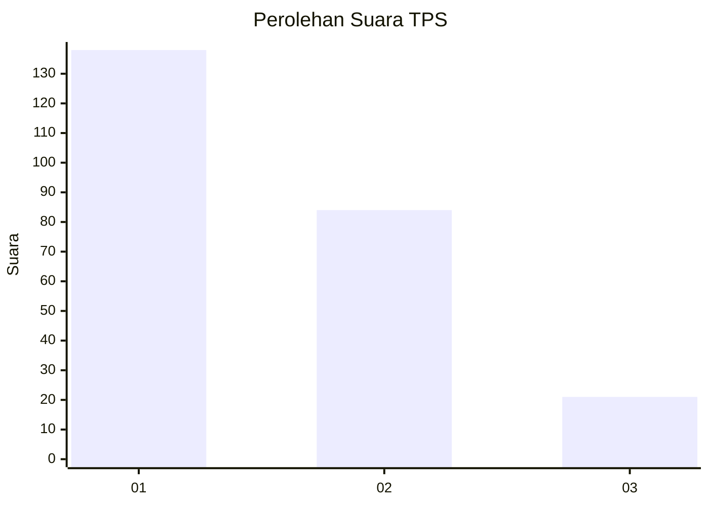
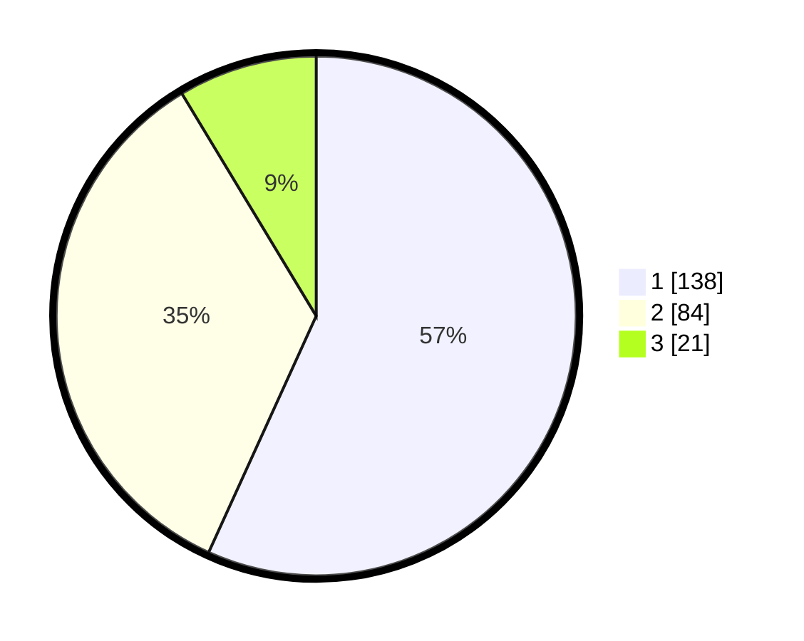

# Hasil

## Grafik

## Tabel

| No. | Nama Paslon    | Suara | Suara (raw) | Persentase |
|:--- |:-------------- | -----:| -----------:| ----------:|
| 1   | ANIES MUHAIMIN | 138   | [138][p-1]  | 56,79      |
| 2   | PRABOWO GIBRAN | 84    | [84][p-2]   | 34,57      |
| 3   | GANJAR MAHFUD  | 21    | [21][p-3]   | 8,64       |

[p-1]: https://github.com/gigit-pemilu/pemilu-2024-19-kepulauan-bangka-belitung/blob/main/pilpres/hitung-suara/sub/19-kepulauan-bangka-belitung/sub/01-bangka/sub/04-mendo-barat/sub/2008-kemuja/sub/005-tps/sub/paslon-1.txt
[p-2]: https://github.com/gigit-pemilu/pemilu-2024-19-kepulauan-bangka-belitung/blob/main/pilpres/hitung-suara/sub/19-kepulauan-bangka-belitung/sub/01-bangka/sub/04-mendo-barat/sub/2008-kemuja/sub/005-tps/sub/paslon-2.txt
[p-3]: https://github.com/gigit-pemilu/pemilu-2024-19-kepulauan-bangka-belitung/blob/main/pilpres/hitung-suara/sub/19-kepulauan-bangka-belitung/sub/01-bangka/sub/04-mendo-barat/sub/2008-kemuja/sub/005-tps/sub/paslon-3.txt

## Foto C Plano

https://sirekap-obj-formc.kpu.go.id/8134/pemilu/ppwp/19/01/04/20/08/1901042008005-20240224-111258--dba5db60-e670-41e0-a2fc-8e70c0771f26.jpg

https://sirekap-obj-formc.kpu.go.id/8134/pemilu/ppwp/19/01/04/20/08/1901042008005-20240224-111435--ddaf67f9-9254-4876-9787-0605a7445f0b.jpg

https://sirekap-obj-formc.kpu.go.id/8134/pemilu/ppwp/19/01/04/20/08/1901042008005-20240224-111537--5db12765-20c8-44dd-8325-c2ffdddd5340.jpg

## Metadata

| Key        | Value               |
| ---------- | ------------------- |
| Time Stamp | 2024-02-28 19:00:00 |

