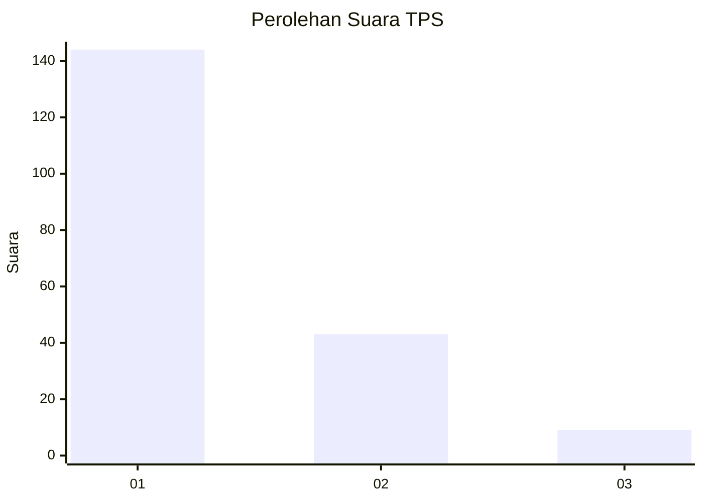
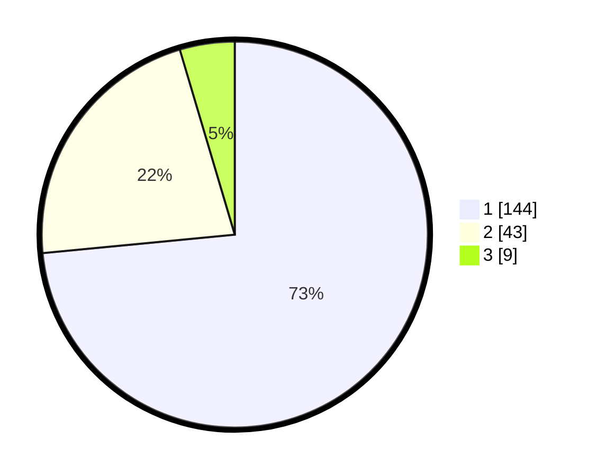

# Hasil

## Grafik

## Tabel

| No. | Nama Paslon    | Suara | Suara (raw) | Persentase |
|:--- |:-------------- | -----:| -----------:| ----------:|
| 1   | ANIES MUHAIMIN | 144   | [144][p-1]  | 73,47      |
| 2   | PRABOWO GIBRAN | 43    | [43][p-2]   | 21,94      |
| 3   | GANJAR MAHFUD  | 9     | [9][p-3]    | 4,59       |

[p-1]: https://github.com/gigit-pemilu/pemilu-2024-19-kepulauan-bangka-belitung/blob/main/pilpres/hitung-suara/sub/19-kepulauan-bangka-belitung/sub/01-bangka/sub/04-mendo-barat/sub/2008-kemuja/sub/007-tps/sub/paslon-1.txt
[p-2]: https://github.com/gigit-pemilu/pemilu-2024-19-kepulauan-bangka-belitung/blob/main/pilpres/hitung-suara/sub/19-kepulauan-bangka-belitung/sub/01-bangka/sub/04-mendo-barat/sub/2008-kemuja/sub/007-tps/sub/paslon-2.txt
[p-3]: https://github.com/gigit-pemilu/pemilu-2024-19-kepulauan-bangka-belitung/blob/main/pilpres/hitung-suara/sub/19-kepulauan-bangka-belitung/sub/01-bangka/sub/04-mendo-barat/sub/2008-kemuja/sub/007-tps/sub/paslon-3.txt

## Foto C Plano

https://sirekap-obj-formc.kpu.go.id/04a3/pemilu/ppwp/19/01/04/20/08/1901042008007-20240224-132857--c5139c04-0cdf-40af-9da6-3e52d67c1dee.jpg

https://sirekap-obj-formc.kpu.go.id/04a3/pemilu/ppwp/19/01/04/20/08/1901042008007-20240224-132926--5c15a5f4-6ffc-4ccb-bac9-02995f8b0b48.jpg

https://sirekap-obj-formc.kpu.go.id/04a3/pemilu/ppwp/19/01/04/20/08/1901042008007-20240224-133007--42971766-5182-4668-860f-12ec46cb19c8.jpg

## Metadata

| Key        | Value               |
| ---------- | ------------------- |
| Time Stamp | 2024-02-28 21:00:00 |

