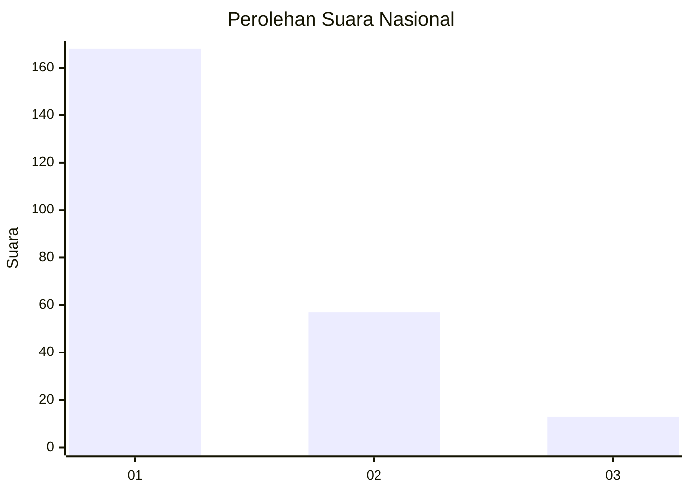
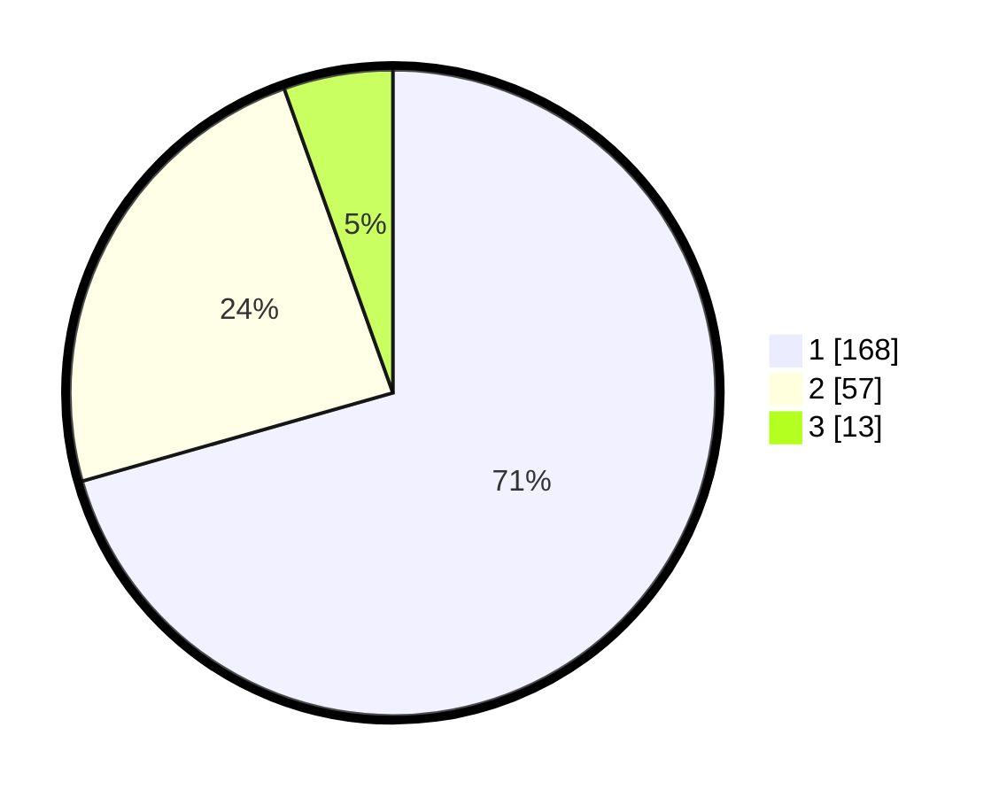

# Hasil

## Grafik

## Tabel

| No. | Nama Paslon    | Suara | Suara (raw) | Persentase |
|:--- |:-------------- | -----:| -----------:| ----------:|
| 1   | ANIES MUHAIMIN | 168   | [168][p-1]  | 70,59      |
| 2   | PRABOWO GIBRAN | 57    | [57][p-2]   | 23,95      |
| 3   | GANJAR MAHFUD  | 13    | [13][p-3]   | 5,46       |

[p-1]: https://github.com/gigit-pemilu/pemilu-2024/blob/main/pilpres/hitung-suara/sub/19-kepulauan-bangka-belitung/sub/01-bangka/sub/04-mendo-barat/sub/2008-kemuja/sub/008-tps/sub/paslon-1.txt
[p-2]: https://github.com/gigit-pemilu/pemilu-2024/blob/main/pilpres/hitung-suara/sub/19-kepulauan-bangka-belitung/sub/01-bangka/sub/04-mendo-barat/sub/2008-kemuja/sub/008-tps/sub/paslon-2.txt
[p-3]: https://github.com/gigit-pemilu/pemilu-2024/blob/main/pilpres/hitung-suara/sub/19-kepulauan-bangka-belitung/sub/01-bangka/sub/04-mendo-barat/sub/2008-kemuja/sub/008-tps/sub/paslon-3.txt

## Foto C Plano

https://sirekap-obj-formc.kpu.go.id/7c18/pemilu/ppwp/19/01/04/20/08/1901042008008-20240224-133235--ad0cfae2-7028-4508-ac8b-9ff953b64c1b.jpg

https://sirekap-obj-formc.kpu.go.id/7c18/pemilu/ppwp/19/01/04/20/08/1901042008008-20240224-133308--d121fb57-19c4-4d49-8788-387e32be71e8.jpg

https://sirekap-obj-formc.kpu.go.id/7c18/pemilu/ppwp/19/01/04/20/08/1901042008008-20240224-133347--06991a59-1746-4a89-9282-7552b982e785.jpg

## Metadata

| Key        | Value               |
| ---------- | ------------------- |
| Time Stamp | 2024-02-29 10:00:00 |

