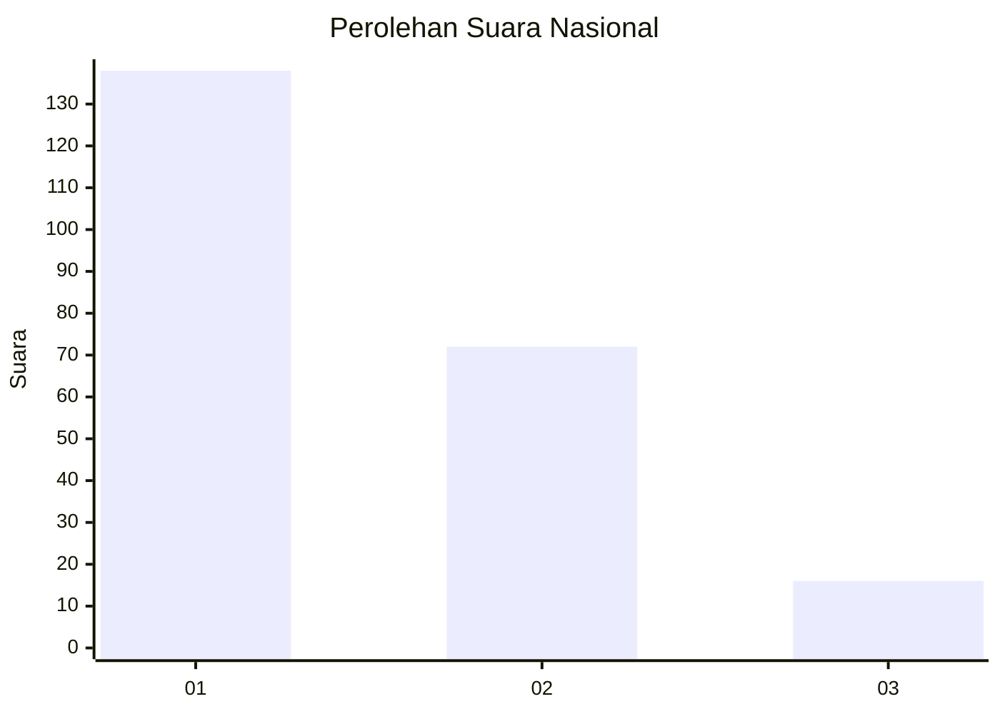
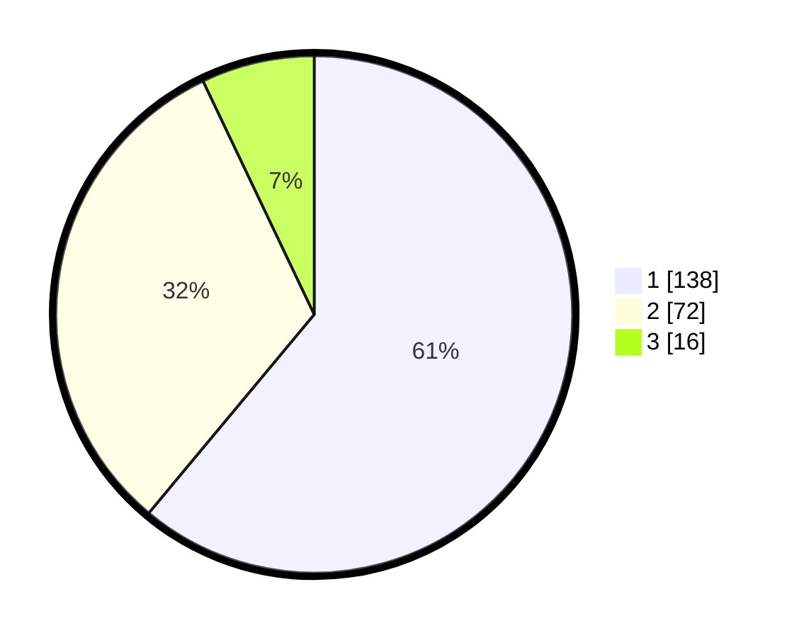

# Hasil

## Grafik

## Tabel

| No. | Nama Paslon    | Suara | Suara (raw) | Persentase |
|:--- |:-------------- | -----:| -----------:| ----------:|
| 1   | ANIES MUHAIMIN | 138   | [138][p-1]  | 61,06      |
| 2   | PRABOWO GIBRAN | 72    | [72][p-2]   | 31,86      |
| 3   | GANJAR MAHFUD  | 16    | [16][p-3]   | 7,08       |

[p-1]: https://github.com/gigit-pemilu/pemilu-2024/blob/main/pilpres/hitung-suara/sub/19-kepulauan-bangka-belitung/sub/01-bangka/sub/04-mendo-barat/sub/2008-kemuja/sub/012-tps/sub/paslon-1.txt
[p-2]: https://github.com/gigit-pemilu/pemilu-2024/blob/main/pilpres/hitung-suara/sub/19-kepulauan-bangka-belitung/sub/01-bangka/sub/04-mendo-barat/sub/2008-kemuja/sub/012-tps/sub/paslon-2.txt
[p-3]: https://github.com/gigit-pemilu/pemilu-2024/blob/main/pilpres/hitung-suara/sub/19-kepulauan-bangka-belitung/sub/01-bangka/sub/04-mendo-barat/sub/2008-kemuja/sub/012-tps/sub/paslon-3.txt

## Foto C Plano

https://sirekap-obj-formc.kpu.go.id/4ad5/pemilu/ppwp/19/01/04/20/08/1901042008012-20240224-141704--bf8aac84-d996-40ac-adc1-361f3079b51b.jpg

https://sirekap-obj-formc.kpu.go.id/4ad5/pemilu/ppwp/19/01/04/20/08/1901042008012-20240224-141939--ffe81c9b-89fb-41df-b7ec-7db09f007ebd.jpg

https://sirekap-obj-formc.kpu.go.id/4ad5/pemilu/ppwp/19/01/04/20/08/1901042008012-20240224-142055--133160f7-f154-4f4f-a438-6fc8d93c5dea.jpg

## Metadata

| Key        | Value               |
| ---------- | ------------------- |
| Time Stamp | 2024-03-01 22:00:00 |

