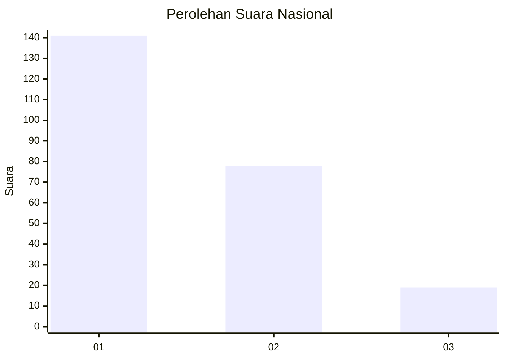
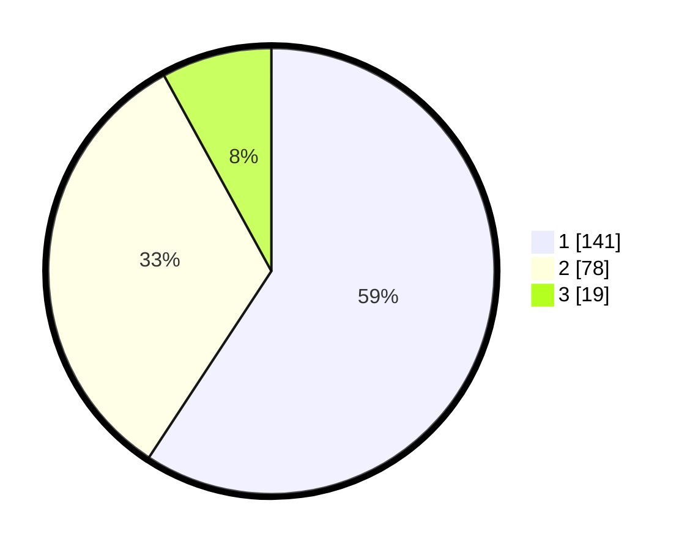

# Hasil

## Grafik

## Tabel

| No. | Nama Paslon    | Suara | Suara (raw) | Persentase |
|:--- |:-------------- | -----:| -----------:| ----------:|
| 1   | ANIES MUHAIMIN | 141   | [141][p-1]  | 59,24      |
| 2   | PRABOWO GIBRAN | 78    | [78][p-2]   | 32,77      |
| 3   | GANJAR MAHFUD  | 19    | [19][p-3]   | 7,98       |

[p-1]: https://github.com/gigit-pemilu/pemilu-2024/blob/main/pilpres/hitung-suara/sub/19-kepulauan-bangka-belitung/sub/01-bangka/sub/04-mendo-barat/sub/2008-kemuja/sub/013-tps/sub/paslon-1.txt
[p-2]: https://github.com/gigit-pemilu/pemilu-2024/blob/main/pilpres/hitung-suara/sub/19-kepulauan-bangka-belitung/sub/01-bangka/sub/04-mendo-barat/sub/2008-kemuja/sub/013-tps/sub/paslon-2.txt
[p-3]: https://github.com/gigit-pemilu/pemilu-2024/blob/main/pilpres/hitung-suara/sub/19-kepulauan-bangka-belitung/sub/01-bangka/sub/04-mendo-barat/sub/2008-kemuja/sub/013-tps/sub/paslon-3.txt

## Foto C Plano

https://sirekap-obj-formc.kpu.go.id/22bf/pemilu/ppwp/19/01/04/20/08/1901042008013-20240224-150626--6cd03df4-02da-406b-b8c6-f2e03adf9bb6.jpg

https://sirekap-obj-formc.kpu.go.id/22bf/pemilu/ppwp/19/01/04/20/08/1901042008013-20240224-150714--c7de3cc8-737f-4ada-be3c-9d4f67e94f93.jpg

https://sirekap-obj-formc.kpu.go.id/22bf/pemilu/ppwp/19/01/04/20/08/1901042008013-20240224-150751--ea4ca9d9-584e-4710-8f59-8480cfb8a7d3.jpg

## Metadata

| Key        | Value               |
| ---------- | ------------------- |
| Time Stamp | 2024-03-09 21:00:00 |

