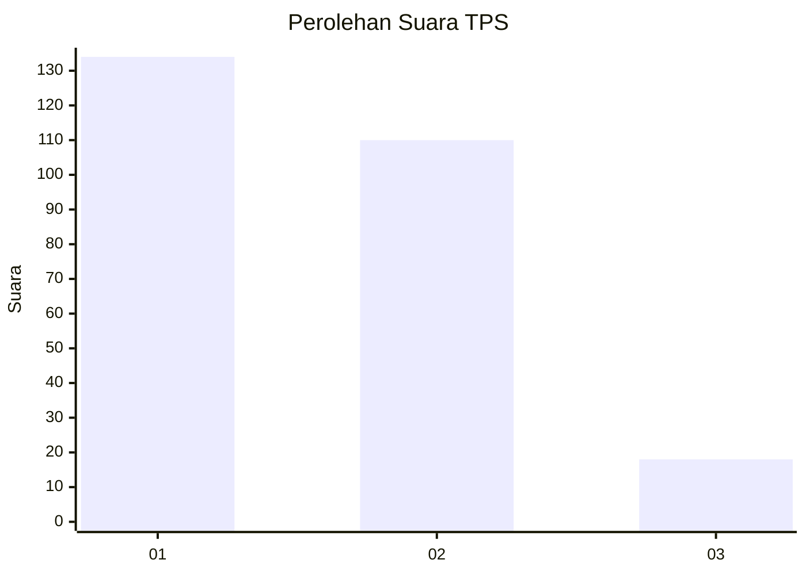
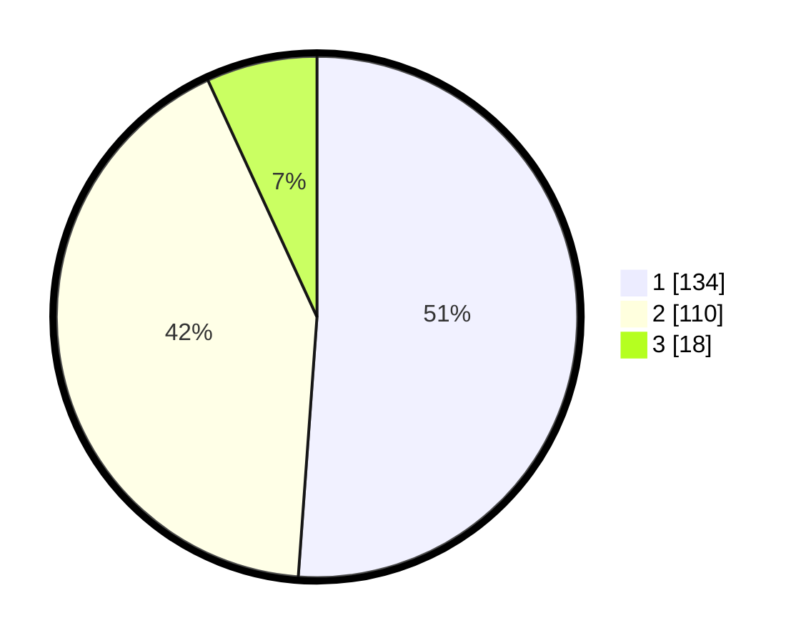

# Hasil

## Grafik

## Tabel

| No. | Nama Paslon    | Suara | Suara (raw) | Persentase |
|:--- |:-------------- | -----:| -----------:| ----------:|
| 1   | ANIES MUHAIMIN | 134   | [134][p-1]  | 51,15      |
| 2   | PRABOWO GIBRAN | 110   | [110][p-2]  | 41,98      |
| 3   | GANJAR MAHFUD  | 18    | [18][p-3]   | 6,87       |

[p-1]: https://github.com/gigit-pemilu/pemilu-2024-19-kepulauan-bangka-belitung/blob/main/pilpres/hitung-suara/sub/19-kepulauan-bangka-belitung/sub/01-bangka/sub/04-mendo-barat/sub/2008-kemuja/sub/014-tps/sub/paslon-1.txt
[p-2]: https://github.com/gigit-pemilu/pemilu-2024-19-kepulauan-bangka-belitung/blob/main/pilpres/hitung-suara/sub/19-kepulauan-bangka-belitung/sub/01-bangka/sub/04-mendo-barat/sub/2008-kemuja/sub/014-tps/sub/paslon-2.txt
[p-3]: https://github.com/gigit-pemilu/pemilu-2024-19-kepulauan-bangka-belitung/blob/main/pilpres/hitung-suara/sub/19-kepulauan-bangka-belitung/sub/01-bangka/sub/04-mendo-barat/sub/2008-kemuja/sub/014-tps/sub/paslon-3.txt

## Foto C Plano

https://sirekap-obj-formc.kpu.go.id/b456/pemilu/ppwp/19/01/04/20/08/1901042008014-20240224-152936--2796877a-dc27-4de2-b6ea-855fe1ad5d0e.jpg

https://sirekap-obj-formc.kpu.go.id/b456/pemilu/ppwp/19/01/04/20/08/1901042008014-20240224-153002--bf1c0379-b346-45ca-9d06-075496d9e033.jpg

https://sirekap-obj-formc.kpu.go.id/b456/pemilu/ppwp/19/01/04/20/08/1901042008014-20240224-153022--dc883603-2f1e-471b-82fe-f3fb077c82a8.jpg

## Metadata

| Key        | Value               |
| ---------- | ------------------- |
| Time Stamp | 2024-02-29 12:00:00 |

