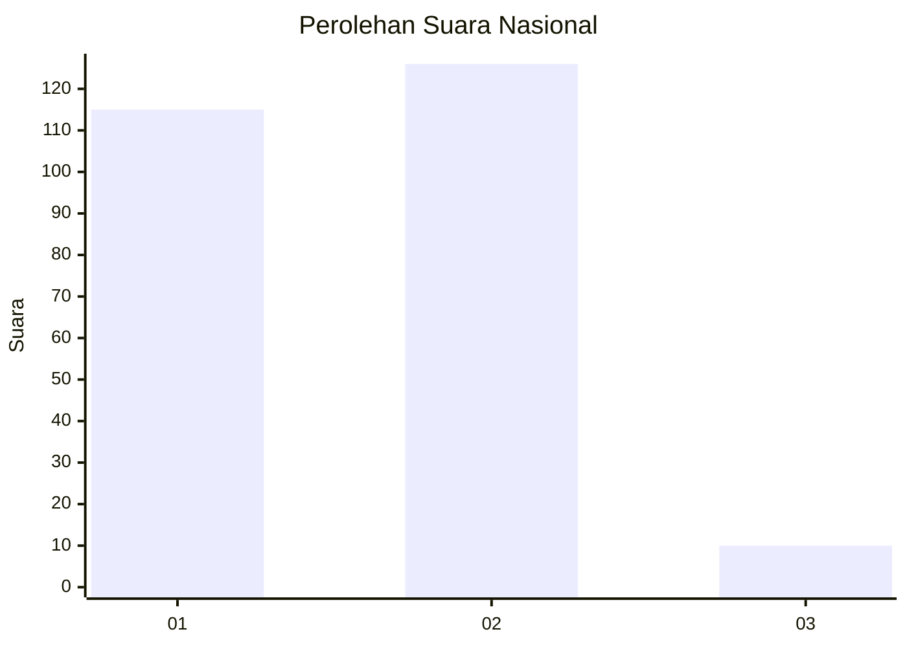
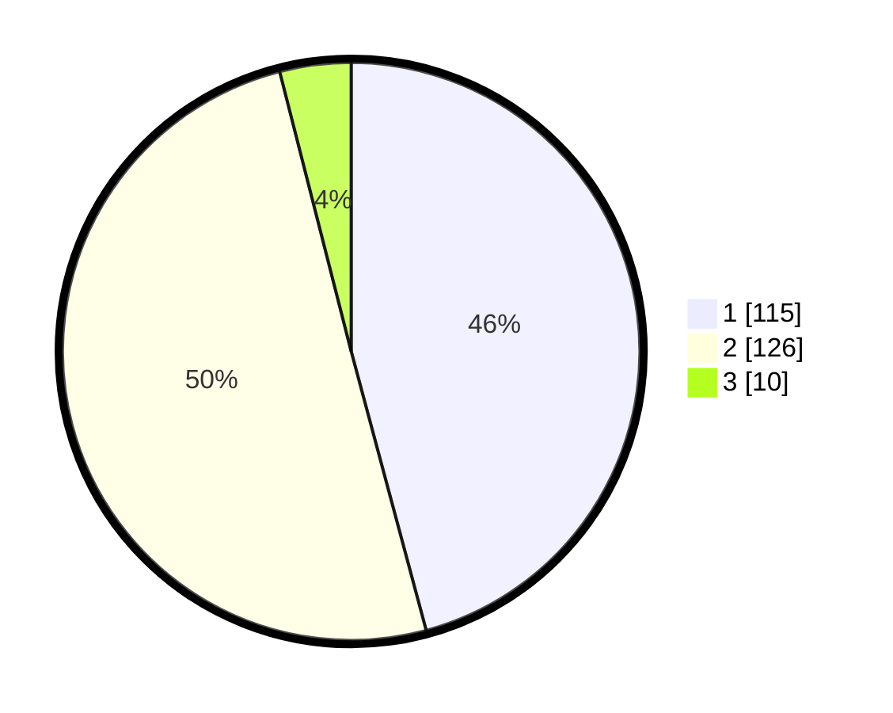

# Hasil

## Grafik

## Tabel

| No. | Nama Paslon    | Suara | Suara (raw) | Persentase |
|:--- |:-------------- | -----:| -----------:| ----------:|
| 1   | ANIES MUHAIMIN | 115   | [115][p-1]  | 45,82      |
| 2   | PRABOWO GIBRAN | 126   | [126][p-2]  | 50,20      |
| 3   | GANJAR MAHFUD  | 10    | [10][p-3]   | 3,98       |

[p-1]: https://github.com/gigit-pemilu/pemilu-2024/blob/main/pilpres/hitung-suara/sub/19-kepulauan-bangka-belitung/sub/01-bangka/sub/04-mendo-barat/sub/2010-kota-kapur/sub/005-tps/sub/paslon-1.txt
[p-2]: https://github.com/gigit-pemilu/pemilu-2024/blob/main/pilpres/hitung-suara/sub/19-kepulauan-bangka-belitung/sub/01-bangka/sub/04-mendo-barat/sub/2010-kota-kapur/sub/005-tps/sub/paslon-2.txt
[p-3]: https://github.com/gigit-pemilu/pemilu-2024/blob/main/pilpres/hitung-suara/sub/19-kepulauan-bangka-belitung/sub/01-bangka/sub/04-mendo-barat/sub/2010-kota-kapur/sub/005-tps/sub/paslon-3.txt

## Foto C Plano

https://sirekap-obj-formc.kpu.go.id/1d8e/pemilu/ppwp/19/01/04/20/10/1901042010005-20240222-115322--2f1d7795-ce90-4f4f-871d-1edbe288db10.jpg

https://sirekap-obj-formc.kpu.go.id/1d8e/pemilu/ppwp/19/01/04/20/10/1901042010005-20240222-115417--5321e36e-108e-4814-99ec-c2c17a7c9126.jpg

https://sirekap-obj-formc.kpu.go.id/1d8e/pemilu/ppwp/19/01/04/20/10/1901042010005-20240222-115603--c3ba9814-2eda-4144-ad73-2e91e0b07da4.jpg

## Metadata

| Key        | Value               |
| ---------- | ------------------- |
| Time Stamp | 2024-02-25 11:00:00 |

